```
Programa de Ingeniería de Sistemas y Computación
Universidad del Quindío

Título: Implementación de Controladores REST en Spring Boot
Duración estimada: 120
Docentes: Carlos Andrés Florez, Christian Andrés Candela
Guía: 05
```
# Controladores REST en Spring Boot

## 🎯 Objetivo
Implementar una API REST utilizando **Spring Boot**, basada en un diseño previo realizado con **OpenAPI**. Los estudiantes aprenderán a traducir un diseño de API en una implementación funcional en Java, aplicando principios de programación empresarial y buenas prácticas de desarrollo.

---

## Conceptos Básicos
Antes de iniciar con el diseño, es importante comprender algunos conceptos fundamentales:

#### 1. REST (Representational State Transfer)
Estilo arquitectónico basado en principios como:
- Separación cliente-servidor.
- Uso de recursos identificados por URIs.
- Uso de métodos HTTP estándar (GET, POST, PUT, DELETE, PATCH, etc.).
- Implementación de respuestas sin estado (**stateless**).
- Cacheabilidad y escalabilidad.

**Referencia:** Fielding, R. T. (2000). *Architectural Styles and the Design of Network-based Software Architectures*. University of California, Irvine.

#### 2. HTTP (Hypertext Transfer Protocol) 
Protocolo de comunicación para la transferencia de datos en la web. Define métodos estándar como:
- **GET**: Obtener información.
- **POST**: Crear un nuevo recurso.
- **PUT**: Actualizar un recurso existente.
- **PATCH**: Actualizar parcialmente un recurso.
- **DELETE**: Eliminar un recurso.

**Referencia:** RFC 7231 - *Hypertext Transfer Protocol (HTTP/1.1): Semantics and Content*. [IETF RFC 7231](https://tools.ietf.org/html/rfc7231).

#### 3. OpenAPI
Especificación abierta para describir APIs RESTful, permitiendo generar documentación interactiva, facilitar la integración con herramientas de prueba y mejorar la interoperabilidad.

**Referencia:** OpenAPI Initiative. (2023). *OpenAPI Specification*. [OpenAPI Docs](https://www.openapis.org/).

---

## Contextualización Teórica  

### Diseño de APIs y Documentación con OpenAPI
La documentación de APIs es crucial para garantizar que los desarrolladores puedan entender y utilizar los servicios web de manera efectiva. **OpenAPI** permite:  
- Generar documentación interactiva (Swagger UI).  
- Facilitar la integración con herramientas de prueba como Postman.  
- Mejorar la interoperabilidad entre sistemas heterogéneos.  

#### Herramientas para Documentación y Pruebas de APIs 
- **Swagger UI:** Interfaz interactiva para explorar y probar APIs.  
- **Postman:** Herramienta para realizar pruebas y validar respuestas.  
- **Insomnia:** Alternativa ligera para pruebas de APIs.  

### API REST en Spring Boot
Spring Boot facilita la creación de APIs REST mediante la utilización de anotaciones y convenciones que simplifican el desarrollo. Algunas características clave incluyen:
- **Controladores REST:** Clases anotadas con `@RestController` que manejan las solicitudes HTTP.
- **Serialización/Deserialización:** Conversión automática entre objetos Java y JSON/XML.
- **Manejo de Errores:** Respuestas de error estandarizadas mediante `@RestControllerAdvice`.
- **Validación de Datos:** Uso de anotaciones como `@Valid` para validar los datos de entrada.

### Arquitectura de una Aplicación REST

La arquitectura típica de una aplicación REST en Spring Boot puede dividirse en varias capas, cada una con responsabilidades específicas. A continuación se presenta un diagrama que ilustra estas capas y sus interacciones:

```mermaid
graph TB
    subgraph "Presentation Layer"
        CA[📱 Client Application<br/>Web/Mobile Interface]
    end

    subgraph "API Layer"
        C[🎯 Controller<br/>Request Mapping<br/>Response Handling]
    end

    subgraph "Business Layer"
        S[⚙️ Service<br/>Business Logic<br/>Data Processing]
    end

    subgraph "Data Access Layer"
        R[🗃️ Repository<br/>Database Interactions<br/>Query Management]
        M[📋 Model/Entity<br/>Data Access Objects<br/>Domain Objects]
    end

    subgraph "Storage Layer"
        DB[(🗄️ Database<br/>Persistent Storage)]
    end

    %% Connections with labeled arrows
    CA <==> |HTTP/REST APIs<br/>JSON Requests| C
    C <==> |Method Calls<br/>DTOs| S
    S <==> |Repository Pattern<br/>Business Entities| R
    R <==> |ORM/SQL<br/>Entity Mapping| M
    M <==> |Database Queries<br/>CRUD Operations| DB

    %% Styling
    classDef clientLayer fill:#FF6B6B,stroke:#E55555,stroke-width:2px,color:#fff
    classDef apiLayer fill:#4ECDC4,stroke:#45B7B8,stroke-width:2px,color:#fff
    classDef businessLayer fill:#45B7D1,stroke:#3498DB,stroke-width:2px,color:#fff
    classDef dataLayer fill:#96CEB4,stroke:#74B9FF,stroke-width:2px,color:#fff
    classDef storageLayer fill:#FFEAA7,stroke:#FDCB6E,stroke-width:2px,color:#2d3436

    class CA clientLayer
    class C apiLayer
    class S businessLayer
    class R,M dataLayer
    class DB storageLayer
```



El proceso de petición desde el cliente a los servicios del backend (Spring Boot) **sigue el modelo de arquitectura Cliente-Servidor** y se basa en el **protocolo HTTP** (o HTTPS). Aquí hay un resumen general del proceso:

- Un cliente (como un navegador web o una aplicación móvil) inicia una solicitud enviando una petición HTTP al servidor Spring Boot.

- En el servidor Spring Boot, las peticiones son manejadas por controladores. Los controladores están anotados con `@Controller`, `@RestController` u otras anotaciones específicas de Spring.

- El controlador realiza las operaciones necesarias en función de la lógica de negocio. Puede interactuar con servicios, acceder a bases de datos, realizar operaciones y preparar datos para enviar como respuesta.

- Generación de la respuesta: Una vez que el controlador ha completado su lógica, genera una respuesta. La respuesta generada por el controlador se envía de vuelta al cliente a través del protocolo HTTP.

- El cliente (por ejemplo, un navegador web o una aplicación móvil) recibe la respuesta y realiza acciones según la lógica de la aplicación.

En esta guía nos **enfocaremos en la implementación de los controladores REST** y la configuración de las rutas para manejar las solicitudes HTTP.

**Referencias:**

  - [Documentación de Spring Boot sobre REST](https://spring.io/guides/gs/rest-service)
  - [Documentación de la API de Jakarta Bean Validation 3.0](https://jakarta.ee/specifications/bean-validation/3.0/apidocs/jakarta/validation/constraints/package-summary)  
  - [Introducción a la Validación de Beans en Jakarta EE](https://jakarta.ee/learn/docs/jakartaee-tutorial/current/beanvalidation/bean-validation/bean-validation.html)
  - [Especificación de Jakarta Bean Validation 3.0](https://jakarta.ee/specifications/bean-validation/3.0/jakarta-bean-validation-spec-3.0)  

---

## Buenas Prácticas y Recomendaciones

1. **Especificación OpenAPI:**  
   - Se recomienda crear primero la especificación OpenAPI y luego implementar los controladores REST en Spring Boot basándose en dicha especificación.
  
2. **Consistencia en las Rutas:**  
   - Utilizar nombres de recursos en plural (e.g., `/users` en lugar de `/user`).
   - Evitar verbos en las rutas (e.g., `/users/{id}` en lugar de `/getUserById/{id}`).
   
3. **Uso de Códigos de Estado HTTP:**  
   - `200 OK`: Solicitud exitosa.
   - `201 Created`: Recurso creado.
   - `400 Bad Request`: Error en la solicitud del cliente.
   - `409 Conflict`: Conflicto al crear un recurso (e.g., duplicado).
   - `404 Not Found`: Recurso no encontrado.
   - `500 Internal Server Error`: Error en el servidor.

4. **Seguridad en APIs:**  
   - Implementar autenticación y autorización con **OAuth2** o **JWT**.
   - Validar y sanitizar entradas para prevenir ataques **SQL Injection** y **XSS**, para esto se recomienda usar las anotaciones de validación de Jakarta Bean Validation.

**Referencia:** OWASP. (2021). *OWASP Top Ten*. [OWASP Docs](https://owasp.org/www-project-top-ten/).


---

## Procedimiento

Continuaremos trabajando en el proyecto final del espacio académico que iniciamos en las guías anteriores. Si no ha completado la guía anterior, por favor hágalo antes de continuar con esta.

### 1. Configuración inicial

Asegúrese que tiene las siguientes dependencias añadidas en el archivo `build.gradle` del proyecto de Spring Boot:

```groovy
implementation 'org.springframework.boot:spring-boot-starter-web'
implementation 'org.springdoc:springdoc-openapi-starter-webmvc-ui:2.8.9'
```

### 2. Crear un controlador simple

Cree una clase que se llame `GreetingController`. Para esto primero cree un paquete que se llame `co.edu.uniquindio.application.controllers`. A esta clase añádale la anotación `@RestController`. Y haga que quede así:

```java
package co.edu.uniquindio.application.controllers;

import org.springframework.web.bind.annotation.GetMapping;
import org.springframework.web.bind.annotation.PathVariable;
import org.springframework.web.bind.annotation.RequestMapping;
import org.springframework.web.bind.annotation.RestController;

@RestController
@RequestMapping("/greeting") // Prefijo común para todas las rutas del controlador
public class GreetingController {

    @GetMapping
    public String greet(){
        return "Hola, bienvenido a la aplicación";
    }

    @GetMapping("/{name}")
    public String greetName(@PathVariable String name){
        return "Hola %s, bienvenido a la aplicación".formatted(name);
    }
}
```

Con base en el código anterior, podemos destacar lo siguiente:

- `@RestController`: Indica que esta clase es un controlador REST, lo que significa que manejará solicitudes HTTP y devolverá respuestas en formato de texto o JSON.
- `@RequestMapping("/greeting")` para que todas las rutas comiencen con `/greeting`. Esto permite que las rutas queden más organizadas y evitamos posibles conflictos con otras rutas en la aplicación.
- `@GetMapping`: Especifica que los métodos dentro del controlador responderán a solicitudes **HTTP GET**.

El primer método se "activa" cuando un cliente hace una solicitud GET a la raíz del controlador (`/greeting`). Por ejemplo: `http://localhost:8080/greeting` Devuelve el mensaje: "Hola, bienvenido a la aplicación".

El segundo método se "activa" cuando un cliente hace una solicitud GET a la raíz del controlador (`/greeting`), con un parámetro en la URL. Por ejemplo: `http://localhost:8080/greeting/Carlos` Devuelve el mensaje "Hola Carlos, bienvenido a la aplicación".

> **⚠️ NOTA:** El puerto por defecto es el 8080, pero puede variar según la configuración del proyecto en el archivo `application.properties`.

### 3. Crear archivo de pruebas HTTP

Para probar estas peticiones se recomienda crear un archivo en la carpeta `test/resources` que se llame por ejemplo `greeting.http` y puede quedar así:

```bash
### Saludo
GET http://localhost:8080/greeting

### Saludo con un nombre dado como parámetro
GET http://localhost:8080/greeting/Carlos
```

### 4. Probar las rutas

Pruebe cada ruta (para esto el servidor debe estar en ejecución). También puede acceder a las rutas desde su navegador web.

### 5. Crear `UserController`

Cree una nueva clase que se llame `UserController`. En el paquete `co.edu.uniquindio.application.controllers`. A esta clase añádale la anotación `@RestController`. Así:

```java
package co.edu.uniquindio.application.controllers;

import org.springframework.web.bind.annotation.RestController;

@RestController
public class UserController {

}
```

### 6. Configurar endpoint

Adicione a dicha clase la url (endpoint) que reconocerá el controlador para dar respuesta a las peticiones HTTP. Agregue lo siguiente debajo de `@RestController`:

```java
@RequestMapping("/api/users")
```

Esto significa que cuando se pida la url `http://localhost:8080/api/users` será el controlador REST que estamos programando quien responda ante las peticiones realizadas.

### 7. Crear métodos CRUD

Cree un método para cada servicio de negocio de los usuarios que sea pertinente para la API. A manera de ejemplo se hará el controlador implementando solamente los métodos para hacer un CRUD básico en la entidad. Estos métodos se deben crear en la clase `UserController`:

```java
public void create(CreateUserDTO userDTO) throws Exception{
}

public void edit(EditUserDTO userDTO) throws Exception{
}

public void delete(String id) throws Exception{
}

public UserDTO get(String id) throws Exception{
}

public List<UserDTO> listAll(){
}
```

> **⚠️ NOTA:** Cada método del controlador debe corresponderse con un servicio de usuarios, manteniendo coherencia en el nombre, el tipo de retorno, las excepciones y los parámetros. Para el intercambio de información en la API, es necesario utilizar DTOs que encapsulen los datos tanto de entrada como de salida. Estos DTOs deben ubicarse en el paquete `co.edu.uniquindio.application.dto`.

Un **DTO (Data Transfer Object)** es un objeto diseñado para transportar datos entre diferentes capas o componentes de una aplicación. Su objetivo principal es encapsular la información que se intercambia, evitando exponer directamente la estructura interna de las entidades o modelos principales del sistema.

### 8. Crear DTOs con records

Cree los DTOs con los atributos correspondientes para cada método del CRUD. Un DTO es una clase que encapsula la información necesaria para cada requisito específico de la aplicación, separando la lógica de negocio de la estructura de los datos que se intercambian entre el cliente y el servidor.

Dado que los DTO son objetos que no tienen lógica y solo sirven para encapsular atributos, podemos hacer uso de los `record` de Java, entonces, por ejemplo el DTO `CreateUserDTO` se puede crear así:

```java
package co.edu.uniquindio.application.dto;

public record CreateUserDTO(
    String name,
    String phone,
    String email,
    String password,
    String photoUrl,
    LocalDate dateBirth,
    Role role
) {
}
```

Para más información sobre DTO y los `record` de Java:
- [Java Record Class y JDK 14](https://www.arquitecturajava.com/java-record-class-y-jdk-14/)
- [Data Transfer Object DTO](https://www.arquitecturajava.com/data-transfer-object-dto-un-concepto-clave/)
- [Patrones Arquitectónicos - DTO](https://reactiveprogramming.io/blog/es/patrones-arquitectonicos/dto)

### 9. Agregar validaciones a DTOs

Es necesario realizar validaciones sobre cada uno de los atributos de los DTOs que se utilizan para registrar o actualizar información en el backend (por ejemplo, en una base de datos). Con estas validaciones aplicadas, el DTO `CreateUserDTO` quedaría de la siguiente manera:

```java
package co.edu.uniquindio.application.dto;

import co.edu.uniquindio.application.model.Role;
import jakarta.validation.constraints.Email;
import jakarta.validation.constraints.NotBlank;
import jakarta.validation.constraints.NotNull;
import jakarta.validation.constraints.Past;
import org.hibernate.validator.constraints.Length;
import java.time.LocalDate;

public record CreateUserDTO(
        @NotBlank @Length(max = 100) String name,
        @Length(max = 10) String phone,
        @NotBlank @Length(max = 50) @Email String email,
        @NotBlank @Length(min = 7, max = 20) String password,
        @Length(max = 300) String photoUrl,
        @NotNull @Past LocalDate dateBirth,
        @NotNull Role role
) {
}
```

El DTO debe tener las validaciones pertinentes para garantizar una buena integridad de los datos. Todos los DTO que represente un objeto que será guardado en la base de datos debe tener las validaciones.

Para más información sobre las anotaciones de validaciones:
  - [Documentación de la API de Jakarta Bean Validation 3.0](https://jakarta.ee/specifications/bean-validation/3.0/apidocs/jakarta/validation/constraints/package-summary)  
  - [Introducción a la Validación de Beans en Jakarta EE](https://jakarta.ee/learn/docs/jakartaee-tutorial/current/beanvalidation/bean-validation/bean-validation.html)
  - [Especificación de Jakarta Bean Validation 3.0](https://jakarta.ee/specifications/bean-validation/3.0/jakarta-bean-validation-spec-3.0) 

### 10. Crear `EditUserDTO` y `UserDTO`

Cree el DTO `EditUserDTO` con las validaciones pertinentes. Adicionalmente, cree el DTO `UserDTO`, el cual será utilizado para devolver información al cliente. Dado que este último DTO es una respuesta generada por el backend, no requiere validaciones, ya que los datos ya fueron previamente procesados y verificados.

El record `EditUserDTO`, puede estructurarse de la siguiente manera (se asume que el usuario no puede modificar su correo electrónico ni su contraseña; para cambiar la contraseña, deberá utilizar otro mecanismo):

```java
package co.edu.uniquindio.application.dto;

import co.edu.uniquindio.application.model.Role;
import jakarta.validation.constraints.NotBlank;
import jakarta.validation.constraints.NotNull;
import jakarta.validation.constraints.Past;
import org.hibernate.validator.constraints.Length;
import java.time.LocalDate;

public record EditUserDTO(
        @NotBlank @Length(max = 100) String name,
        @Length(max = 10) String phone,
        @Length(max = 300) String photoUrl,
        @NotNull @Past LocalDate dateBirth,
        @NotNull Role role
) {
}
```
El record `UserDTO` puede quedar así:

```java
package co.edu.uniquindio.application.dto;

import co.edu.uniquindio.application.model.Role;

public record UserDTO(
        String id,
        String name,
        String email,
        String photoUrl,
        Role role
) {
}
```

> ⚠️ **IMPORTANTE:** Recuerde que los DTOs son objetos simples que no contienen lógica de negocio. Y claramente cada DTO es diferente según el contexto en el que se utilice.

### 11. Agregar anotaciones HTTP a métodos

Como se explicó previamente, a cada método de `UserController` se le debe añadir una anotación de acuerdo al método HTTP que deba dar respuesta. Para obtener se usa GET, para guardar o registrar se usa POST, para borrar DELETE y para modificar PUT.

```java
@PostMapping
public void create(CreateUserDTO userDTO) throws Exception{
}

@PutMapping
public void edit(EditUserDTO userDTO) throws Exception{
}

@DeleteMapping("/{id}")
public void delete(String id) throws Exception{
}

@GetMapping("/{id}")
public UserDTO get(String id) throws Exception{
    return null;
}

@GetMapping
public List<UserDTO> listAll(){
    return null;
}
```

### 12. Configurar parámetros de entrada

Algunos métodos necesitan información que puede venir por la url o en el cuerpo de la petición. Para esos casos se debe indicar explícitamente como va a llegar dicha información. Si es por la url se debe usar la anotación `@PathVariable` y si es dentro del cuerpo de la petición se usa `@RequestBody`, para este último caso se recomienda que vaya acompañado de la anotación `@Valid` (para que tenga en cuenta las anotaciones de validación de los atributos de los DTO).

Por ejemplo, si se desea obtener la información completa de un objeto, lo más natural es enviar su identificador (`id`) y, con base en ese valor, retornar el resto de los datos. En este caso, el identificador puede enviarse en la URL. En cambio, para registrar un usuario es necesario proporcionar todos los datos que se quieren almacenar; por lo tanto, lo ideal es incluir esta información en el cuerpo de la petición.

Se puede implementar cada uno de los métodos del controlador REST haciendo uso de las anotaciones correspondientes, así:

```java
@PostMapping
public void create(@Valid @RequestBody CreateUserDTO userDTO) throws Exception{
    
}

@PutMapping("/{id}") // Debe coincidir con el nombre del parámetro (id)
public void edit(@PathVariable String id, @Valid @RequestBody EditUserDTO userDTO) throws Exception{

}

@DeleteMapping("/{id}") // Debe coincidir con el nombre del parámetro (id)
public void delete(@PathVariable String id) throws Exception{
    
}

@GetMapping("/{id}") // Debe coincidir con el nombre del parámetro (id)
public UserDTO get(@PathVariable String id) throws Exception{
    return null;
}

@GetMapping
public List<UserDTO> listAll(){
    return null;
}
```

> ⚠️ **Importante:** Los métodos del controlador no deben contener lógica de negocio; su función es únicamente invocar los métodos definidos en la capa de servicios y transferirles los parámetros correspondientes. En una próxima guía se implementará la lógica de negocio en los servicios.

### 13. Implementar `ResponseEntity`

Como vimos en los métodos anteriores, algunos devuelven `void`, mientras que otros pueden lanzar excepciones al realizar operaciones de consulta, registro, u otras similares. Lo ideal es brindar siempre retroalimentación al usuario: informar cuando todo funciona correctamente y también cuando ocurre algún error. Para lograrlo, se puede utilizar el objeto `ResponseEntity`.

Por ejemplo, para la creación de una nueva cuenta de usuario podemos modificarlo de la siguiente manera para que siempre haya una respuesta:

```java
@PostMapping
public ResponseEntity<ResponseDTO<String>> create(@Valid @RequestBody CreateUserDTO userDTO) throws Exception{
    //Lógica para crear el usuario
    return ResponseEntity.status(HttpStatus.CREATED).body(new ResponseDTO<>(false, "El registro ha sido exitoso"));
}
```

El objeto `ResponseEntity` nos permite asignar un código de respuesta (`status`) y un contenido (`body`), para este caso estamos devolviendo un mensaje en formato JSON. El objetivo del DTO `ResponseDTO` es que todas las respuestas del servidor tengan **la misma estructura**.

### 14. Crear ResponseDTO

Cree `ResponseDTO` en el paquete `co.edu.uniquindio.application.dto` así:

```java
package co.edu.uniquindio.application.dto;

public record ResponseDTO<T>(
    boolean error,
    T content
) {
}
```

Este `record` tiene un atributo de tipo `boolean` que indica si hay error o no, y otro atributo de tipo `T` (genérico) que representará la respuesta como tal. Eso implica que el contenido de la respuesta puede tomar el valor que se requiera: un `String`, un objeto, una lista, etc.

### 15. Completar métodos con ResponseEntity

En este otro ejemplo, si existe el codigo de la cuenta de usuario retornamos el detalle de la misma, este detalle está en el objeto `UserDTO`:

```java
@GetMapping("/{id}")
public ResponseEntity<ResponseDTO<UserDTO>> get(@PathVariable String id) throws Exception{
    //Lógica para consular el usuario
    return ResponseEntity.ok(new ResponseDTO<>(false, null));
}
```

Este sería el código para eliminar la cuenta de un usuario con el ajuste indicado anteriormente:

```java
@DeleteMapping("/{id}")
public ResponseEntity<ResponseDTO<String>> delete(@PathVariable String id) throws Exception{
    //Lógica para eliminar el usuario
    return ResponseEntity.ok(new ResponseDTO<>(false, "El usuario ha sido eliminado"));
}
```

Este sería el código para listar todas las cuentas de los usuarios:

```java
@GetMapping
public ResponseEntity<ResponseDTO<List<UserDTO>>> listAll(){
    //Lógica para consultar todos los usuarios
    List<UserDTO> list = new ArrayList<>();
    return ResponseEntity.ok(new ResponseDTO<>(false, list));
}
```

Y finalmente, este sería el método de editar la información de la cuenta de un usuario:

```java
@PutMapping("/{id}")
public ResponseEntity<ResponseDTO<String>> edit(@PathVariable String id, @Valid @RequestBody EditUserDTO userDTO) throws Exception{
    //Lógica para editar el usuario
    return ResponseEntity.ok(new ResponseDTO<>(false, "El usuario ha sido actualizado"));
}
```

Códigos de estado HTTP: [HTTP Status Codes - MDN](https://developer.mozilla.org/es/docs/Web/HTTP/Status)

### 16. Manejo de excepciones

El manejo de las excepciones se debe programar en una nueva clase a la que llamaremos `RestExceptionHandler`. Básicamente esta clase mostrará un mensaje de error personalizado al usuario según el tipo de excepción que arroje el servicio (cualquier servicio).

Dentro del paquete `co.edu.uniquindio.application.exceptions` cree la clase `RestExceptionHandler` con la anotación `@RestControllerAdvice` así:

```java
package co.edu.uniquindio.application.exceptions;

import co.edu.uniquindio.application.dto.ResponseDTO;
import co.edu.uniquindio.application.dto.ValidationDTO;
import org.springframework.http.ResponseEntity;
import org.springframework.validation.BindingResult;
import org.springframework.validation.FieldError;
import org.springframework.web.bind.MethodArgumentNotValidException;
import org.springframework.web.bind.annotation.ExceptionHandler;
import org.springframework.web.bind.annotation.RestControllerAdvice;
import org.springframework.web.servlet.resource.NoResourceFoundException;

import java.util.ArrayList;
import java.util.List;

@RestControllerAdvice
public class RestExceptionHandler {

    @ExceptionHandler(NoResourceFoundException.class)
    public ResponseEntity<ResponseDTO<String>> noResourceFoundExceptionHandler(NoResourceFoundException ex){
        return ResponseEntity.status(404).body( new ResponseDTO<>(true, "El recurso solicitado no existe") );
    }

    @ExceptionHandler(Exception.class)
    public ResponseEntity<ResponseDTO<String>> generalExceptionHandler (Exception e){
        return ResponseEntity.internalServerError().body( new ResponseDTO<>(true, e.getMessage()) );
    }

    @ExceptionHandler(MethodArgumentNotValidException.class)
    public ResponseEntity<ResponseDTO<List<ValidationDTO>>> validationExceptionHandler ( MethodArgumentNotValidException ex ) {
        List<ValidationDTO> errors = new ArrayList<>();
        BindingResult results = ex.getBindingResult();
        for (FieldError e: results.getFieldErrors()) {
            errors.add( new ValidationDTO(e.getField(), e.getDefaultMessage()) );
        }
        return ResponseEntity.badRequest().body( new ResponseDTO<>(true, errors) );
    }
}
```

Cada método de la clase `RestExceptionHandler` responde a una excepción que puede ser arrojada en cualquier momento por cualquier servicio de negocio. Para diferenciar cada método se hace uso de la anotación `@ExceptionHandler`. Acá una breve descripción de cada una:

- **`NoResourceFoundException`:** Excepción que se lanza cuando se trata de acceder a un recurso que no existe.
- **`Exception`:** Excepción general de Java. Lo ideal es tener excepciones propias para cada tipo de error y no ponerle a todas las excepciones simplemente `Exception`.
- **`MethodArgumentNotValidException`:** Excepción que se lanza cuando no se cumple alguna validación puesta en los DTO (`@NotNull`, `@Email`, `@Max`, etc..). Para este caso debe crear un nuevo DTO con el nombre: `ValidationDTO`, este record debe debe tener dos `String`: field y message.

### 17. Crear archivo de pruebas para usuarios

Pruebe cada ruta, para esto, cree un nuevo archivo en la carpeta `test/resources` que se llame `users.http` y que tenga lo siguiente:

```bash
### Obtener todos los usuarios
GET http://localhost:8080/api/users

### Obtener un usuario por id (cambie 1 por el id del usuario que desea obtener)
GET http://localhost:8080/api/users/1

### Crear un usuario
POST http://localhost:8080/api/users
Content-Type: application/json

{
  "name": "Carlos",
  "phone": "121212",
  "email": "carlos@email.com",
  "password": "12345678",
  "photoUrl": "",
  "dateBirth": "2000-08-22",
  "role": "USER"
}

### Actualizar un usuario (cambie 1 por el id del usuario que desea actualizar)
PUT http://localhost:8080/api/users/1
Content-Type: application/json

{
  "name": "Carlos",
  "phone": "333333",
  "photoUrl": "mi foto",
  "dateBirth": "2000-08-22",
  "role": "USER"
}

### Eliminar un usuario (cambie 1 por el id del usuario que desea eliminar)
DELETE http://localhost:8080/api/users/1
```

> **⚠️ Importante:** Al probar cada ruta, asegúrese de que el servidor esté en ejecución y de que los datos de prueba estén configurados correctamente. Aún no hay una funcionalidad implementada para manejar los datos pero puede observar las respuestas que genera el servidor.

### 18. Implementar filtros con `@RequestParam`

Modifique el método `listAll` de la clase `UserController` para que permita obtener usuarios filtrados por su nombre y por su teléfono (ambos opcionales). En este caso, se aconseja hacer algo así:

```java
@GetMapping
public ResponseEntity<ResponseDTO<List<UserDTO>>> listAll(
        @RequestParam(required = false) String name,
        @RequestParam(required = false) String phone
) {
    //Lógica para consultar todos los usuarios con filtros
    List<UserDTO> list = new ArrayList<>();
    return ResponseEntity.ok(new ResponseDTO<>(false, list));
}
```

La anotación `@RequestParam` se usa para enviar parámetros por la url a la petición. En este caso, estas peticiones son válidas:

```bash
### Obtener todos los usuarios que tienen un nombre dado
GET http://localhost:8080/api/users?name=Carlos

### Obtener todos los usuarios cuyo teléfono es 1234567
GET http://localhost:8080/api/users?phone=1234567

### Obtener todos los usuarios cuyo teléfono es 1234567 y su nombre es Carlos
GET http://localhost:8080/api/users?phone=1234567&name=Carlos
```

> **NOTA:** Se recomienda crear un DTO cuando se requieren múltiples filtros y utilizar `@ModelAttribute` en lugar de `@RequestParam` individuales, esto para mantener un código más limpio y organizado.

### 19. Crear controlador de alojamientos

Cree una nueva clase y programe un nuevo `@RestController` para manejar la parte de los alojamientos del proyecto final (puede empezar con el CRUD). Consulte las buenas prácticas para crear las rutas y los códigos de respuesta. Y haga el respectivo archivo de pruebas (`.http`).

### 20. Programar todos los RestControllers

Programe los demás `@RestController` para todos requerimientos del proyecto final. Consulte las buenas prácticas para crear las rutas y los códigos de respuesta.

### 21. Métodos de prueba

Para probar los diferentes métodos de los controladores podemos hacerlo de muchas maneras, en esta guía creamos archivos de prueba (`.http`) para cada uno de los métodos, pero también se pueden utilizar herramientas como Postman, Insomnia o Swagger.

### 22. Guardar los cambios en Git

Asegúrese de guardar todos los cambios realizados en el proyecto utilizando Git. Cree un commit con un mensaje descriptivo y luego haga push a su repositorio remoto.

---

## Para la próxima clase

- ¿Para qué se usa `@CookieValue` y `@RequestHeader`  en los controladores REST?
- ¿Qué otras herramientas sirven para probar APIs? Investigue cómo utilizar Postman o Insomnia para probar las APIs que ha creado.
- Profundice en el concepto de DTO (Data Transfer Object) y su importancia en la comunicación entre capas de la aplicación.
- Investigue sobre GraphQL, ¿para qué sirve? ¿Qué ventajas y desventajas tiene frente a REST?

---

## Referencias Bibliográficas 

1. Fielding, R. T. (2000). *Architectural Styles and the Design of Network-based Software Architectures*. University of California, Irvine.  
2. RFC 7231 - *Hypertext Transfer Protocol (HTTP/1.1): Semantics and Content*. [IETF RFC 7231](https://tools.ietf.org/html/rfc7231).  
3. OpenAPI Initiative. (2023). *OpenAPI Specification*. [OpenAPI Docs](https://www.openapis.org/).  
4. Richardson, L., & Amundsen, M. (2016). *RESTful Web APIs*. O'Reilly Media.  
5. OWASP. (2021). *OWASP Top Ten*. [OWASP Docs](https://owasp.org/www-project-top-ten/).