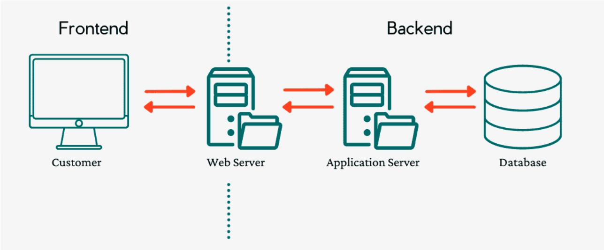

```
Programa de Ingeniería de Sistemas y Computación
Universidad del Quindío

Título: Introducción a la programación empresarial
Duración estimada: 60
Docentes: Carlos Andrés Florez, Christian Andrés Candela
Guía: 01
```

# **Introducción**

En el mundo actual, donde la tecnología se ha convertido en un pilar fundamental para el desarrollo empresarial, es indispensable que los futuros desarrolladores de software comprendan los conceptos fundamentales y las herramientas necesarias para construir aplicaciones empresariales robustas y eficientes. Este documento tiene como objetivo introducir a los estudiantes en los principios clave de la programación empresarial basada en tecnologías web, destacando la importancia de la arquitectura de software, los patrones de diseño y las tecnologías modernas.

## **Objetivo**

Introducir y consolidar los conceptos más importantes relacionados con la programación empresarial basada en tecnologías web. Al finalizar, los estudiantes estarán capacitados para:

1. Comprender el funcionamiento y las características de los programas escritos en lenguajes de programación específicos.
2. Abstraer problemas empresariales y traducirlos en soluciones programáticas utilizando Java en un entorno web.
3. Diseñar modelos de datos basados en ORM (Object-Relational Mapping) para optimizar el desarrollo de aplicaciones empresariales.

---

## **Conceptos básicos**

Para abordar el desarrollo de aplicaciones empresariales, es fundamental tener una base sólida en los siguientes conceptos:

### **Programación Orientada a Objetos (POO):**
La POO es un paradigma de programación que organiza el código en objetos, los cuales encapsulan tanto datos como comportamientos. Este enfoque facilita la modularidad, la reutilización de código y la escalabilidad de las aplicaciones.

### **Estructuras de Datos:**
Las estructuras de datos son esenciales para organizar y manipular información de manera eficiente. Ejemplos comunes incluyen listas, pilas, colas, árboles y grafos.  

### **Lógica de Programación:**
La lógica de programación implica el uso de algoritmos y estructuras de control para resolver problemas computacionales. Es la base sobre la cual se construyen todas las aplicaciones.

---

## **Contextualización Teórica**

En este espacio académico, se busca desarrollar en los estudiantes habilidades, conceptos y competencias necesarias para construir aplicaciones empresariales con diferentes interfaces de usuario. Para lograrlo, se utilizarán tecnologías propias de aplicaciones distribuidas, como Web Services, REST y Spring, junto con patrones de diseño que promuevan la reutilización de código, alta cohesión y bajo acoplamiento.

### **Competencias Esperadas**

**1. Comprensión del Funcionamiento de Programas Empresariales:**  Los estudiantes aprenderán a analizar y comprender cómo funcionan los programas diseñados para resolver problemas empresariales específicos.

**2. Abstracción de Problemas Empresariales:**  Se enfatizará la capacidad de abstraer problemas complejos y traducirlos en soluciones programáticas utilizando Java en un entorno web.

**3. Diseño de Modelos de Datos Basados en ORM:**  Los estudiantes aprenderán a diseñar modelos de datos utilizando frameworks ORM como Hibernate, lo que permitirá una gestión eficiente de bases de datos relacionales.

---

## **Aplicaciones Empresariales**

Una aplicación empresarial es un software diseñado específicamente para satisfacer las necesidades de una organización, en lugar de las necesidades de usuarios individuales. Ejemplos incluyen sistemas de facturación, gestión de nómina, control de inventario y software a medida.

### **Características Clave**

1. **Descentralización y Concurrencia:**  
   El internet es inherentemente descentralizado, concurrente y asíncrono. Por lo tanto, las aplicaciones empresariales deben estar bien estructuradas para funcionar en este entorno.

2. **Arquitectura Cliente-Servidor:**  
   Esta arquitectura divide las tareas entre servidores (proveedores de recursos) y clientes (demandantes). Un cliente realiza peticiones al servidor, quien responde con la información solicitada.  


### **Ventajas de la Arquitectura Cliente-Servidor**

- **Centralización del Control:** Permite gestionar accesos, recursos y la integridad de los datos desde el servidor.
- **Escalabilidad:** Se pueden aumentar la capacidad de clientes y servidores por separado.
- **Fácil Mantenimiento:** Los cambios en el servidor afectan mínimamente a los clientes.

### **Desventajas de la Arquitectura Cliente-Servidor**

- **Congestión del Tráfico:** Una gran cantidad de peticiones simultáneas puede sobrecargar al servidor.
- **Dependencia del Servidor:** Si el servidor falla, las peticiones de los clientes no pueden ser satisfechas.
- **Requisitos de Hardware y Software:** Se necesita hardware y software especializado, especialmente en el lado del servidor.

---

## **Tecnologías en Aplicaciones Empresariales**



### **Frontend (Lado del Cliente)**

Las tecnologías más utilizadas en el frontend incluyen:

- **Aplicaciones Web:** JavaScript, CSS y HTML.
- **Aplicaciones Móviles:** Java, XML, Swift, Kotlin.
- **Aplicaciones de Escritorio:** C++, Java, C#.

### **Backend (Lado del Servidor)**

El backend requiere un servidor de aplicaciones, un lenguaje de programación y un sistema de gestión de bases de datos (SGBD). Ejemplos de servidores de aplicaciones incluyen Apache Tomcat, JBoss, Nginx y Node.js.

### **Sistemas de Gestión de Bases de Datos (SGBD)**

Los SGBD se dividen en dos tipos principales:

**1. Bases de Datos Relacionales (SQL):** MySQL, PostgreSQL, SQL Server.
**2. Bases de Datos No Relacionales (NoSQL):** MongoDB, Redis.

---

## **Modelo de Programación por Capas**

En el desarrollo de software empresarial, los componentes de la aplicación se organizan en capas para garantizar alta cohesión y bajo acoplamiento. Las capas más comunes son:

**1. Capa de Presentación:** Proporciona una interfaz gráfica de usuario (GUI).
**2. Capa de Lógica de Negocio:** Implementa las reglas y restricciones de la aplicación.
**3. Capa de Acceso a Datos:** Gestionada por frameworks ORM como Hibernate o EclipseLink.

---

## **Referencias Bibliográficas**

1. Gamma, E., Helm, R., Johnson, R., & Vlissides, J. (1994). *Design Patterns: Elements of Reusable Object-Oriented Software*. Addison-Wesley.
2. Cormen, T. H., Leiserson, C. E., Rivest, R. L., & Stein, C. (2009). *Introduction to Algorithms*. MIT Press.
3. Tanenbaum, A. S., & Van Steen, M. (2007). *Distributed Systems: Principles and Paradigms*. Pearson Education.
4. Silberschatz, A., Korth, H. F., & Sudarshan, S. (2010). *Database System Concepts*. McGraw-Hill.