```
Programa de Ingeniería de Sistemas y Computación
Universidad del Quindío

Título: Pruebas unitarias en Spring Boot
Duración estimada: 240
Docentes: Carlos Andrés Florez, Christian Andrés Candela
Guía: 13
```

# Pruebas unitarias en Spring Boot

## 🎯 Objetivo  
Comprender qué son las pruebas unitarias, su importancia en el desarrollo de software y cómo implementarlas eficientemente en un proyecto Spring Boot.

---

## Conceptos básicos

- **Pruebas Unitarias**: Verificación del comportamiento de unidades individuales de código (métodos o funciones).  
- **JUnit**: Framework de pruebas para Java.  
- **Mockito**: Biblioteca para simular dependencias externas.  
- **Spring Boot Test**: Herramientas integradas de Spring para pruebas unitarias e integración.  
- **Spring Boot:** Framework para desarrollar aplicaciones en Java con una configuración mínima.
- **Inyección de dependencias:** Mecanismo para gestionar la creación y administración de componentes.
- **HTTP (Hypertext Transfer Protocol)**  Protocolo de comunicación para la transferencia de datos en la web. 
- **CRUD (Create, Read, Update, Delete)**  Conjunto de operaciones básicas para manipular datos (crear, leer, actualizar y eliminar).

---

## Contextualización Teórica 

Las pruebas son una parte fundamental del desarrollo de software moderno. Permiten verificar que el código funciona como se espera, facilitando la detección temprana de errores y mejorando la calidad del producto final. 

> "Las pruebas no son solo para encontrar errores, son para prevenir que ocurran" - Martin Fowler


### Glosario Técnico

| Término | Definición | Ejemplo |
|---------|------------|---------|
| **Prueba Unitaria** | Verificación de unidades individuales de código | Probar un método de cálculo |
| **Mock** | Objeto simulado que reemplaza dependencias | Simular una base de datos |
| **AAA Pattern** | Arrange-Act-Assert (Organizar-Actuar-Afirmar) | Estructura básica de pruebas |
| **Cobertura** | Porcentaje de código ejecutado por pruebas | 80% de cobertura |

### ¿Qué son las Pruebas Unitarias?

Las pruebas unitarias son pequeños tests que validan si una unidad específica de código funciona correctamente de manera aislada. Estas pruebas son esenciales porque:
1. **Detección temprana de errores:** Ayudan a identificar fallos en la lógica de negocio antes de que el código se integre con otros sistemas.
2. **Mejor mantenimiento del código:** Facilitan la refactorización sin riesgo de introducir errores.
3. **Mejoran la calidad del software**: Garantizan que cada componente funcione como se espera.

#### Importancia de las Pruebas Unitarias

Las pruebas unitarias son un componente esencial en el desarrollo de software, ya que permiten validar de manera aislada el comportamiento de los servicios y la lógica de negocio. En Spring Boot, el uso de herramientas como JUnit y Mockito facilita la verificación del correcto funcionamiento de los métodos sin depender de una base de datos o de otros componentes de la aplicación.

Al implementar pruebas unitarias, se logran beneficios como:

- Reducen costos al identificar errores durante el desarrollo.
- Facilitan la colaboración en equipos grandes al garantizar consistencia.
- Mejoran la documentación implícita del código.

En el contexto de Spring Boot, las pruebas unitarias se enfocan en la validación de los métodos de los servicios, asegurando que las reglas de negocio se ejecuten correctamente y que las excepciones sean manejadas de manera adecuada.

### Pruebas de Integración: El Puente entre Componentes

Las pruebas de integración validan la interacción correcta entre múltiples componentes o sistemas que funcionan conjuntamente. A diferencia de las unitarias, involucran:  

- **Comunicación con bases de datos reales** (MySQL, MongoDB)  
- **Llamadas a servicios externos** (APIs REST, SOAP)  
- **Interacción entre capas** (Controlador → Servicio → Repositorio)  

**Características clave:**  
| Aspecto               | Descripción                                                                 |
|-----------------------|-----------------------------------------------------------------------------|
| **Objetivo**          | Detectar fallos en interfaces e interacciones entre componentes integrados  |
| **Velocidad**         | Moderada (segundos por prueba)                                              |
| **Alcance**           | Subconjunto del sistema (2+ componentes acoplados)                         |
| **Herramientas**      | `@SpringBootTest`, TestContainers, bases de datos en memoria (H2)          |

### Pruebas End-to-End (E2E): Validando el Flujo Completo 

Simulan el comportamiento real de un usuario final ejecutando escenarios completos desde la interfaz hasta el backend y sistemas externos.  

**Elementos involucrados:**  

✅ **Interfaz de usuario** (Browser, Mobile App)  
✅ **Backend services**  
✅ **Bases de datos**  
✅ **Redes y middleware**  

### Comparativa clave:

| Criterio          | Pruebas Unitarias | Pruebas de Integración | Pruebas E2E         |
|-------------------|-------------------|------------------------|---------------------|
| **Enfoque**       | Métodos aislados  | Módulos interactuando  | Sistema completo    |
| **Dependencias**  | Mockeadas         | Parcialmente reales    | Todas reales        |
| **Ejecución**     | Milisegundos      | Segundos               | Minutos/horas       |
| **Herramientas**  | JUnit, Mockito    | SpringBootTest         | Selenium, Cypress   |

### Pirámide de Pruebas: Visión Holística 

```mermaid
pie
    title Pirámide de Pruebas
    "Unitarias" : 70
    "Integración" : 20
    "End-to-End" : 10
```

```mermaid
graph TD
    A[70% Unitarias] -->|Validar lógica| B[20% Integración]
    B -->|Verificar interfaces| C[10% E2E]
    style A fill:#4CAF50,stroke:#388E3C
    style B fill:#2196F3,stroke:#1976D2
    style C fill:#FF9800,stroke:#F57C00
```





**Razón de la pirámide:**  
- **Unitarias:** Cimientos sólidos (rápidas, baratas)  
- **Integración:** Garantizan ensamblaje correcto  
- **E2E:** Confirmación final (costosas, frágiles)  

**Error común:** Pirámide invertida (más E2E que unitarias → lentitud, difícil mantenimiento).  

### **Cuándo Usar Cada Tipo**  

| Escenario                          | Tipo Recomendado       | Razón                                                                 |
|------------------------------------|------------------------|-----------------------------------------------------------------------|
| Validar algoritmo de descuento     | **Unitaria**           | Lógica pura sin dependencias                                          |
| Probar conexión a base de datos    | **Integración**        | Requiere DB real pero no toda la app                                  |
| Flujo completo de compra          | **E2E**                | Necesita UI + backend + pasarela de pago                             |
| Verificar respuesta HTTP de un API | **Integración**        | Prueba cliente-servidor sin interfaz gráfica                         |

> "Las pruebas unitarias te dicen *si el código funciona*, las de integración *si los componentes colaboran*, y las E2E *si el sistema cumple su propósito*" — Adaptado de Martin Fowler


### Herramientas y Frameworks

#### 1. JUnit 5
- Framework principal para escribir pruebas unitarias en Java.
- Anotaciones clave: `@Test`, `@BeforeEach`, `@AfterEach`, `@DisplayName`.

#### 2. Mockito
- Simula dependencias externas (ej: repositorios, servicios) para aislar el código bajo prueba.
- Métodos útiles: `mock()`, `when()`, `verify()`.

#### 3. Spring Boot Test
- Proporciona herramientas específicas para probar aplicaciones Spring Boot.
- Anotaciones clave: `@SpringBootTest`, `@ExtendWith(MockitoExtension.class)`.


### Estructura de una Prueba Unitaria

```java
import org.junit.jupiter.api.*;
import static org.mockito.Mockito.*;
import static org.junit.jupiter.api.Assertions.*;

class UserServiceTest {

    private UserRepository userRepository;
    private UserService userService;

    @BeforeEach
    void setUp() {
        userRepository = mock(UserRepository.class); // Mock del repositorio
        userService = new UserServiceImpl(userRepository); // Servicio con dependencia simulada
    }

    @Test
    @DisplayName("Crear un nuevo usuario")
    void testCreateUser() {
        // Arrange
        User user = new User("usuario@mail.com", "12345aBc", "Usuario de Prueba");
        when(userRepository
            .findUserByEmail("usuario@mail.com"))
            .thenReturn(Optional.empty());

        // Act
        UserResponse response = userService.createUser(new UserRegistrationRequest(
            "usuario@mail.com", "12345aBc", "Usuario de Prueba"
        ));

        // Assert
        assertNotNull(response);
        assertEquals("usuario@mail.com", response.email());
        // Verifica que se llame a save()
        verify(userRepository, times(1)).save(any(User.class)); 
    }
}
```

### Tipos de Pruebas en Spring Boot

#### 1. Pruebas Unitarias
- Validan métodos individuales sin interactuar con la base de datos o servicios externos.
- Usan mocks para simular dependencias.

#### 2. Pruebas de Integración
- Validan la interacción entre componentes (ej: servicio + repositorio).
- Usan una base de datos en memoria (como H2) para pruebas.

#### 3. Pruebas de Controladores
- Validan endpoints REST usando `MockMvc`.
- Ejemplo:
```java
@WebMvcTest(UserController.class)
class UserControllerTest {

    @Autowired
    private MockMvc mockMvc;

    @MockBean
    private UserService userService;

    @Test
    void testGetUser() throws Exception {
        UserResponse mockUser = new UserResponse("usuario@mail.com",
             "Usuario de Prueba");
        when(userService.getUser("123"))
            .thenReturn(Optional.of(mockUser));

        mockMvc.perform(get("/users/123"))
               .andExpect(status().isOk())
               .andExpect(jsonPath("$.email").value("usuario@mail.com"));
    }
}
```

---

## Buenas Prácticas y Recomendaciones

1. **Principio FIRST**:
   - **F**ast (Rápidas): Las pruebas deben ejecutarse en milisegundos. Un conjunto completo de pruebas unitarias no debería tardar más de unos segundos.
     - Limite el uso de recursos externos.
     - Las pruebas unitarias deben ejecutarse rápidamente para permitir ciclos de desarrollo ágiles.
     - Evite operaciones costosas como consultas a bases de datos o llamadas a APIs externas.
   - **I**solated (Aisladas): Cada prueba debe ser independiente y no depender de elementos tales como estados globales, orden de ejecución, recursos externos, etc.
     - Use mocks para simular dependencias externas.
     - Evite acceder a bases de datos o servicios reales en pruebas unitarias.
     - Cada prueba debe ser independiente y no depender del estado de otras pruebas.
   - **R**epeatable (Repetibles): Las pruebas deben producir el mismo resultado en cualquier entorno y momento.
     - Use métodos como `@BeforeEach` y `@AfterEach` para configurar y limpiar el estado antes y después de cada prueba.
   - **S**elf-validating (Auto-validables): La prueba debe entre otras cosas: determinar automáticamente si pasó o falló, no requerir interpretación humana, proporcionar mensajes de error claros.
     - Asegúrese de probar que el código lanza las excepciones esperadas en casos de error.
   - **T**imely (Oportunas): Las pruebas deben escribirse preferiblemente antes del código (TDD), máximo inmediatamente después y nunca como actividad posterior.
    

2. **Usar Datos de Prueba Claros**:
   - Cree objetos de prueba con valores significativos.

3. **Nombrar Pruebas Correctamente**:
   - Use nombres descriptivos (ej: `testCreateUser_WhenEmailExists_ThrowsException`).


4. **Organizar las Pruebas con AAA (Arrange, Act, Assert)**:
   - **Arrange**: Configure los datos iniciales y mocks necesarios.
   - **Act**: Ejecute la acción o método bajo prueba.
   - **Assert**: Verifique que el resultado sea el esperado.
   - Ejemplo:
     ```java
     @Test
     void testSum() {
         // Arrange
         Calculator calculator = new Calculator();
         
         // Act
         int result = calculator.sum(2, 3);
         
         // Assert
         assertEquals(5, result);
     }
     ```
5. **Probar Escenarios Positivos y Negativos**:
   - Incluya tanto casos válidos como inválidos para garantizar que el código maneje correctamente todas las situaciones.
 

6.  **Usar Herramientas de Cobertura de Código**:
    - Utilize herramientas como **JaCoCo** para medir la cobertura de tus pruebas y asegurarte de que estás probando suficientemente tu código.  

7.  **Evitar Uso Excesivo de Mocks**:
    - Los mocks son útiles, pero un exceso puede llevar a pruebas frágiles que no reflejan el comportamiento real del sistema.
    - Equilibra el uso de mocks con pruebas de integración cuando sea necesario.

8.  **Documentar las Pruebas**:
    - Añada comentarios claros para explicar el propósito de cada prueba, especialmente si el escenario es complejo.

9.  **Automatizar las Pruebas**:
    - Integre las pruebas unitarias en pipelines de CI/CD para ejecutarlas automáticamente en cada cambio de código.

10. **Mantenga las Pruebas Simples**:
    - Evite escribir pruebas demasiado complejas. Si una prueba es difícil de entender, probablemente también lo será mantenerla.
  
11. **Mantener las Pruebas Actualizadas**:
    - A medida que evoluciona el código, asegúrese de actualizar las pruebas para reflejar los cambios y evitar falsos positivos.    

---

## **DESAFÍO: IMPLEMENTACIÓN DE PRUEBAS UNITARIAS Y DE INTEGRACIÓN EN SPRING BOOT**  
A continuación, se presentan un conjunto de pasos y requerimientos generales para la construcción de un conjunto de pruebas unitarias y de integración para su API RESTful, sus servicios de negocio y sus repositorios. Los estudiantes deben usar el proyecto previamente elaborado como elemento base para la construcción de sus servicios de negocio en Spring Boot:

### Resumen de Servicios REST a probar
```java
public class UserController {
    @PostMapping
    public ResponseEntity<UserResponse> 
        create(@Valid @RequestBody UserRegistrationRequest request)
    @GetMapping("/{id}")
    public ResponseEntity<UserResponse> 
        get(@PathVariable("id") String id)
}
```

### Resumen de Servicio de negocio a probar
```java
public interface UserService {
    UserResponse createUser(UserRegistrationRequest user);
    Optional<UserResponse> getUser(String id);
}
```

### Resumen del Repositorio a probar
```java
@Repository
public interface UserRepository extends MongoRepository<User, String> {
    Optional<User> findUserByEmail(String email);

    @Query(value = "{ 'status': { $ne: 'DELETED' }, 'email': ?0 }")
    Optional<User> findExistingUserByEmail(String email);

    @Query(value = "{ 'status': { $ne: 'DELETED' }, " +
            "  'fullName': { $regex: ?0, $options: 'i' }, " +
            "  'email': { $regex: ?1, $options: 'i' }, " +
            "  ?#{ [2] != null ? 'dateBirth' : '_ignore' } : ?2 }",
            sort = "{ 'fullName': 1 }")
    Page<User> findExistingUsersByFilters
        (String fullName, String email, LocalDate dateBirth, Pageable pageable);

    List<UserResponse> findByStatusNot(UserStatus status);
}
```
---

1. En la carpeta `test/java` cree los paquetes `co.edu.uniquindio.[proyecto].data`, `co.edu.uniquindio.[proyecto].services.unit`, `co.edu.uniquindio.[proyecto].services.integration`, `co.edu.uniquindio.[proyecto].controllers.unit`, `co.edu.uniquindio.[proyecto].controllers.integration` y `co.edu.uniquindio.[proyecto].repositories`.

    - `co.edu.uniquindio.[proyecto].data`: Contendrá los elementos necesarios para crear el conjunto de datos básicos para la realización de pruebas.
    - `co.edu.uniquindio.[proyecto].services.unit`: Contendrá las clases encargadas de crear las pruebas unitarias para los servicios de negocio.
    - `co.edu.uniquindio.[proyecto].services.integration`: Contendrá las clases encargadas de crear las pruebas de integración para los servicios de negocio.
    - `co.edu.uniquindio.[proyecto].controllers.unit`: Contendrá las clases encargadas de crear las pruebas unitarias para los servicios REST.
    - `co.edu.uniquindio.[proyecto].controllers.integration`: Contendrá las clases encargadas de crear las pruebas de integración para los servicios REST.
    - `co.edu.uniquindio.[proyecto].repositories`: Contendrá las clases encargadas de crear las pruebas unitarias para los repositorios, en especial para las consultas (**`@Query`**).
---

2. En la carpeta `test/resources` cree un archivo application.properties, en el tendremos la configuración que usará la aplicación para la realización de las pruebas.

```properties
spring.data.mongodb.uri=mongodb://localhost:27017/proyecto-test
logging.level.org.springframework.data.mongodb.core.MongoTemplate=DEBUG
```

> ℹ️ Observe que `spring.data.mongodb.uri=mongodb://localhost:27017/proyecto-test` configura una base de datos para pruebas diferente a la usada en desarrollo. Esto debido a que las pruebas borrarán los datos de las colecciones cada vez que se ejecuten para garantizar un resultado predecible.

---

### PRUEBAS UNITARIAS EN REPOSITORIOS

3. En el paquete `co.edu.uniquindio.[proyecto].data` cree la clase `TestDataLoader` como se muestra a continuación.  

```java
import com.example.demo.domain.Rol;
import com.example.demo.domain.User;
import com.example.demo.domain.UserStatus;
import com.example.demo.repositories.UserRepository;
import org.springframework.data.mongodb.core.MongoTemplate;
import org.springframework.security.crypto.bcrypt.BCryptPasswordEncoder;
import java.time.LocalDate;
import java.util.*;
import java.util.stream.Collectors;

public class TestDataLoader {

    public static Map<String, User> loadTestData(
                UserRepository userRespository, 
                MongoTemplate mongoTemplate) {
            var encoder = new BCryptPasswordEncoder();
            return loadTestData(
                    List.of(
                        new User(UUID.randomUUID().toString(),
                            "ana@example.com", 
                            encoder.encode("12346Abc"),
                            "Ana López", 
                            LocalDate.of(1982,8,27), 
                            Rol.USER, 
                            UserStatus.ACTIVE),
                        new User(UUID.randomUUID().toString(),
                            "carlos@example.com",
                            encoder.encode("12346Abc"),
                            "Carlos Pérez", 
                            LocalDate.of(1984,10,28), 
                            Rol.USER, 
                            UserStatus.ACTIVE)
                    ),
                    userRespository,
                    mongoTemplate
            );
    }

    public static Map<String, User> loadTestData
        (Collection<User> newUsers,UserRepository userRespository, 
            MongoTemplate mongoTemplate) {
        // Borrar datos existentes para asegurar la repetibilidad de las pruebas.
        mongoTemplate.getDb().listCollectionNames()
                .forEach(mongoTemplate::dropCollection);
        return userRespository.saveAll(newUsers).stream()
            .collect(Collectors.toMap(User::getId, usuario -> usuario));
    }
}
```
---
4. En el paquete `co.edu.uniquindio.[proyecto].repositories` cree la clase `UserRepositoryTest` como se muestra a continuación.  

```java
import com.example.demo.data.TestDataLoader;
import com.example.demo.domain.User;
import com.example.demo.domain.UserStatus;
import com.example.demo.dtos.UserResponse;
import org.junit.jupiter.api.BeforeEach;
import org.junit.jupiter.api.Test;
import org.springframework.beans.factory.annotation.Autowired;
import org.springframework.boot.test.autoconfigure.data.mongo.DataMongoTest;
import org.springframework.data.domain.Page;
import org.springframework.data.domain.PageRequest;
import org.springframework.data.mongodb.core.MongoTemplate;
import java.util.List;
import java.util.Map;
import java.util.Optional;
import static org.junit.jupiter.api.Assertions.*;

@DataMongoTest
class UserRepositoryTest {
    @Autowired
    private UserRepository userRepository;
    @Autowired
    private MongoTemplate mongoTemplate;
    private Map<String, User> users;

    @BeforeEach
    void setUp() {
        users = TestDataLoader.loadTestData(userRepository,mongoTemplate);
    }
    // . . .
}
```

> ℹ️ En esta clase crearemos los métodos para probar la clase `UserRepository`.
> ℹ️ El método `@BeforeEach void setUp()` contiene elementos de preparación de datos de prueba (Sección de Arrange), la cual será ejecutada antes de ejecutar cada uno de los métodos de prueba de la clase.
---
5. Probar el método findUserByEmail

```java
@Test
void testFindUserByEmailSuccess() {
    // Sección de Arrange: Obtiene un usuario aleatorio a ser empleado en la prueba
    var testUser = users.values().stream().findAny().orElseThrow();
    // Sección de Act: Se ejecuta la búsqueda de usuario por email.
    Optional<User> result = userRepository.findUserByEmail(testUser.getEmail());
    // Sección de Assert: Se verifica que el usuario obtenido 
    // corresponda con los datos esperados.
    assertTrue(result.isPresent());
    assertEquals(testUser.getFullName(), result.get().getFullName());
}
```

> ℹ️ Cada prueba debe contener una sección de preparación de datos de prueba, una sección de ejecución del método a probar y una sección de verificación.
---
6. Probar el método findExistingUserByEmail

- Se prueba cuando se conoce que el status del usuario es diferente de DELETED
```java
@Test
void testFindExistingUserByEmailWhenUserExists() {
    // Sección de Arrange: Obtiene un usuario aleatorio a ser empleado en la prueba
    var testUser = users.values().stream().findAny().orElseThrow();
    // Sección de Act: Se ejecuta la búsqueda de usuario por email 
    // con estado diferente a DELETED.
    Optional<User> result = userRepository
                                .findExistingUserByEmail(testUser.getEmail());
    // Sección de Assert: Se verifica que el usuario obtenido 
    // corresponda con los datos esperados.
    assertTrue(result.isPresent());
    assertEquals(testUser.getEmail(), result.get().getEmail());
}
```
- Se prueba cuando se conoce que el usuario tiene status DELETED
```java
@Test
void testFindExistingUserByEmailWhenUserDeleted() {
    // Sección de Arrange: Obtiene un usuario aleatorio a ser empleado en la prueba
    var testUser = users.values().stream().findAny().orElseThrow();
    testUser.setStatus(UserStatus.DELETED);
    userRepository.save(testUser);
    // Sección de Act: Se ejecuta la búsqueda de usuario por email 
    // con estado diferente a DELETED.
    Optional<User> result = userRepository
                                .findExistingUserByEmail(testUser.getEmail());
    // Sección de Assert: Se verifica que el usuario no sea obtenido 
    // porque ha sido borrado.
    assertFalse(result.isPresent());
}
```
---
7. Probar el método findExistingUsersByFilters
```java
@Test
void testFindExistingUsersByFilters() {
    // Sección de Arrange: Obtiene un usuario aleatorio a ser empleado en la prueba
    var testUser = users.values().stream().findAny().orElseThrow();
    // Sección de Act: Se ejecuta la búsqueda aplicando todos los filtros
    Page<User> result = userRepository
                            .findExistingUsersByFilters(testUser.getFullName(), testUser.getEmail(),
                                testUser.getDateBirth(), PageRequest.of(0, 10));
    // Sección de Assert: Se verifica que se haya encontrado el 
    // usuario que coincide con la búsqueda.
    assertFalse(result.isEmpty());
    assertEquals(1, result.getTotalElements());
}
```   
---
8. Probar el método findByStatusNot
```java
@Test
void testFindByStatusNot() {
    // Sección de Arrange: Se asumen los datos precargados como datos de prueba
    // Sección de Act: Se ejecuta la búsqueda de los 
    // usuarios que no tienen status DELETED
    List<UserResponse> usersFound = userRepository.findByStatusNot(UserStatus.DELETED);
    // Sección de Assert: Se verifica que se haya encontrado todos usuarios precargados.
    assertFalse(usersFound.isEmpty());
    assertEquals(this.users.size(), usersFound.size());
    assertTrue(this.users.values().stream().map(User::getId).toList().containsAll(usersFound.stream().map(UserResponse::id).toList()));
}
```   
---
9. Cree clases que permitan probar los repositorios de su proyecto.
---
### PRUEBAS UNITARIAS DE SERVICIOS DE NEGOCIO

10. En el paquete ``co.edu.uniquindio.[proyecto].services.unit`` cree la clase `UserServiceTest` como se muestra a continuación.

```java
import static org.junit.jupiter.api.Assertions.*;
import static org.mockito.Mockito.*;
import com.example.demo.domain.Rol;
import com.example.demo.domain.User;
import com.example.demo.domain.UserStatus;
import com.example.demo.dtos.UserRegistrationRequest;
import com.example.demo.dtos.UserResponse;
import com.example.demo.exceptions.ValueConflictException;
import com.example.demo.mappers.UserMapper;
import com.example.demo.repositories.UserRepository;
import com.example.demo.services.UserServiceImpl;
import org.junit.jupiter.api.BeforeEach;
import org.junit.jupiter.api.Test;
import org.junit.jupiter.api.extension.ExtendWith;
import org.mockito.InjectMocks;
import org.mockito.Mock;
import org.mockito.junit.jupiter.MockitoExtension;
import java.time.LocalDate;
import java.util.Optional;
import java.util.UUID;

@ExtendWith(MockitoExtension.class) // Habilita Mockito en JUnit 5
class UserServiceImplTest {
    @Mock
    private UserRepository userRepository; // Simula la capa de persistencia
    @Mock
    private UserMapper userMapper; // Simula la conversión de entidades a DTOs
    @InjectMocks
    private UserServiceImpl userService; // Inyecta los mocks en la implementación real
    private UserRegistrationRequest userRequest;
    private UserResponse userResponse;
    private User user;

    @BeforeEach
    void setUp() {
        user = new User(UUID.randomUUID().toString(),"juan@example.com","12345Abc",
            "Juan Perez", LocalDate.of(1980,6,25), 
            Rol.USER, UserStatus.REGISTERED);
        userRequest = new UserRegistrationRequest(user.getEmail(), user.getPassword(), 
            user.getFullName(),user.getDateBirth(),user.getRol());
        userResponse = new UserResponse(UUID.randomUUID().toString(),user.getEmail(), 
        user.getFullName(), user.getDateBirth(),user.getRol());
    }
    // . . .
}
```
> ℹ️ El método `@BeforeEach void setUp()` contiene elementos de preparación de datos de prueba (Sección de Arrange), la cual será ejecutada antes de ejecutar cada uno de los métodos de prueba de la clase.
---
11.  Probar el método createUser
- Creación exitosa de usuario:
```java
@Test
void testCreateUserSuccess() {
    // Arrange: Simular que no existe un usuario con el email dado
    when(userRepository.findExistingUserByEmail(userRequest.email()))
        .thenReturn(Optional.empty());
    when(userMapper.parseOf(userRequest))
        .thenReturn(user); // Simular conversión DTO -> Entity
    when(userRepository.save(any(User.class)))
        .thenReturn(user); // Simular persistencia
    when(userMapper.toUserResponse(any(User.class)))
        .thenReturn(userResponse); // Simular conversión Entity -> DTO

    // Act: Llamar al método que se está probando
    UserResponse result = userService.createUser(userRequest);

    // Assert: Verificar que los datos devueltos son los esperados
    assertNotNull(result);
    assertEquals(userResponse.id(), result.id());
    assertEquals(userResponse.email(), result.email());

    // Verificar que los mocks fueron llamados correctamente
    verify(userRepository).findExistingUserByEmail(userRequest.email());
    verify(userRepository).save(any(User.class));
    verify(userMapper).toUserResponse(any(User.class));
}
```
- Creación fallida de usuario por email repetido.
```java
@Test
void testCreateUserThrowsValueConflictExceptionWhenEmailExists() {
    // Arrange: Simular que ya existe un usuario con el mismo email
    when(userRepository.findExistingUserByEmail(userRequest.email()))
        .thenReturn(Optional.of(user));
    // Act & Assert: Verificar que se lanza la excepción cuando el usuario ya existe
    assertThrows(ValueConflictException.class, 
        () -> userService.createUser(userRequest));
    // Verificar que el método `save` nunca fue llamado
    verify(userRepository, never()).save(any());
}
```
---
12.  Probar el método getUser
- Obtener usuario exitosamente:
```java
@Test
void testGetUserSuccess() {
    // Arrange: Simular que el usuario existe
    when(userRepository.findById(user.getId())).thenReturn(Optional.of(user));
    when(userMapper.toUserResponse(any(User.class))).thenReturn(userResponse);
    // Act: Se ejecuta el método para obtener el usuario
    Optional<UserResponse> result = userService.getUser(user.getId());
    // Assert: Se verifica que el usuario obtenido corresponda con el solicitado
    assertTrue(result.isPresent());
    assertEquals(userResponse.id(), result.get().id());
    // Verificar que los mocks fueron llamados correctamente
    verify(userRepository).findById(user.getId());
    verify(userMapper).toUserResponse(any(User.class));
}
```
- Obtener usuario fallida.
```java
@Test
void testGetUserNotFound() {
    // Arrange: Simular que el usuario no existe
    when(userRepository.findById("99")).thenReturn(Optional.empty());
    // Act: Se ejecuta el método para obtener el usuario
    Optional<UserResponse> result = userService.getUser("99");
    // Assert: Se verifica que la respuesta este vacía.
    assertFalse(result.isPresent());
    verify(userRepository).findById("99");
    verify(userMapper, never()).toUserResponse(any());
}
```
---
13.  Cree clases que permitan probar (pruebas unitarias) los servicios de negocio de su proyecto.
---
### PRUEBAS DE INTEGRACIÓN DE SERVICIOS DE NEGOCIO

14.  En el paquete ``co.edu.uniquindio.[proyecto].services.integration`` cree la clase `UserServiceTest` como se muestra a continuación.

```java
import com.example.demo.data.TestDataLoader;
import com.example.demo.domain.Rol;
import com.example.demo.domain.User;
import com.example.demo.dtos.UserRegistrationRequest;
import com.example.demo.exceptions.ValueConflictException;
import com.example.demo.repositories.UserRepository;
import com.example.demo.services.UserService;
import org.junit.jupiter.api.BeforeEach;
import org.junit.jupiter.api.Test;
import org.springframework.beans.factory.annotation.Autowired;
import org.springframework.boot.test.context.SpringBootTest;
import org.springframework.data.mongodb.core.MongoTemplate;
import java.time.LocalDate;
import java.util.Map;
import java.util.Optional;
import java.util.UUID;
import static org.junit.jupiter.api.Assertions.*;

@SpringBootTest
public class UserServiceTest {
    @Autowired
    private UserService userService;
    @Autowired
    private UserRepository userRepository;
    @Autowired
    private MongoTemplate mongoTemplate;
    private Map<String, User> users;

    @BeforeEach
    void setUp() {
        users = TestDataLoader.loadTestData(userRepository,mongoTemplate);
    }
    // . . .
}
```
> ℹ️ El método `@BeforeEach void setUp()` contiene elementos de preparación de datos de prueba (Sección de Arrange), la cual será ejecutada antes de ejecutar cada uno de los métodos de prueba de la clase.
> ℹ️ A diferencia de las pruebas unitarias donde se simula la respuesta de los repositorios, en las pruebas de integración se usa realmente el repositorio y se interactúa con la base de datos probando la integración del servicio de negocio con el repositorio y la base de datos.
---
15. Probar el método createUser
- Creación exitosa de usuario:
```java
@Test
void testCreateUser() {
    // Sección de Arrange: Se crean los datos del usuario a ser registrado
    var user = new UserRegistrationRequest("juan@example.com","12345Abc","Juan Perez",
            LocalDate.of(1980,6,25), Rol.USER);
    // Sección de Act: Ejecute la acción de crear usuario.
    var newUser = userService.createUser(user);
    // Sección de Assert: Se verifica que el usuario se haya registrado con los datos proporcionados.
    assertNotNull(newUser.id());
    assertEquals(user.email(),newUser.email());
    assertEquals(user.fullName(),newUser.fullName());
    assertEquals(user.dateBirth(),newUser.dateBirth());
    assertEquals(user.rol(),newUser.rol());
}
```
- Creación fallida de usuario por email repetido.
```java
@Test
void testCreateUserThrowsValueConflictExceptionWhenEmailExists() {
    // Sección de Arrange: Se crean los datos del usuario a ser 
    // registrado (Con el email de un usuario ya existente).
    var userStore = users.values().stream().findAny().orElseThrow();
    var user = new UserRegistrationRequest(userStore.getEmail(), "12345Abc","Juan Perez",
            LocalDate.of(1980,6,25), Rol.USER);
    // Sección de Act y Sección de Assert: Ejecute la acción de crear usuario,
    //  se verifica que genere una excepción debido al email repetido.
    assertThrows(ValueConflictException.class,() -> userService.createUser(user) );
}
```
---
16. Probar el método getUser
- Obtener usuario exitosamente:
```java
@Test
void testGetUserSuccess() {
    // Sección de Arrange: Se obtiene aleatoriamente 
    // uno de los usuarios registrado para pruebas.
    var userStore = users.values().stream().findAny().orElseThrow();
    // Sección de Act: Ejecute la acción de obtener usuario basado en su Id.
    var foundUser = userService.getUser(userStore.getId()).orElseThrow();
    // Sección de Assert: Se verifica que los datos obtenidos 
    // correspondan a los del usuario almacenado.
    assertEquals(userStore.getFullName(),foundUser.fullName());
    assertEquals(userStore.getDateBirth(),foundUser.dateBirth());
    assertEquals(userStore.getRol(),foundUser.rol());
}
```
- Obtener usuario fallido.
```java
@Test
void testGetUserNotFound() {
    // Sección de Arrange: Se crean los datos del usuario a ser registrado 
    // (Con el email de un usuario ya existente).
    var id = UUID.randomUUID().toString();
    // Sección de Act: Ejecute la acción de obtener usuario basado en su Id.
    var user = userService.getUser(id);
    // Sección de Assert: Se verifica que los datos obtenidos 
    // correspondan a lo esperado.
    assertEquals(Optional.empty(),user);
}
```
---
17. Cree clases que permitan probar (pruebas de integración) los servicios de negocio de su proyecto.
---
### PRUEBAS UNITARIAS DE SERVICIOS DE REST

18. En el paquete ``co.edu.uniquindio.[proyecto].controllers.unit`` cree la clase `UserControllerTest` como se muestra a continuación.

```java
import com.example.demo.controllers.UserController;
import com.example.demo.domain.Rol;
import com.example.demo.dtos.UserRegistrationRequest;
import com.example.demo.dtos.UserResponse;
import com.example.demo.exceptions.ValueConflictException;
import com.example.demo.services.UserService;
import com.fasterxml.jackson.databind.ObjectMapper;
import org.junit.jupiter.api.BeforeEach;
import org.junit.jupiter.api.Test;
import org.mockito.Mockito;
import org.springframework.beans.factory.annotation.Autowired;
import org.springframework.boot.test.autoconfigure.web.servlet.WebMvcTest;
import org.springframework.test.context.bean.override.mockito.MockitoBean;
import org.springframework.test.web.servlet.MockMvc;
import java.time.LocalDate;
import java.util.Optional;
import java.util.UUID;
import static org.springframework.test.web.servlet.request.MockMvcRequestBuilders.get;
import static org.springframework.test.web.servlet.request.MockMvcRequestBuilders.post;
import static org.springframework.test.web.servlet.result.MockMvcResultMatchers.jsonPath;
import static org.springframework.test.web.servlet.result.MockMvcResultMatchers.status;

@WebMvcTest(UserController.class)
public class UserControllerTest {
    @Autowired
    private MockMvc mockMvc;
    @Autowired
    private ObjectMapper objectMapper;
    @MockitoBean
    private UserService userService;
    private UserRegistrationRequest user;
    private UserResponse userResponse;

    @BeforeEach
    void setup() {
        user = new UserRegistrationRequest("juan@example.com","12345Abc","Juan Perez", 
            LocalDate.of(1980,6,25), Rol.USER);
        userResponse = new UserResponse(UUID.randomUUID().toString(),
            user.email(), user.fullName(), user.dateBirth(),user.rol());
    }
    // . . . 
}
```
> ℹ️ En esta clase se ha agregado el método `@BeforeEach void setUp()` la cual contiene elementos de preparación de datos de prueba (Sección de Arrange), la cual será ejecutada antes de ejecutar cada uno de los métodos de prueba de la clase.
---
19. Probar el método POST /users
- Creación exitosa de usuario:
```java
@Test
void testCreateUserSuccess() throws Exception {
    // Sección de Arrange: Se configura la respuesta simulada por el 
    // componente userService, en este cado se indica que cuando se 
    // envíe la solicitud de creación debe retornar la respuesta dada.
    Mockito.when(userService.createUser(Mockito.any(UserRegistrationRequest.class)))
        .thenReturn(userResponse);
    // Sección de Act: Ejecute la acción de invocación del servicio 
    // de registro de usuarios
    mockMvc.perform(post("/users")
                    .contentType("application/json")
                    .content(objectMapper.writeValueAsString(user)))
            // Sección de Assert: Se verifica que los datos 
            // obtenidos correspondan a los del usuario registrado.
            .andExpect(status().isCreated())
            .andExpect(jsonPath("$.fullName").value(user.fullName()))
            .andExpect(jsonPath("$.email").value(user.email()))
            .andExpect(jsonPath("$.rol").value(user.rol().toString()));
}
```
- Creación fallida de usuario por email repetido.
```java
@Test
void testCreateUserValueConflictExceptionWhenEmailExists() throws Exception {
    // Sección de Arrange: Se configura la respuesta simulada por el 
    // componente userService, en este cado se indica que cuando se 
    // envíe la solicitud de creación debe generar una excepción de 
    // tipo ValueConflictException.
    Mockito.when(userService.createUser(Mockito.any(UserRegistrationRequest.class)))
        .thenThrow(ValueConflictException.class);

    // Sección de Act: Ejecute la acción de invocación del servicio 
    // de registro de usuarios
    mockMvc.perform(post("/users")
                    .contentType("application/json")
                    .content(objectMapper.writeValueAsString(user)))
            // Sección de Assert: Se verifica que el resultado 
            // obtenido corresponda a lo esperado un status code de conflicto.
            .andExpect(status().isConflict());
}
```
---
20. Probar el método GET /users
- Obtener usuario exitosamente:
```java
@Test
void testGetUserSuccess() throws Exception {
    // Sección de Arrange: Se configura la respuesta simulada por el 
    // componente userService, en este cado se indica que cuando se 
    // envíe la solicitud de creación debe retornar la respuesta dada.
    Mockito.when(userService.getUser(userResponse.id()))
        .thenReturn(Optional.of(userResponse));
    // Sección de Act: Ejecute la acción de invocación del servicio 
    // de consulta de usuarios
    mockMvc.perform(get("/users/"+userResponse.id()))
            // Sección de Assert: Se verifica que los datos 
            // obtenidos correspondan a los del usuario esperado.
            .andExpect(status().isOk())
            .andExpect(jsonPath("$.fullName").value(user.fullName()))
            .andExpect(jsonPath("$.email").value(user.email()))
            .andExpect(jsonPath("$.rol").value(user.rol().toString()));
}
```
- Obtener usuario fallida.
```java
@Test
void testGetUserNotFound() throws Exception {
    // Sección de Arrange: Se configura la respuesta simulada por el 
    // componente userService, en este cado se indica que cuando se 
    // envíe la solicitud de creación debe retornar la respuesta dada.
    Mockito.when(userService.getUser(userResponse.id())).thenReturn(Optional.empty());
    // Sección de Act: Ejecute la acción de invocación del servicio de consulta de usuarios
    mockMvc.perform(get("/users/"+userResponse.id()))
            // Sección de Assert: Se verifica que la respuesta 
            // obtenida sea la esperada (404).
            .andExpect(status().isNotFound());
}
```
---
21. Cree clases que permitan probar (pruebas unitarias) los servicios rest su proyecto.
---
### PRUEBAS DE INTEGRACIÓN DE SERVICIOS DE REST

22. En el paquete ``co.edu.uniquindio.[proyecto].controllers.integration`` cree la clase `UserControllerTest` como se muestra a continuación.

```java
import com.example.demo.data.TestDataLoader;
import com.example.demo.domain.Rol;
import com.example.demo.domain.User;
import com.example.demo.dtos.UserRegistrationRequest;
import com.example.demo.repositories.UserRepository;
import com.fasterxml.jackson.databind.ObjectMapper;
import org.junit.jupiter.api.BeforeEach;
import org.junit.jupiter.api.Test;
import org.springframework.beans.factory.annotation.Autowired;
import org.springframework.boot.test.autoconfigure.web.servlet.AutoConfigureMockMvc;
import org.springframework.boot.test.context.SpringBootTest;
import org.springframework.data.mongodb.core.MongoTemplate;
import org.springframework.test.web.servlet.MockMvc;
import java.time.LocalDate;
import java.util.Map;
import java.util.UUID;
import static org.springframework.test.web.servlet.request.MockMvcRequestBuilders.get;
import static org.springframework.test.web.servlet.request.MockMvcRequestBuilders.post;
import static org.springframework.test.web.servlet.result.MockMvcResultMatchers.jsonPath;
import static org.springframework.test.web.servlet.result.MockMvcResultMatchers.status;

@SpringBootTest(webEnvironment = SpringBootTest.WebEnvironment.RANDOM_PORT)
@AutoConfigureMockMvc
public class UserControllerTest {
    @Autowired
    private MockMvc mockMvc;
    @Autowired
    private ObjectMapper objectMapper;
    @Autowired
    private UserRepository userRepository;
    @Autowired
    private MongoTemplate mongoTemplate;
    private Map<String, User> users;

    @BeforeEach
    void setUp() {
        users = TestDataLoader.loadTestData(userRepository,mongoTemplate);
    }
    // . . .
}
```
> ℹ️ En esta clase se ha agregado el método `@BeforeEach void setUp()` la cual contiene elementos de preparación de datos de prueba (Sección de Arrange), la cual será ejecutada antes de ejecutar cada uno de los métodos de prueba de la clase.
> ℹ️ A diferencia de las pruebas unitarias donde se simula la respuesta de los servicios de negocio, en las pruebas de integración se usa realmente el servicio de negocio, el repositorio y se interactúa con la base de datos probando la integración de todos los componentes del sistema.
---
23. Probar el método POST /users
- Creación exitosa de usuario:
```java
@Test
void testCreateUserSuccess() throws Exception {
    // Sección de Arrange:
    var user = new UserRegistrationRequest("juan@example.com",
                    "12345Abc","Juan Perez", 
                    LocalDate.of(1980,6,25), Rol.USER);

    // Sección de Act: Ejecute la acción de invocación del servicio 
    // de registro de usuarios
    mockMvc.perform(post("/users")
                    .contentType("application/json")
                    .content(objectMapper.writeValueAsString(user)))
            // Sección de Assert: Se verifica que los datos 
            // obtenidos correspondan a los del usuario registrado.
            .andExpect(status().isCreated())
            .andExpect(jsonPath("$.fullName").value(user.fullName()))
            .andExpect(jsonPath("$.email").value(user.email()))
            .andExpect(jsonPath("$.rol").value(user.rol().toString()));
}
```
- Creación fallida de usuario por email repetido.
```java
@Test
void testCreateUserValueConflictExceptionWhenEmailExists() throws Exception {
    // Sección de Arrange: Se seleccionan datos de un usuario ya 
    // creado para que cuando se envíe la solicitud de creación 
    // genere una excepción de tipo ValueConflictException.
    var userStore = users.values().stream().findAny().orElseThrow();
    var user = new UserRegistrationRequest(userStore.getEmail(),    
            "12345Abc","Juan Perez",
            LocalDate.of(1980,6,25), Rol.USER);

    // Sección de Act: Ejecute la acción de invocación del servicio 
    // de registro de usuarios
    mockMvc.perform(post("/users")
                    .contentType("application/json")
                    .content(objectMapper.writeValueAsString(user)))
            // Sección de Assert: Se verifica que el resultado 
            // obtenido corresponda a lo esperado un status code de conflicto.
            .andExpect(status().isConflict());
}
```
---
24. Probar el método GET /users
- Obtener usuario exitosamente:
```java
@Test
void testGetUserSuccess() throws Exception {
    // Sección de Arrange: Se preparan los datos para enviar una 
    // solicitud de un usuario registrado
    var userStore = users.values().stream().findAny().orElseThrow();

    // Sección de Act: Ejecute la acción de invocación del servicio 
    // de consulta de usuarios
    mockMvc.perform(get("/users/"+userStore.getId()))
            // Sección de Assert: Se verifica que los datos 
            // obtenidos correspondan a los del usuario esperado.
            .andExpect(status().isOk())
            .andExpect(jsonPath("$.fullName").value(userStore.getFullName()))
            .andExpect(jsonPath("$.email").value(userStore.getEmail()))
            .andExpect(jsonPath("$.rol").value(userStore.getRol().toString()));
}
```
- Obtener usuario fallida.
```java
@Test
void testGetUserNotFound() throws Exception {
    // Sección de Arrange: Se crean los datos del usuario a ser 
    // registrado (Con el email de un usuario ya existente).
    var id = UUID.randomUUID().toString();
    // Sección de Act: Ejecute la acción de invocación del servicio 
    // de consulta de usuarios
    mockMvc.perform(get("/users/"+id))
            // Sección de Assert: Se verifica que la respuesta 
            // obtenida sea la esperada (404).
            .andExpect(status().isNotFound());
}
```
---
25. Cree clases que permitan probar (pruebas de integración) los servicios rest su proyecto.
    > Ejecute las pruebas y verifique el correcto funcionamiento de su sistema.
---
    

## Evaluación o Resultado

Se espera que el estudiante:
- Comprenda los conceptos básicos de pruebas unitarias.
- Implemente pruebas unitarias para servicios y controladores.
- Use herramientas como JUnit y Mockito de manera efectiva.
- Comprenda los conceptos básicos de pruebas de integración.
- Implemente pruebas de integración para servicios y controladores.
---

## Referencias Bibliográficas

- Spring Boot Documentation: [https://spring.io/projects/spring-boot](https://spring.io/projects/spring-boot)
- Postman API Testing: [https://www.postman.com/](https://www.postman.com/)
- cURL Command Reference: [https://curl.se/docs/](https://curl.se/docs/)
- [JUnit 5](https://junit.org/junit5/docs/current/user-guide/)
- [Mockito](https://site.mockito.org/)
- [Spring Boot Testing](https://spring.io/guides/gs/testing-web/)
- [Testing Best Practices](https://martinfowler.com/articles/practical-test-pyramid.html)


