```
Programa de Ingeniería de Sistemas y Computación
Universidad del Quindío

Título: Pruebas unitarias en Spring Boot
Duración estimada: 240
Docentes: Carlos Andrés Florez, Christian Andrés Candela
Guía: 13
```

# Pruebas unitarias en Spring Boot

## 🎯 Objetivo  
Comprender qué son las pruebas unitarias, su importancia en el desarrollo de software y cómo implementarlas eficientemente en un proyecto Spring Boot.

---

## Conceptos básicos

- **Pruebas Unitarias**: Verificación del comportamiento de unidades individuales de código (métodos o funciones).  
- **JUnit**: Framework de pruebas para Java.  
- **Mockito**: Biblioteca para simular dependencias externas.  
- **Spring Boot Test**: Herramientas integradas de Spring para pruebas unitarias e integración.  
- **Spring Boot:** Framework para desarrollar aplicaciones en Java con una configuración mínima.
- **Inyección de dependencias:** Mecanismo para gestionar la creación y administración de componentes.
- **HTTP (Hypertext Transfer Protocol)**  Protocolo de comunicación para la transferencia de datos en la web. 
- **CRUD (Create, Read, Update, Delete)**  Conjunto de operaciones básicas para manipular datos (crear, leer, actualizar y eliminar).

---

## Contextualización Teórica 

Las pruebas son una parte fundamental del desarrollo de software moderno. Permiten verificar que el código funciona como se espera, facilitando la detección temprana de errores y mejorando la calidad del producto final. 

> "Las pruebas no son solo para encontrar errores, son para prevenir que ocurran" - Martin Fowler


### Glosario Técnico

| Término | Definición | Ejemplo |
|---------|------------|---------|
| **Prueba Unitaria** | Verificación de unidades individuales de código | Probar un método de cálculo |
| **Mock** | Objeto simulado que reemplaza dependencias | Simular una base de datos |
| **AAA Pattern** | Arrange-Act-Assert (Organizar-Actuar-Afirmar) | Estructura básica de pruebas |
| **Cobertura** | Porcentaje de código ejecutado por pruebas | 80% de cobertura |

### ¿Qué son las Pruebas Unitarias?

Las pruebas unitarias son pequeños tests que validan si una unidad específica de código funciona correctamente de manera aislada. Estas pruebas son esenciales porque:
1. **Detección temprana de errores:** Ayudan a identificar fallos en la lógica de negocio antes de que el código se integre con otros sistemas.
2. **Mejor mantenimiento del código:** Facilitan la refactorización sin riesgo de introducir errores.
3. **Mejoran la calidad del software**: Garantizan que cada componente funcione como se espera.

#### Importancia de las Pruebas Unitarias

Las pruebas unitarias son un componente esencial en el desarrollo de software, ya que permiten validar de manera aislada el comportamiento de los servicios y la lógica de negocio. En Spring Boot, el uso de herramientas como JUnit y Mockito facilita la verificación del correcto funcionamiento de los métodos sin depender de una base de datos o de otros componentes de la aplicación.

Al implementar pruebas unitarias, se logran beneficios como:

- Reducen costos al identificar errores durante el desarrollo.
- Facilitan la colaboración en equipos grandes al garantizar consistencia.
- Mejoran la documentación implícita del código.

En el contexto de Spring Boot, las pruebas unitarias se enfocan en la validación de los métodos de los servicios, asegurando que las reglas de negocio se ejecuten correctamente y que las excepciones sean manejadas de manera adecuada.

### Pruebas de Integración: El Puente entre Componentes

Las pruebas de integración validan la interacción correcta entre múltiples componentes o sistemas que funcionan conjuntamente. A diferencia de las unitarias, involucran:  

- **Comunicación con bases de datos reales** (MySQL, MongoDB)  
- **Llamadas a servicios externos** (APIs REST, SOAP)  
- **Interacción entre capas** (Controlador → Servicio → Repositorio)  

**Características clave:**  
| Aspecto               | Descripción                                                                 |
|-----------------------|-----------------------------------------------------------------------------|
| **Objetivo**          | Detectar fallos en interfaces e interacciones entre componentes integrados  |
| **Velocidad**         | Moderada (segundos por prueba)                                              |
| **Alcance**           | Subconjunto del sistema (2+ componentes acoplados)                         |
| **Herramientas**      | `@SpringBootTest`, TestContainers, bases de datos en memoria (H2)          |

### Pruebas End-to-End (E2E): Validando el Flujo Completo 

Simulan el comportamiento real de un usuario final ejecutando escenarios completos desde la interfaz hasta el backend y sistemas externos.  

**Elementos involucrados:**  

- **Interfaz de usuario** (Browser, Mobile App)  
- **Backend services**  
- **Bases de datos**  
- **Redes y middleware**  

### Comparativa clave:

En la siguiente tabla se resumen las diferencias principales entre los tres tipos de pruebas:

| Criterio          | Pruebas Unitarias | Pruebas de Integración | Pruebas E2E         |
|-------------------|-------------------|------------------------|---------------------|
| **Enfoque**       | Métodos aislados  | Módulos interactuando  | Sistema completo    |
| **Dependencias**  | Mockeadas         | Parcialmente reales    | Todas reales        |
| **Ejecución**     | Milisegundos      | Segundos               | Minutos/horas       |
| **Herramientas**  | JUnit, Mockito    | SpringBootTest         | Selenium, Cypress   |

### Pirámide de Pruebas 

A nivel estratégico, la pirámide de pruebas sugiere una distribución ideal de tipos de pruebas para maximizar la eficiencia y cobertura:



Esta estructura asegura que la mayoría de los errores se detecten rápidamente en las pruebas unitarias, mientras que las pruebas de integración y E2E validan la correcta interacción y funcionalidad del sistema completo.

```mermaid
graph TD
    A[70% Unitarias] -->|Validar lógica| B[20% Integración]
    B -->|Verificar interfaces| C[10% E2E]
    style A fill:#4CAF50,stroke:#388E3C
    style B fill:#2196F3,stroke:#1976D2
    style C fill:#FF9800,stroke:#F57C00
```

**Razón de la pirámide:**  
- **Unitarias:** Cimientos sólidos (rápidas, baratas)  
- **Integración:** Garantizan ensamblaje correcto  
- **E2E:** Confirmación final (costosas, frágiles)  

**Error común:** Pirámide invertida (más E2E que unitarias → lentitud, difícil mantenimiento).  

### **Cuándo Usar Cada Tipo**  

A continuación, se presentan escenarios comunes y el tipo de prueba recomendado para cada uno:

| Escenario                          | Tipo Recomendado       | Razón                                                                 |
|------------------------------------|------------------------|-----------------------------------------------------------------------|
| Validar algoritmo de descuento     | **Unitaria**           | Lógica pura sin dependencias                                          |
| Probar conexión a base de datos    | **Integración**        | Requiere DB real pero no toda la app                                  |
| Flujo completo de compra          | **E2E**                | Necesita UI + backend + pasarela de pago                             |
| Verificar respuesta HTTP de un API | **Integración**        | Prueba cliente-servidor sin interfaz gráfica                         |

> "Las pruebas unitarias te dicen *si el código funciona*, las de integración *si los componentes colaboran*, y las E2E *si el sistema cumple su propósito*" — Adaptado de Martin Fowler

### Herramientas y Frameworks

Las herramientas más comunes para realizar pruebas unitarias en Spring Boot incluyen:

#### 1. JUnit 5
- Framework principal para escribir pruebas unitarias en Java.
- Anotaciones clave: `@Test`, `@BeforeEach`, `@AfterEach`, `@DisplayName`.

#### 2. Mockito
- Simula dependencias externas (ej: repositorios, servicios) para aislar el código bajo prueba.
- Métodos útiles: `mock()`, `when()`, `verify()`.

#### 3. Spring Boot Test
- Proporciona herramientas específicas para probar aplicaciones Spring Boot.
- Anotaciones clave: `@SpringBootTest`, `@ExtendWith(MockitoExtension.class)`.

### Tipos de Pruebas en Spring Boot

Podemos clasificar las pruebas en tres categorías principales:

#### 1. Pruebas Unitarias
- Validan métodos individuales sin interactuar con la base de datos o servicios externos.
- Usan mocks para simular dependencias.

#### 2. Pruebas de Integración
- Validan la interacción entre componentes (ej: servicio + repositorio).
- Usan una base de datos en memoria (como H2) para pruebas.

#### 3. Pruebas de Controladores
- Validan endpoints REST usando `MockMvc`.
- Simulan solicitudes HTTP y verifican respuestas.
---

## Buenas Prácticas y Recomendaciones

1. **Principio FIRST**:
   - **F**ast (Rápidas): Las pruebas deben ejecutarse en milisegundos. Un conjunto completo de pruebas unitarias no debería tardar más de unos segundos.
   - **I**solated (Aisladas): Cada prueba debe ser independiente y no depender de elementos tales como estados globales, orden de ejecución, recursos externos, etc.
   - **R**epeatable (Repetibles): Las pruebas deben producir el mismo resultado en cualquier entorno y momento. Use métodos como `@BeforeEach` y `@AfterEach` para configurar y limpiar el estado antes y después de cada prueba.
   - **S**elf-validating (Auto-validables): La prueba debe entre otras cosas: determinar automáticamente si pasó o falló, no requerir interpretación humana, proporcionar mensajes de error claros.
   - **T**imely (Oportunas): Las pruebas deben escribirse preferiblemente antes del código (TDD), máximo inmediatamente después y nunca como actividad posterior.
    
2. **Usar Datos de Prueba Claros**:
   - Cree objetos de prueba con valores significativos.

3. **Nombrar Pruebas Correctamente**:
   - Use nombres descriptivos (ej: `testCreateUserWhenEmailExistsThrowsException`).


4. **Organizar las Pruebas con AAA (Arrange, Act, Assert)**:
   - **Arrange**: Configure los datos iniciales y mocks necesarios.
   - **Act**: Ejecute la acción o método bajo prueba.
   - **Assert**: Verifique que el resultado sea el esperado.
   - Ejemplo:
     ```java
     @Test
     void testSum() {
         // Arrange
         Calculator calculator = new Calculator();
         
         // Act
         int result = calculator.sum(2, 3);
         
         // Assert
         assertEquals(5, result);
     }
     ```
5. **Probar Escenarios Positivos y Negativos**:
   - Incluya tanto casos válidos como inválidos para garantizar que el código maneje correctamente todas las situaciones.
 

6.  **Usar Herramientas de Cobertura de Código**:
    - Utilize herramientas como **JaCoCo** para medir la cobertura de tus pruebas y asegurarte de que estás probando suficientemente tu código.  

7.  **Evitar Uso Excesivo de Mocks**:
    - Los mocks son útiles, pero un exceso puede llevar a pruebas frágiles que no reflejan el comportamiento real del sistema.
    - Equilibra el uso de mocks con pruebas de integración cuando sea necesario.

8.  **Documentar las Pruebas**:
    - Añada comentarios claros para explicar el propósito de cada prueba, especialmente si el escenario es complejo.

9.  **Mantenga las Pruebas Simples**:
    - Evite escribir pruebas demasiado complejas. Si una prueba es difícil de entender, probablemente también lo será mantenerla.
  
10. **Mantener las Pruebas Actualizadas**:
    - A medida que evoluciona el código, asegúrese de actualizar las pruebas para reflejar los cambios y evitar falsos positivos.    

---

## Procedimiento 

A continuación, se presentan un conjunto de pasos y requerimientos generales para la construcción de un conjunto de pruebas unitarias y de integración para su API REST, sus servicios de negocio y sus repositorios. Los estudiantes deben usar el proyecto previamente elaborado como elemento base para la construcción de sus servicios de negocio en Spring Boot.

Se harán **las pruebas con el CRUD de usuarios**, por lo tanto serán útiles los siguientes componentes del proyecto de Spring Boot: `UserController`, `UserService`, y `UserRepository`.

### 1. Estructura de Paquetes para Pruebas

En la carpeta `test/java` cree los siguientes paquetes para organizar las pruebas:

- `co.edu.uniquindio.application.data`: Contendrá los elementos necesarios para crear el conjunto de datos básicos para la realización de pruebas.
- `co.edu.uniquindio.application.services.unit`: Contendrá las clases encargadas de crear las pruebas unitarias para los servicios de negocio.
- `co.edu.uniquindio.application.services.integration`: Contendrá las clases encargadas de crear las pruebas de integración para los servicios de negocio.
- `co.edu.uniquindio.application.controllers.unit`: Contendrá las clases encargadas de crear las pruebas unitarias para los servicios REST.
- `co.edu.uniquindio.application.controllers.integration`: Contendrá las clases encargadas de crear las pruebas de integración para los servicios REST.
- `co.edu.uniquindio.application.repositories`: Contendrá las clases encargadas de crear las pruebas unitarias para los repositorios, en especial para las consultas (**`@Query`**).

### 2. Configuración de base de datos para pruebas

En la carpeta `test/resources` cree un archivo `application.properties`, en el tendremos la configuración que usará la aplicación para la realización de las pruebas.

```properties
# Configuración datasource
spring.datasource.url=jdbc:mariadb://localhost:3306/booking-test
spring.datasource.username=USERNAME
spring.datasource.password=PASSWORD
spring.datasource.driver-class-name=org.mariadb.jdbc.Driver

# Configuración JPA/Hibernate
spring.jpa.hibernate.ddl-auto=update
spring.jpa.show-sql=true
```

> ⚠️ Observe que `mariadb://localhost:3306/booking-test` configura una **base de datos para pruebas** diferente a la usada en desarrollo. Esto debido a que las pruebas borrarán los datos de las colecciones cada vez que se ejecuten para garantizar un resultado predecible.

### 3. Preparación de Datos de Prueba

En el paquete `co.edu.uniquindio.application.data` cree la clase `TestDataLoader` como se muestra a continuación.  

```java
package co.edu.uniquindio.application.data;

import co.edu.uniquindio.application.model.entity.User;
import co.edu.uniquindio.application.model.enums.Role;
import co.edu.uniquindio.application.model.enums.Status;
import co.edu.uniquindio.application.repositories.UserRepository;
import org.springframework.security.crypto.bcrypt.BCryptPasswordEncoder;

import java.time.LocalDate;
import java.time.LocalDateTime;
import java.util.*;
import java.util.stream.Collectors;

public class TestDataLoader {

    public static Map<String, User> loadTestData(UserRepository userRepository) {
        var encoder = new BCryptPasswordEncoder();

        // Se crean dos usuarios de prueba
        return loadTestData(
                List.of(
                        User.builder()
                                .id(UUID.randomUUID().toString())
                                .email("ana@example.com")
                                .password(encoder.encode("12346Abc"))
                                .name("Ana López")
                                .dateBirth(LocalDate.of(1982, 8, 27))
                                .createdAt(LocalDateTime.now())
                                .isHost(false)
                                .role(Role.GUEST)
                                .status(Status.ACTIVE)
                                .build(),
                        User.builder()
                                .id(UUID.randomUUID().toString())
                                .email("carlos@example.com")
                                .password(encoder.encode("12346Abc"))
                                .name("Carlos Pérez")
                                .dateBirth(LocalDate.of(1984, 10, 28))
                                .createdAt(LocalDateTime.now())
                                .isHost(false)
                                .role(Role.GUEST)
                                .status(Status.ACTIVE)
                                .build()
                ),
                userRepository
        );
    }

    public static Map<String, User> loadTestData(Collection<User> newUsers, UserRepository userRepository) {
        // Borrar datos existentes para asegurar repetibilidad
        userRepository.deleteAll();

        // Guardar los nuevos
        return userRepository.saveAll(newUsers)
                .stream()
                .collect(Collectors.toMap(User::getId, u -> u));
    }
}
```

### 4. Pruebas Unitarias de Repositorios

En el paquete `co.edu.uniquindio.application.repositories` cree la clase `UserRepositoryTest` como se muestra a continuación.  

```java
package co.edu.uniquindio.application.repositories;

import co.edu.uniquindio.application.data.TestDataLoader;
import co.edu.uniquindio.application.model.entity.User;
import co.edu.uniquindio.application.model.enums.Status;
import org.junit.jupiter.api.BeforeEach;
import org.junit.jupiter.api.Test;
import org.springframework.beans.factory.annotation.Autowired;
import org.springframework.boot.test.autoconfigure.jdbc.AutoConfigureTestDatabase;
import org.springframework.boot.test.autoconfigure.orm.jpa.AutoConfigureDataJpa;
import org.springframework.boot.test.autoconfigure.orm.jpa.DataJpaTest;

import java.util.Map;
import java.util.Optional;

import static org.junit.jupiter.api.Assertions.*;

@DataJpaTest
@AutoConfigureTestDatabase(replace = AutoConfigureTestDatabase.Replace.NONE)
class UserRepositoryTest {

    @Autowired
    private UserRepository userRepository;
    private Map<String, User> users;

    @BeforeEach
    void setUp() {
        // Cargar datos de prueba antes de cada test
        users = TestDataLoader.loadTestData(userRepository);
    }

    @Test
    void findUserByEmail_whenUserExists_returnsUser() {
        // Arrange. Obtiene un usuario aleatorio
        var testUser = users.values().stream().findAny().orElseThrow();

        // Act. Se ejecuta la búsqueda de usuario por email
        Optional<User> result = userRepository.findByEmail(testUser.getEmail());

        // Assert. Se verifica que el usuario obtenido exista
        assertTrue(result.isPresent());
        assertEquals(testUser.getName(), result.get().getName());
    }


    @Test
    void findUserById_whenUserExists_returnsUser() {
        // Arrange. Obtiene un usuario aleatorio
        var testUser = users.values().stream().findAny().orElseThrow();

        // Act. Se ejecuta la búsqueda de usuario por id
        Optional<User> result = userRepository.findById(testUser.getId());

        // Assert. Se verifica que el usuario obtenido exista
        assertTrue(result.isPresent());
    }
}
```   

La anotación `@DataJpaTest` configura un entorno de prueba enfocado en JPA, proporcionando una configuración mínima para probar los repositorios.

### 5. Pruebas Unitarias de Servicios de Negocio

En el paquete ``co.edu.uniquindio.application.services.unit`` cree la clase `UserServiceTest` como se muestra a continuación.

```java
package co.edu.uniquindio.application.services.unit;

import static org.junit.jupiter.api.Assertions.*;
import static org.mockito.ArgumentMatchers.any;
import static org.mockito.Mockito.*;

import co.edu.uniquindio.application.dto.user.CreateUserDTO;
import co.edu.uniquindio.application.dto.user.UserDTO;
import co.edu.uniquindio.application.exceptions.ValueConflictException;
import co.edu.uniquindio.application.mappers.UserMapper;
import co.edu.uniquindio.application.model.entity.User;
import co.edu.uniquindio.application.model.enums.Role;
import co.edu.uniquindio.application.model.enums.Status;
import co.edu.uniquindio.application.repositories.UserRepository;
import co.edu.uniquindio.application.services.impl.UserServiceImpl;
import org.junit.jupiter.api.BeforeEach;
import org.junit.jupiter.api.Test;
import org.junit.jupiter.api.extension.ExtendWith;
import org.mockito.InjectMocks;
import org.mockito.Mock;
import org.mockito.junit.jupiter.MockitoExtension;
import org.springframework.security.crypto.password.PasswordEncoder;

import java.time.LocalDate;
import java.time.LocalDateTime;
import java.util.Optional;
import java.util.UUID;

@ExtendWith(MockitoExtension.class)
class UserServiceTest {

    @Mock
    private UserRepository userRepository;

    @Mock
    private UserMapper userMapper;

    @Mock
    private PasswordEncoder passwordEncoder;

    @InjectMocks
    private UserServiceImpl userService;

    private CreateUserDTO userRequest;
    private User user;
    private UserDTO userResponse;

    @BeforeEach
    void setUp() {
        // Crear la solicitud de usuario
        userRequest = new CreateUserDTO(
                "Carlos",
                "123456789",
                "carlos@email.com",
                "Password123",
                "http://photo.url",
                LocalDate.of(1990, 1, 1),
                Role.GUEST
        );

        // Crear la entidad de usuario
        user = User.builder()
                .id(UUID.randomUUID().toString())
                .name(userRequest.name())
                .phone(userRequest.phone())
                .email(userRequest.email())
                .password("encodedPassword")
                .photoUrl(userRequest.photoUrl())
                .dateBirth(userRequest.dateBirth())
                .createdAt(LocalDateTime.now())
                .isHost(false)
                .role(userRequest.role())
                .status(Status.ACTIVE)
                .build();

        // Crear la respuesta esperada
        userResponse = new UserDTO(
                user.getId(),
                user.getName(),
                user.getEmail(),
                user.getPhotoUrl(),
                user.getRole()
        );
    }
    // . . .
}
```
> ⚠️ El método `@BeforeEach void setUp()` contiene elementos de preparación de datos de prueba (Sección de Arrange), la cual será ejecutada antes de ejecutar cada uno de los métodos de prueba de la clase.

**Probar el método createUser**

Primero, se probará el método `create` del servicio de negocio `UserService`. Esta es una prueba satisfactoria para el caso en que se crea un usuario exitosamente.

```java
@Test
void testCreateUserSuccess() {
    // Arrange
    when(userRepository.findByEmail(userRequest.email())).thenReturn(Optional.empty());
    when(passwordEncoder.encode(userRequest.password())).thenReturn("encodedPassword");
    when(userMapper.toEntity(userRequest)).thenReturn(user);
    when(userRepository.save(any(User.class))).thenReturn(user);

    // Act & Assert
    assertDoesNotThrow(() -> userService.create(userRequest));

    // Verify interactions
    verify(userRepository).findByEmail(userRequest.email());
    verify(passwordEncoder).encode(userRequest.password());
    verify(userMapper).toEntity(userRequest);
    verify(userRepository).save(any(User.class));
}
```

Ahora, se probará el método `create` del servicio de negocio `UserService`. Esta es una prueba que verifica que se lance una excepción cuando se intenta crear un usuario con un email que ya existe.

```java
@Test
void testCreateUserThrowsValueConflictExceptionWhenEmailExists() {
    // Arrange
    when(userRepository.findByEmail(userRequest.email())).thenReturn(Optional.of(user));

    // Act & Assert
    assertThrows(ValueConflictException.class, () -> userService.create(userRequest));

    // Verify no save was attempted
    verify(userRepository).findByEmail(userRequest.email());
    verify(userRepository, never()).save(any());
    verify(userMapper, never()).toEntity(any());
}
```

**Probar el método getUser**

Igualmente, se probará el método `get` del servicio de negocio `UserService`. Esta es una prueba satisfactoria para el caso en que se obtiene un usuario exitosamente.

```java
@Test
void testGetUserSuccess() {
    // Arrange
    when(userRepository.findById(user.getId())).thenReturn(Optional.of(user));
    when(userMapper.toUserDTO(user)).thenReturn(userResponse);

    // Act
    UserDTO result = assertDoesNotThrow( () -> userService.get(user.getId()));

    // Assert
    assertNotNull(result);
    assertEquals(userResponse.id(), result.id());

    verify(userRepository).findById(user.getId());
    verify(userMapper).toUserDTO(user);
}
```

Ahora, se probará el método `get` del servicio de negocio `UserService`. Esta es una prueba que verifica que se lance una excepción cuando se intenta obtener un usuario que no existe.

```java
@Test
void testGetUserThrowsExceptionWhenNotFound() {
    // Arrange
    String invalidId = "99";
    when(userRepository.findById(invalidId)).thenReturn(Optional.empty());

    // Act & Assert
    assertThrows(Exception.class, () -> userService.get(invalidId));

    verify(userRepository).findById(invalidId);
    verify(userMapper, never()).toUserDTO(any());
}
```

**Más casos de prueba**

Cree clases que permitan probar (pruebas unitarias) los servicios de negocio de su proyecto.

### 6. Pruebas de Integración de Servicios de Negocio

En el paquete `co.edu.uniquindio.application.services.integration` cree la clase `UserServiceTest` como se muestra a continuación.

```java
package co.edu.uniquindio.application.services.integration;

import co.edu.uniquindio.application.data.TestDataLoader;
import co.edu.uniquindio.application.dto.user.CreateUserDTO;
import co.edu.uniquindio.application.exceptions.ValueConflictException;
import co.edu.uniquindio.application.model.entity.User;
import co.edu.uniquindio.application.model.enums.Role;
import co.edu.uniquindio.application.repositories.UserRepository;
import co.edu.uniquindio.application.services.UserService;
import org.junit.jupiter.api.BeforeEach;
import org.junit.jupiter.api.Test;
import org.springframework.beans.factory.annotation.Autowired;
import org.springframework.boot.test.context.SpringBootTest;
import java.time.LocalDate;
import java.util.Map;
import java.util.UUID;
import static org.junit.jupiter.api.Assertions.*;

@SpringBootTest
public class UserServiceTest {
    
    @Autowired
    private UserService userService;
    @Autowired
    private UserRepository userRepository;
    private Map<String, User> users;

    @BeforeEach
    void setUp() {
        users = TestDataLoader.loadTestData(userRepository);
    }
    // . . .
}
```
> ⚠️ El método `@BeforeEach void setUp()` contiene elementos de preparación de datos de prueba (Sección de Arrange), la cual será ejecutada antes de ejecutar cada uno de los métodos de prueba de la clase.

A diferencia de las pruebas unitarias donde se simula la respuesta de los repositorios, en las pruebas de integración se usa realmente el repositorio y se interactúa con la base de datos probando la integración del servicio de negocio con el repositorio y la base de datos.

**Probar el método createUser**

Se probará el método `create` del servicio de negocio `UserService`. Esta es una prueba satisfactoria para el caso en que se crea un usuario exitosamente.

```java
@Test
void testCreateUser() {
    // Sección de Arrange: Se crean los datos del usuario a ser registrado
    var user = new CreateUserDTO(
            "Carlos",
            "123456789",
            "carlos@email.com",
            "Password123",
            "http://photo.url",
            LocalDate.of(1990, 1, 1),
            Role.GUEST
    );
    // Sección de Act: Ejecute la acción de crear usuario y se espera que no lance excepciones
    assertDoesNotThrow( () -> userService.create(user));
}
```

Ahora, se probará el método `create` del servicio de negocio `UserService`. Esta es una prueba que verifica que se lance una excepción cuando se intenta crear un usuario con un email que ya existe.

```java
@Test
void testCreateUserThrowsValueConflictExceptionWhenEmailExists() {
    // Sección de Arrange: Se crean los datos del usuario a ser
    // registrado (Con el email de un usuario ya existente).
    var userStore = users.values().stream().findAny().orElseThrow();
    var user = new CreateUserDTO(
            "Carlos",
            "123456789",
            userStore.getEmail(),
            "Password123",
            "http://photo.url",
            LocalDate.of(1990, 1, 1),
            Role.GUEST
    );
    // Sección de Act y Sección de Assert: Ejecute la acción de crear usuario,
    //  se verifica que genere una excepción debido al email repetido.
    assertThrows(ValueConflictException.class,() -> userService.create(user) );
}
```

**Probar el método getUser**

Igualmente, se probará el método `get` del servicio de negocio `UserService`. Esta es una prueba satisfactoria para el caso en que se obtiene un usuario exitosamente.

```java
@Test
void testGetUserSuccess() {
    // Sección de Arrange: Se obtiene aleatoriamente
    // uno de los usuarios registrado para pruebas.
    var userStore = users.values().stream().findAny().orElseThrow();
    // Sección de Act: Ejecute la acción de obtener usuario basado en su Id.
    var foundUser = assertDoesNotThrow( () -> userService.get(userStore.getId()) );
    // Sección de Assert: Se verifica que los datos obtenidos
    // correspondan a los del usuario almacenado.
    assertEquals(userStore.getName(),foundUser.name());
    assertEquals(userStore.getEmail(),foundUser.email());
    assertEquals(userStore.getRole(),foundUser.role());
}
```

Ahora, se probará el método `get` del servicio de negocio `UserService`. Esta es una prueba que verifica que se lance una excepción cuando se intenta obtener un usuario que no existe.

```java
@Test
void testGetUserNotFound() {
    // Sección de Arrange: Se crean los datos del usuario a ser registrado
    // (Con un id que no existe).
    var id = UUID.randomUUID().toString();
    // Sección de Act: Ejecute la acción de obtener usuario basado en su Id
    assertThrows(Exception.class, () -> userService.get(id) );
}
```

**Más casos de prueba**

Cree clases que permitan probar (pruebas de integración) los servicios de negocio de su proyecto.

### 7. Pruebas Unitarias de Controladores REST

En el paquete ``co.edu.uniquindio.application.controllers.unit`` cree la clase `UserControllerTest` e investigue cómo realizar pruebas unitarias de controladores REST usando `MockMvc` y `Mockito`.

### 8. Pruebas de Integración de Controladores REST

En el paquete ``co.edu.uniquindio.application.controllers.integration`` cree la clase `UserControllerTest` como se muestra a continuación.

```java

import co.edu.uniquindio.application.data.TestDataLoader;
import co.edu.uniquindio.application.dto.user.CreateUserDTO;
import co.edu.uniquindio.application.model.entity.User;
import co.edu.uniquindio.application.model.enums.Role;
import co.edu.uniquindio.application.repositories.UserRepository;
import com.fasterxml.jackson.databind.ObjectMapper;
import org.junit.jupiter.api.BeforeEach;
import org.junit.jupiter.api.Test;
import org.springframework.beans.factory.annotation.Autowired;
import org.springframework.boot.test.autoconfigure.web.servlet.AutoConfigureMockMvc;
import org.springframework.boot.test.context.SpringBootTest;
import org.springframework.test.web.servlet.MockMvc;
import java.time.LocalDate;
import java.util.Map;
import java.util.UUID;
import static org.springframework.test.web.servlet.request.MockMvcRequestBuilders.get;
import static org.springframework.test.web.servlet.request.MockMvcRequestBuilders.post;
import static org.springframework.test.web.servlet.result.MockMvcResultMatchers.jsonPath;
import static org.springframework.test.web.servlet.result.MockMvcResultMatchers.status;

@SpringBootTest(webEnvironment = SpringBootTest.WebEnvironment.RANDOM_PORT)
@AutoConfigureMockMvc
public class UserControllerTest {

    @Autowired
    private MockMvc mockMvc;
    @Autowired
    private ObjectMapper objectMapper;
    @Autowired
    private UserRepository userRepository;

    private Map<String, User> users;

    @BeforeEach
    void setUp() {
        users = TestDataLoader.loadTestData(userRepository);
    }
    // . . .
}
```
> ⚠️ En esta clase se ha agregado el método `@BeforeEach void setUp()` la cual contiene elementos de preparación de datos de prueba (Sección de Arrange), la cual será ejecutada antes de ejecutar cada uno de los métodos de prueba de la clase.

A diferencia de las pruebas unitarias donde se simula la respuesta de los servicios de negocio, en las pruebas de integración se usa realmente el servicio de negocio, el repositorio y se interactúa con la base de datos probando la integración de todos los componentes del sistema.

**Probar el método createUser**

Se probará el método `create` del controlador `UserController`. Esta es una prueba satisfactoria para el caso en que se crea un usuario exitosamente.

```java
@Test
void testCreateUserSuccess() throws Exception {
    // Sección de Arrange:
    var user = new CreateUserDTO(
            "Carlos",
            "123456789",
            "carlos@email.com",
            "Password123",
            "http://photo.url",
            LocalDate.of(1990, 1, 1),
            Role.GUEST
    );

    // Sección de Act: Ejecute la acción de invocación del servicio de registro de usuarios
    mockMvc.perform(post("/api/users")
                    .contentType("application/json")
                    .content(objectMapper.writeValueAsString(user)))
            // Sección de Assert: Se verifica que el resultado sea 201 Created
            .andExpect(status().isCreated());
}
```
Ahora, se probará el método `create` del controlador `UserController`. Esta es una prueba que verifica que se lance una excepción cuando se intenta crear un usuario con un email que ya existe.

```java
@Test
void testCreateUserValueConflictExceptionWhenEmailExists() throws Exception {
    // Sección de Arrange: Se seleccionan datos de un usuario ya
    // creado para que cuando se envíe la solicitud de creación
    // genere una excepción de tipo ValueConflictException.
    var userStore = users.values().stream().findAny().orElseThrow();
    var user = new CreateUserDTO(
            "Carlos",
            "123456789",
            userStore.getEmail(),
            "Password123",
            "http://photo.url",
            LocalDate.of(1990, 1, 1),
            Role.GUEST
    );

    // Sección de Act: Ejecute la acción de invocación del servicio de registro de usuarios
    mockMvc.perform(post("/api/users")
                    .contentType("application/json")
                    .content(objectMapper.writeValueAsString(user)))
            // Sección de Assert: Se verifica que el resultado
            // obtenido corresponda a lo esperado un status code de conflicto.
            .andExpect(status().isConflict());
}
```

**Probar el método getUser**

Igualmente, se probará el método `get` del controlador `UserController`. Esta es una prueba satisfactoria para el caso en que se obtiene un usuario exitosamente.

```java
@Test
void testGetUserSuccess() throws Exception {
    // Sección de Arrange: Se preparan los datos para enviar una
    // solicitud de un usuario registrado
    var userStore = users.values().stream().findAny().orElseThrow();

    // Sección de Act: Ejecute la acción de invocación del servicio
    // de consulta de usuarios
    mockMvc.perform(get("/api/users/"+userStore.getId()))
            // Sección de Assert: Se verifica que los datos
            // obtenidos correspondan a los del usuario esperado.
            .andExpect(status().isOk())
            .andExpect(jsonPath("$.content.name").value(userStore.getName()))
            .andExpect(jsonPath("$.content.email").value(userStore.getEmail()))
            .andExpect(jsonPath("$.content.role").value(userStore.getRole().toString()));
}
```
Ahora, se probará el método `get` del controlador `UserController`. Esta es una prueba que verifica que se lance una excepción cuando se intenta obtener un usuario que no existe.

```java
@Test
void testGetUserNotFound() throws Exception {
    // Sección de Arrange: Se crean los datos del usuario a ser
    // registrado (Con el email de un usuario ya existente).
    var id = UUID.randomUUID().toString();
    // Sección de Act: Ejecute la acción de invocación del servicio de consulta de usuarios
    mockMvc.perform(get("/api/users/"+id))
            // Sección de Assert: Se verifica que la respuesta obtenida sea la esperada (404).
            .andExpect(status().isNotFound());
}
```

**Más casos de prueba**

Cree clases que permitan probar (pruebas de integración) las demás rutas de sus controladores REST.

### 9. Seguridad en Pruebas

Investigue cómo manejar la seguridad (JWT, Basic Auth, etc.) en las pruebas unitarias e de integración de controladores REST.

### 10. Control de versiones

Recuerde hacer commit de sus avances en el repositorio de git y subirlos a GitHub.

---

## Evaluación o Resultado

Se espera que el estudiante:
- Comprenda los conceptos básicos de pruebas unitarias.
- Implemente pruebas unitarias para servicios y controladores.
- Use herramientas como JUnit y Mockito de manera efectiva.
- Comprenda los conceptos básicos de pruebas de integración.
- Implemente pruebas de integración para servicios y controladores.
---

## Referencias Bibliográficas

- Spring Boot Documentation: [https://spring.io/projects/spring-boot](https://spring.io/projects/spring-boot)
- Postman API Testing: [https://www.postman.com/](https://www.postman.com/)
- cURL Command Reference: [https://curl.se/docs/](https://curl.se/docs/)
- [JUnit 5](https://junit.org/junit5/docs/current/user-guide/)
- [Mockito](https://site.mockito.org/)
- [Spring Boot Testing](https://spring.io/guides/gs/testing-web/)
- [Testing Best Practices](https://martinfowler.com/articles/practical-test-pyramid.html)


