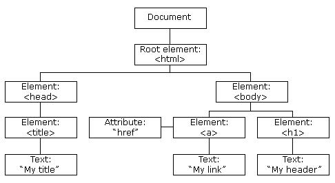

```
Programa de Ingeniería de Sistemas y Computación
Universidad del Quindío

Título: Configuración del proyecto frontend con Angular
Duración estimada: 120
Docentes: Carlos Andrés Florez
Guía: 14
```

# Configuración del proyecto frontend con Angular

## 🎯 Objetivo 

Construir y configurar la primera versión del proyecto frontend usando el framework Angular. Esta primera versión contempla la construcción de los componentes básicos y sus rutas.

---

## Conceptos básicos

- **HTML**: Lenguaje de etiquetas de hipertexto usado para estructurar páginas web.
- **Hojas de estilo CSS**: Lenguaje utilizado para describir la presentación de un documento HTML a través de estilos que definen colores, fuentes, tamaños, etc.
- **Lenguaje de programación TypeScript**: Superset de JavaScript que añade tipado estático y otras características.
- **NPM (Node Package Manager)**: Gestor de paquetes para JavaScript que facilita la instalación y gestión de librerías y dependencias.
- **NodeJS**: Entorno de ejecución para JavaScript que permite ejecutar código JavaScript fuera del navegador.

---

## Contextualización Teórica

Angular [https://angular.io/](https://angular.io/) es un framework de código abierto desarrollado por Google, diseñado para construir aplicaciones web dinámicas y de una sola página (SPA).

Angular utiliza una **arquitectura basada en componentes**, donde cada componente encapsula la lógica, la plantilla (vista) y los estilos asociados a una parte específica de la interfaz de usuario.

Además, el framework se apoya en **TypeScript** como lenguaje principal y ofrece características avanzadas como inyección de dependencias, enrutamiento, servicios, data binding y detección de cambios, lo que facilita la creación de aplicaciones modulares, mantenibles y escalables.

### Funcionamiento y características de Angular

El funcionamiento de Angular se basa en varios conceptos clave:

- **Arquitectura basada en componentes:** Bloques fundamentales que combinan lógica, plantillas HTML y estilos CSS. Los componentes pueden anidarse para formar una jerarquía.
- **Directivas:** Manipulan el DOM (`ngIf`, `ngFor`, `ngModel`), y es posible crear directivas personalizadas.
- **Servicios:** Los servicios son clases TypeScript que se utilizan para organizar y compartir lógica de aplicación reutilizable, como la lógica de negocio, el acceso a datos, o la comunicación con servidores remotos. Los servicios pueden inyectarse en componentes u otros servicios a través del mecanismo de inyección de dependencias de Angular.
- **Inyección de Dependencias:** Angular utiliza un sistema de inyección de dependencias (DI) que facilita la creación, gestión e intercambio de dependencias entre diferentes partes de la aplicación. Esto promueve la modularidad y la reutilización del código.
- **Routing:** Angular proporciona un enrutador que permite la navegación entre diferentes vistas (componentes) de una aplicación SPA. El enrutador permite definir rutas para diferentes URLs y cargar los componentes correspondientes cuando se navega a esas rutas.
- **Módulos:** Los módulos en Angular son contenedores para organizar la aplicación en bloques funcionales. Los módulos pueden agrupar componentes, directivas, servicios y otros artefactos relacionados. El módulo raíz de una aplicación Angular se conoce como `AppModule`.

Otra característica importante es que Angular viene con una **interfaz de línea de comandos** (CLI) que facilita la creación, desarrollo y mantenimiento de aplicaciones Angular. La CLI permite generar automáticamente el código base de la aplicación, agregar componentes, servicios, directivas, etc. y realizar tareas de compilación, pruebas y despliegue.

### Aplicaciones web de una sóla página

Las aplicaciones web de una sola página, conocidas comúnmente como SPAs (**Single Page Applications**), son aplicaciones web que funcionan dentro de un único documento HTML y no requieren recargar la página completa durante el uso normal. En lugar de eso, actualizan dinámicamente el contenido mostrado al usuario, generalmente manipulando el **DOM** (Document Object Model) mediante JavaScript. Algunos ejemplos populares de SPAs incluyen aplicaciones como Gmail, Twitter, Facebook, Trello y Google Maps.

### DOM (Document Object Model)

El DOM (Document Object Model) es una representación estructurada de un documento HTML que el navegador genera al cargar una página web. Funciona como un árbol de nodos, donde cada nodo representa un elemento del documento, como etiquetas HTML, atributos, fragmentos de texto o comentarios.

En términos más simples, cuando un navegador carga una página, crea en memoria una estructura de datos que refleja su contenido. Esta estructura, conocida como DOM, permite acceder y modificar dinámicamente la página web, incluyendo su estructura, contenido y estilos. Gracias al DOM, es posible actualizar elementos en tiempo real mediante JavaScript.

Podemos ver una representación visual del DOM a continuación:



El DOM es un árbol jerárquico que representa la estructura del documento HTML. El nodo raíz del árbol es el objeto `document`, que representa todo el documento HTML, y cada elemento HTML se representa como un nodo hijo del nodo padre correspondiente.

Para más información: [https://www.hiberus.com/crecemos-contigo/que-es-angular-y-para-que-sirve/](https://www.hiberus.com/crecemos-contigo/que-es-angular-y-para-que-sirve/)

---

## Precauciones y recomendaciones

Verifique que tiene instalado NodeJS en su última versión para poder compilar y ejecutar la aplicación de Angular. Tenga en cuenta que el proyecto del backend no es necesario para esta guía, por lo que no es necesario tenerlo corriendo.

---

## Evaluación o Resultado

Se espera que el estudiante comprenda la utilidad de Angular en el desarrollo de aplicaciones web frontend. Además, debe tener claridad sobre los conceptos de componentes, rutas y la estructura básica de un proyecto en Angular.

---

## Procedimiento

### 1. Instalación de NodeJS

Antes de crear nuestra aplicación con Angular primero se debe instalar NodeJS en nuestro computador ya que esta herramienta es la que permite la ejecución, compilación y configuración de todo el entorno de desarrollo. 

Se puede descargar desde: [https://nodejs.org/en/download/](https://nodejs.org/en/download/)

### 2. Instalación de Angular CLI

Una vez instalado NodeJS ahora instalamos por medio de npm [https://www.npmjs.com/](https://www.npmjs.com/) el siguiente paquete: `@angular/cli`. Ingresamos al cmd de Windows o la terminal de GNU/Linux o Mac y escribimos lo siguiente:

```bash
npm install -g @angular/cli
```

Según el sistema operativo que tenga puede que sea necesario instalar npm por aparte. **Se espera que se instale Angular en su versión 20.** Para **comprobar la versión de angular** escriba en la terminal lo siguiente:

```bash
ng version
```

### 3. Creación del proyecto

Nos ubicamos en la carpeta donde queremos crear el proyecto y escribimos lo siguiente (puede cambiar **my-app** por otro nombre para el proyecto):

Instale primero **pnpm**:

```bash
npm install -g pnpm
```

Luego cree el proyecto con:

```bash
ng new my-app --package-manager=pnpm
```

Tenga en cuenta lo siguiente:

- Si nos pide que si queremos añadir Angular routing escribimos que si (y).
- Elegimos CSS como formato de hojas de estilos.
- Si nos pregunta si queremos **habilitar Server-Side Rendering (SSR) y Static Site Generation escribimos que no (N).**
- Si nos pregunta si queremos crear una aplicación `zoneless` **escribimos que no (N)**.
- En cuanto a la herramienta de IA puede elegir la que prefiera o ninguna.

El paquete **pnpm** es una alternativa a npm para la gestión de paquetes en proyectos JavaScript y TypeScript. Es conocido por su eficiencia en el manejo del espacio en disco y la velocidad de instalación de dependencias, ya que utiliza un enfoque de almacenamiento en caché y enlaces simbólicos para evitar duplicaciones innecesarias de paquetes.

> ⚠️ **Nota:** Al ejecutar el comando anterior, es necesario esperar hasta que se construya el proyecto y se descarguen las dependencias necesarias para que todo funcione correctamente (**esto puede tardar un rato**, tenga en cuenta que se requiere conexión a internet).

### 4. Estructura del proyecto

Ahora, en Visual Studio Code abrimos la carpeta del proyecto que acabamos de crear. La estructura de los archivos y carpetas debe verse así:

```
my-app/
├── node_modules/
├── public/
│   └── favicon.ico
├── src/
│   ├── app/
│   │   ├── app.config.ts 
│   │   ├── app.css 
│   │   ├── app.html
│   │   ├── app.routes.ts
│   │   ├── app.spec.ts 
│   │   └── app.ts
│   ├── index.html
│   ├── main.ts
│   └── styles.css
├── angular.json
├── package.json
├── pnpm-lock.yaml
├── README.md
├── tsconfig.app.json 
├── tsconfig.json
└── tsconfig.spec.json
```

Podemos identificar tres carpetas importantes:

- **node_modules:** Contiene todos las dependencias usadas en el proyecto. No se debe modificar nada dentro de esta carpeta.
- **public:** Archivos estáticos de estilos, imágenes, iconos, fuentes, etc.
- **src:** Contiene los archivos de código fuente del proyecto.

Dentro de esas carpetas se destacan los siguientes archivos:

- **index.html:** Página web principal de la aplicación.
- **styles.css:** Contiene los estilos globales de la aplicación.
- **package.json:** es la configuración de nuestra aplicación. Contiene el nombre de la app, las dependencias necesarias para su correcta ejecución y muchas otras cosas.
- **angular.json:** es el archivo de configuración principal de un proyecto Angular. Contiene información sobre la estructura del proyecto, las configuraciones de compilación, las rutas de los archivos, las opciones de construcción y otras configuraciones específicas de Angular.
- **main.ts:** es el punto de entrada de la aplicación Angular. Cuando se inicia la aplicación, este archivo se ejecuta primero. Su función principal es inicializar la aplicación y cargar el módulo raíz (generalmente llamado `AppModule`) o componente raíz (`App`).
- **App:** Es el componente raíz de una aplicación Angular. Un componente puede representar toda una página web completa o parte de esta. Por lo general, cada componente está compuesto por cuatro archivos:
  - **app.ts:** Archivo TypeScript que contiene la lógica del componente.
  - **app.html:** Archivo HTML que define la estructura visual del componente.
  - **app.css:** Archivo CSS que contiene los estilos específicos del componente.
  - **app.spec.ts:** Archivo utilizado para pruebas unitarias del componente.

Para más información:

- [https://medium.com/notasdeangular/componentes-en-angular-f25138b00c83](https://medium.com/notasdeangular/componentes-en-angular-f25138b00c83)
- [https://danielherresan.medium.com/arquitectura-limpia-en-angular-17-25c129ed2f7a](https://danielherresan.medium.com/arquitectura-limpia-en-angular-17-25c129ed2f7a)
- [https://imaginaformacion.com/tutoriales/aprende-angular-7-tutorial-de-primeros-pasos](https://imaginaformacion.com/tutoriales/aprende-angular-7-tutorial-de-primeros-pasos)

### 5. Ejecución de la aplicación

Ya podemos ejecutar la aplicación. Para ejecutar la app escribimos lo siguiente en el cmd de Windows o en la terminal de GNU/Linux o Mac:

```bash
ng serve --open
```

Es importante mencionar que este comando se debe ejecutar dentro de la carpeta raíz del proyecto. Una vez ejecutada la aplicación, queda corriendo de manera ininterrumpida (en el puerto **4200**), es decir que cada que hagamos cambios dentro del código, esta se compilará y se ejecutará automáticamente.

La bandera `--open` indica que después de compilar la aplicación, se abrirá automáticamente en el navegador web predeterminado.

> ⚠️ **Nota:** Aunque aún no hemos programado nada, ya podemos ver la página web inicial que genera Angular.

### 6. Creación de carpetas del proyecto

Dentro de la carpeta `src/app` vamos a crear cuatro carpetas: `models`, `pages`, `components` y `services`. El propósito de cada carpeta se explica a continuación:

- **models:** Contendrá las clases o interfaces que representan los objetos intercambiados con el backend, ya sea para recibir datos o enviarlos.
- **pages:** Aquí se definirán los componentes que representan las distintas páginas web de la aplicación.
- **components:** Incluirá componentes reutilizables que forman parte de una página web o elementos independientes que pueden utilizarse en diferentes secciones.
- **services:** Almacena los servicios encargados de la comunicación con la API del backend o del manejo de lógica de negocio.

### 7. Generación de componentes de páginas

Dentro de la carpeta `pages` vamos a crear algunos componentes que representen la página de inicio, el login y el registro de usuarios. Para esto en el cmd de Windows o en la terminal de Linux o Mac escriba lo siguiente:

```bash
ng generate component home --skip-tests
```

```bash
ng generate component login --skip-tests
```

```bash
ng generate component register --skip-tests
```

> ⚠️ **IMPORTANTE:** Es importante mencionar que estos comandos se deben ejecutar dentro de la carpeta `pages` creada en el punto anterior. 

Una vez ejecutados los anteriores comandos, ahora se debe ver así la estructura de archivos del proyecto:

```my-app/
├── node_modules/
├── public/
│   └── favicon.ico
├── src/
│   ├── app/
│   │   ├── components/
│   │   ├── models/
│   │   ├── pages/
│   │   │   ├── home/
│   │   │   │   ├── home.css
│   │   │   │   ├── home.html
│   │   │   │   └── home.ts
│   │   │   ├── login/
│   │   │   │   ├── login.css
│   │   │   │   ├── login.html
│   │   │   │   └── login.ts
│   │   │   └── register/
│   │   │       ├── register.css
│   │   │       ├── register.html
│   │   │       └── register.ts
│   │   ├── services/
│   │   ├── app.config.ts 
│   │   ├── app.css 
│   │   ├── app.html
│   │   ├── app.routes.ts
│   │   ├── app.spec.ts 
│   │   └── app.ts
│   ├── index.html
│   ├── main.ts
│   └── styles.css
├── angular.json
├── package.json
├── pnpm-lock.yaml
├── README.md
├── tsconfig.app.json 
├── tsconfig.json
└── tsconfig.spec.json
```

### 8. Estructura de un componente

Como se puede observar en la imagen anterior, se creó una carpeta para cada página. Cada carpeta contiene el archivo `.css`, `.html` y `.ts`. Abra cada uno de los archivos y analice su contenido.

Un archivo `.ts` de un componente suele tener la siguiente estructura:

```typescript
import { Component } from '@angular/core';

@Component({
  selector: 'app-home',
  imports: [],
  templateUrl: './home.html',
  styleUrl: './home.css'
})
export class Home {

}
```

Se resalta la anotación (decorador) `@Component` que indica que la clase que sigue es un componente de Angular. Dentro del decorador se tienen varios atributos:

- **selector:** es el nombre que se le da al componente para poder usarlo en otros componentes. Por ejemplo, si quiero usar el componente `home` dentro del componente `app` debo escribir `<app-home></app-home>` en el archivo `app.html`.
- **imports:** es una lista de otros componentes o módulos que se van a usar dentro del componente actual.
- **templateUrl:** es la ruta del archivo `.html` que contiene la estructura visual del componente.
- **styleUrl:** es la ruta del archivo `.css` que contiene los estilos del componente.

Un archivo `.html` de un componente suele tener la siguiente estructura:

```html
<p>inicio works!</p>
```

Los archivos `.html` por ahora son muy simples, pero más adelante se irán programando con formularios, tablas, listas, botones, etc. 

El archivo `.css` por defecto está vacío. Aquí se pueden definir los estilos del componente usando el lenguaje CSS.

### 9. Modificación del componente raíz

Modifique el archivo `app.html` para que quede así:

```html
<header>
  <p>Página inicial de {{ title() }}</p>
  <ul>
    <li><a href="#">Inicio</a></li>
    <li><a href="#">Login</a></li>
    <li><a href="#">Registro</a></li>
  </ul>
</header>

<router-outlet></router-outlet>

<footer>
  <p>Universidad del Quindío - 2025</p>
</footer>
```

El archivo `app.html` se divide en tres partes:

- **Header:** Contiene el título de la página y un menú de navegación con tres opciones: Inicio, Login y Registro.
- **Router-outlet:** Es un componente especial de Angular que actúa como un marcador de posición para cargar los componentes asociados a las rutas definidas en la aplicación. Básicamente, es el lugar donde se renderiza el contenido dinámico según la ruta actual. Por ahora no hace nada, pero más adelante se verá su utilidad.
- **Footer:** Contiene un pie de página con información adicional.

Observe que se estamos usando la variable `title` dentro de `{{ }}`. La variable `title` es un `signal`. Este signal está definido en el archivo `app.ts`. 

Un **signal** es una forma de manejar el estado reactivo en Angular. Permite definir variables que pueden cambiar con el tiempo y que, cuando lo hacen, notifican automáticamente a cualquier parte de la aplicación que esté observando esos cambios.

Para más información sobre signals: [https://angular.dev/guide/signals](https://angular.dev/guide/signals)

### 10. Uso de variables en plantillas

Agregue otra variable en la clase `App` y úsela en el archivo `app.html`. La variable se puede llamar `footer` y asígnele el valor: `"Universidad del Quindío 2025"`, modifique el archivo HTML para que use esta variable en lugar de tener el texto "quemado". Se puede basar en la variable `title`, que ya existe en dicha clase.

Tenga en cuenta que esto se puede hacer con variables simples como números, string, boolean, pero también con listas y objetos.

### 11. Configuración de rutas

Modifique el archivo `app.routes.ts` para que se vea así:

```typescript
import { Routes } from '@angular/router';
import { Home } from './pages/home/home';
import { Login } from './pages/login/login';
import { Register } from './pages/register/register';
import { CreatePlace } from './pages/create-place/create-place';

export const routes: Routes = [
    { path: '', component: Home },
    { path: 'login', component: Login },
    { path: 'register', component: Register },
    { path: "**", pathMatch: "full", redirectTo: "" }
];
```

Este archivo permite definir las rutas de toda la aplicación web, observe que dentro de la lista `routes` se tienen varios objetos, cada uno con el atributo `path` y `component`.

- **path:** es la ruta que utilizaremos en el navegador para acceder al componente web. El `path` puede ser estático o dinámico. Por ejemplo, si queremos acceder al detalle de un producto, probablemente necesitemos pasar el ID del mismo a través de la URL; en ese caso, el `path` se podría definir así: `'product/:id'`. Además, desde este mismo archivo es posible agregar filtros de navegación a las rutas, por ejemplo, para restringir el acceso a determinadas páginas solo a los usuarios que hayan iniciado sesión.
- **component:** es el componente que se cargará cuando se acceda a la ruta definida en `path`. Por ejemplo, si accedemos a la ruta `/login`, se cargará el componente `Login`.

Algo importante a mencionar es que (`path: "**"`) es una ruta comodín que coincide con cualquier ruta no definida en la lista. En este caso, redirige a la ruta raíz (`""`), que carga el componente `Home`. Esto es útil para manejar rutas no encontradas o errores 404. **Siempre debe ir al final de la lista de rutas.**

> ⚠️ **NOTA:** Se recomienda instalar la extensión **Angular Language Service** en Visual Studio Code para que sea más fácil programar ya que hace autocompletados más rápidos, también hace sugerencias y . Para autocompletar puede usar Ctrl+Espacio (igual a como se hace en IntelliJ o Eclipse).

### 12. Actualización de enlaces de navegación

Ahora modifique las rutas del menú que tenemos en `app.html` para que quede así:

```html
<header>
  <p>Página inicial de {{ title() }}</p>
  <ul>
    <li><a href="">Inicio</a></li>
    <li><a href="/login">Login</a></li>
    <li><a href="/register">Registro</a></li>
  </ul>
</header>

<router-outlet></router-outlet>

<footer>
  <p>{{ footer() }}</p>
</footer>
```

Pruebe dando click en cada link y observe cómo cambia la url y el contenido de la página de acuerdo a la opción elegida. El componente `router-outlet` está cambiando en función de la ruta seleccionada.

### 13. Uso de `routerLink`

Finalmente, para una navegación más adecuada se recomienda hacer uso de `routerLink` y no de href en la etiqueta `<a>`. Haga el cambio y evidencie los resultados.

```html
<ul>
  <li><a routerLink="">Inicio</a></li>
  <li><a routerLink="/login">Login</a></li>
  <li><a routerLink="/register">Registro</a></li>
</ul>
```

`routerLink` se utiliza para crear **enlaces de navegación en la aplicación**. Angular maneja el enrutamiento de la aplicación y carga la vista correspondiente sin recargar la página totalmente (solo actualiza el componente que sea necesario).

Agregue en la lista de `imports` del archivo `app.ts` el siguiente módulo: `RouterModule`. Debe hacer el import correspondiente (es parecido a los imports que hacemos en Java).

> ⚠️ **IMPORTANTE:** Siempre que se vaya a usar `routerLink` en un componente debe agregar `RouterModule` en los imports del mismo.

### 14. Creación de páginas adicionales

Cree las páginas adicionales necesarias para cumplir con los requerimientos del proyecto final. No olvide agregar la ruta correspondiente en el archivo `app.routes.ts` para cada una de ellas.

Por ahora, las páginas pueden estar vacías; en las siguientes guías se irán programando. Recuerde que un componente puede estar asociado a una página web completa o a elementos reutilizables en varias páginas, como el header y el footer.

### 15. Control de versiones

Cree un nuevo repositorio en GitHub y guarde allí todo lo hecho en esta guía.

---

## Para la próxima clase

- Haga una revisión de la documentación sobre el lenguaje de programación TypeScript. Este lenguaje es fundamental para el desarrollo de aplicaciones con Angular. A continuación les comparto algunas páginas que pueden ser de utilidad.
  - [https://profile.es/blog/que-es-typescript-vs-javascript/](https://profile.es/blog/que-es-typescript-vs-javascript/)
  - [https://www.typescriptlang.org/docs/](https://www.typescriptlang.org/docs/)
  - [https://www.w3schools.com/typescript/typescript_intro.php](https://www.w3schools.com/typescript/typescript_intro.php)
  - [https://medium.com/orbit-software/conceptos-basicos-de-typescript-6fd983610a38](https://medium.com/orbit-software/conceptos-basicos-de-typescript-6fd983610a38)

- Investigue qué es la **carga diferida o carga perezosa** de módulos y componentes en Angular. Qué beneficios trae y cómo lo podemos usar en el archivo `app.routes.ts` por medio de `loadComponent()`.
- Qué son los `signals` en Angular, para qué sirven y cómo se usan.