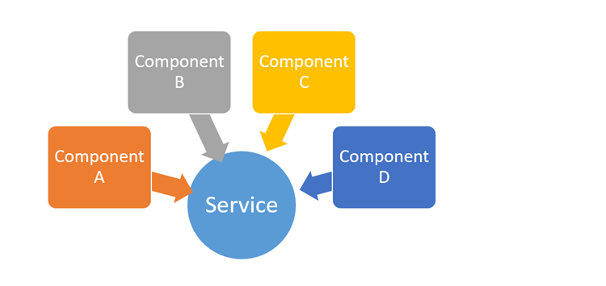

```
Programa de Ingeniería de Sistemas y Computación
Universidad del Quindío

Título: Servicios en Angular
Duración estimada: 120
Docentes: Carlos Andrés Florez
Guía: 17
```

# Servicios en Angular 

## 🎯 Objetivo 

Entender el concepto de servicios en Angular y su utilidad para compartir datos y funcionalidades entre diferentes componentes de una aplicación.

---

## Conceptos básicos

- **HTML**: Lenguaje de etiquetas de hipertexto usado para estructurar páginas web.
- **Framework CSS**: Conjunto de herramientas y convenciones predefinidas que facilitan el desarrollo de interfaces web estilizadas, por ejemplo: Bootstrap.
- **Lenguaje de programación TypeScript**: Superset de JavaScript que añade tipado estático y otras características.
- **Componentes en Angular**: Bloques reutilizables de código que encapsulan la lógica, la plantilla HTML y los estilos CSS para crear partes independientes de una aplicación web.
  
---

## Contextualización Teórica

Un servicio en Angular es una **clase que encapsula lógica y datos** que pueden ser compartidos entre diferentes componentes de una aplicación. Los servicios son ideales para manejar tareas comunes como la gestión de datos, la comunicación con APIs, la autenticación, entre otros.

Los servicios se crean utilizando el comando `ng generate service nombre-del-servicio` y se **inyectan en los componentes mediante el constructor**. Esto permite que varios componentes utilicen la misma instancia del servicio, lo que facilita compartir datos y funcionalidades entre ellos, como se muestra en la siguiente imagen:



Un ejemplo común de uso de servicios es la gestión de datos. Un servicio puede encargarse de realizar operaciones CRUD (Crear, Leer, Actualizar, Eliminar) en memoria o a través de una API, y los componentes pueden llamar a estos métodos para interactuar con los datos sin necesidad de duplicar la lógica en cada componente.

En Angular se promueve la **segregación de responsabilidades**, por lo que es recomendable crear servicios específicos para diferentes funcionalidades en lugar de tener un único servicio monolítico, y tampoco es recomendable que un componente maneje la lógica de negocio directamente. Esto mejora la mantenibilidad y la reutilización del código.

---

## Precauciones y Recomendaciones

Verifique que tiene instalado NodeJS en su última versión para poder compilar y ejecutar la aplicación de Angular. Tener instalada la extensión de **Angular Language Service** en Visual Studio Code.

---

## Evaluación o Resultado

Se espera que el estudiante sea capaz de crear un servicio en Angular que maneje una lista de alojamientos, y que pueda ser utilizado por diferentes componentes para mostrar, crear, actualizar y eliminar alojamientos. Además, se espera que el estudiante implemente una interfaz de usuario básica utilizando Bootstrap para el diseño y SweetAlert2 para las notificaciones.

---

## Procedimiento

### 1. Creación del componente de gestión de alojamientos

Para la gestión de alojamientos por parte del cliente, crearemos un componente que incluirá una tabla con información básica de cada alojamiento y un enlace para ver los detalles de cada uno. Además, agregaremos botones para crear, actualizar y eliminar. Este componente servirá para programar un CRUD completo.

Escriba lo siguiente en el cmd de Windows o la terminal de GNU/Linux o Mac (se debe ejecutar en la carpeta **pages** del proyecto de Angular).

```bash
ng generate component my-places --skip-tests
```

### 2. Configuración de la ruta

Agregue una nueva ruta en el archivo `app.routes.ts` dentro de la lista routes:

```typescript
{ path: "my-places", component: MyPlaces }
```

> ⚠️ **Importante:** Asegúrese que el último elemento de la lista `routes` siempre sea la que tiene la ruta `path: "**"`.

### 3. Actualización del menú de navegación

Modifique el menú de navegación del header (archivo `header.html`) para añadir un item que tenga un link que permita acceder al componente de gestión de alojamientos. Debe quedar así:

```html
<li><a routerLink="/my-places" class="nav-link px-2 text-white">Gestión Alojamientos</a></li>
```

### 4. Creación del servicio de alojamientos

Para probar el aspecto visual de la página vamos a crear un servicio. Este servicio contendrá una lista de alojamientos que podemos usar en diferentes componentes de la aplicación.

Escriba lo siguiente en el cmd de Windows o en la terminal de GNU/Linux o Mac (recuerde ejecutar esto en la carpeta **services** del proyecto de Angular):

```bash
ng generate service places-service --skip-tests
```

### 5. Implementación del servicio de alojamientos

Modifique la clase `PlacesService` del archivo creado en el punto anterior para que quede así:

```typescript
import { Injectable } from '@angular/core';
import { PlaceDTO } from '../models/place-dto';

@Injectable({
  providedIn: 'root'
})
export class PlacesService {
  places: PlaceDTO[];
  
  constructor(){
    this.places = this.createTestPlaces();
  }

  public getAll() {
    return this.places;
  }

  public save(newPlace: PlaceDTO) {
    newPlace.id = Math.floor(Math.random() * (5000 + 1)); // Genera un ID aleatorio entre 0 y 5000
    this.places.push(newPlace);
  }

  public get(id: number): PlaceDTO | undefined {
    return this.places.find(place => place.id == id); 
  }

  public delete(id: number) {
    this.places = this.places.filter(place => place.id != id);
  }

  public update(id: number, updatedPlace: PlaceDTO) {
    const indice = this.places.findIndex(place => place.id == id);
    if (indice != -1) {
      this.places[indice] = updatedPlace;
    }
  }
}
```

Esta clase tiene una lista de alojamientos quemados, que por ahora nos sirven para probar, dicha lista se puede consultar por medio de la función `getAll()`. Además, tenemos la función `get()`, `save()`, `delete()` y `update()` que usaremos para interactuar con los alojamientos de prueba.

Dado que **TypeScript es un lenguaje que soporta programación funcional**, se usan funciones como `find()` y `filter()` para buscar y filtrar elementos en la lista de alojamientos en lugar de usar bucles `for` tradicionales.

Para más información sobre las funciones usadas para manipular las listas:

- [https://developer.mozilla.org/en-US/docs/Web/JavaScript/Reference/Global_Objects/Array/find](https://developer.mozilla.org/en-US/docs/Web/JavaScript/Reference/Global_Objects/Array/find)
- [https://developer.mozilla.org/en-US/docs/Web/JavaScript/Reference/Global_Objects/Array/filter](https://developer.mozilla.org/en-US/docs/Web/JavaScript/Reference/Global_Objects/Array/filter)

### 6. Función para crear alojamientos de prueba

Agregue la siguiente función que crea alojamientos de prueba en la clase `PlacesService`:

```typescript
private createTestPlaces(){

  return [
    {
      id: 1,
      title: 'Casa de Campo El Roble',
      description: 'Hermosa casa campestre con vista a las montañas y chimenea.',
      images: [
        'https://example.com/images/campo1.jpg',
        'https://example.com/images/campo2.jpg'
      ],
      services: ['WiFi', 'Parqueadero', 'Chimenea', 'Zona BBQ'],
      maxGuests: 6,
      pricePerNight: 250000,
      hostId: 'host_001',
      address: {
        city: 'Manizales',
        address: 'Vereda El Rosario, km 5 vía Neira',
        location: { latitude: 5.0703, longitude: -75.5138 }
      }
    },
    {
      id: 2,
      title: 'Apartamento Moderno en el Centro',
      description: 'Apartamento completamente amoblado, ideal para estancias cortas.',
      images: [
        'https://example.com/images/apto1.jpg',
        'https://example.com/images/apto2.jpg'
      ],
      services: ['WiFi', 'Ascensor', 'Aire acondicionado'],
      maxGuests: 3,
      pricePerNight: 180000,
      hostId: 'host_002',
      address: {
        city: 'Bogotá',
        address: 'Carrera 7 #45-20, Chapinero',
        location: { latitude: 4.6486, longitude: -74.0635 }
      }
    },
    {
      id: 3,
      title: 'Cabaña en el Lago Azul',
      description: 'Relájate en una cabaña frente al lago con acceso directo al muelle.',
      images: [
        'https://example.com/images/lago1.jpg',
        'https://example.com/images/lago2.jpg'
      ],
      services: ['WiFi', 'Kayaks', 'Fogata', 'Restaurante'],
      maxGuests: 4,
      pricePerNight: 300000,
      hostId: 'host_003',
      address: {
        city: 'Guatapé',
        address: 'Orilla del embalse, sector El Peñol',
        location: { latitude: 6.2333, longitude: -75.1667 }
      }
    }
  ];

}
```

Puede agregar más alojamientos de prueba si lo desea. Use ChatGPT para que le genere más alojamientos de prueba.

### 7. Creación de la interfaz `PlaceDTO`

Es necesario crear la interfaz `PlaceDTO` (recuerde ejecutar esto en la carpeta **models** del proyecto):

```bash
ng generate interface place-dto
```

Esto representa el Data Transfer Object (DTO) que encapsula los datos de un alojamiento.

### 8. Definición de la interfaz `PlaceDTO`

El contenido de dicho archivo debe quedar así:

```typescript
export interface PlaceDTO {
    id: number;
    title: string;
    description: string;
    images: string[];
    services: string[];
    maxGuests: number;
    pricePerNight: number;
    hostId: string;
    address: Address;
}

export interface AddressDTO{
    city: string;
    address: string;
    location: Location;
}

export interface LocationDTO{
    latitude: number;
    longitude: number;
}
```

Estas estructuras deben coincidir con sus equivalentes en el backend. Cabe destacar que son interfaces ya que su propósito es únicamente encapsular y agrupar los datos correspondientes a un alojamiento, no contienen lógica de negocio.

> ⚠️ **Importante:** En esta guía, todas las operaciones se realizan utilizando un único DTO (`Place`) para simplificar el proceso. Sin embargo, es importante recordar que en el backend los alojamientos cuentan con diferentes DTOs según los servicios específicos. Esto será más evidente al integrar el backend.

### 9. Configuración del componente de gestión

Modifique el archivo `my-places.ts` para que tenga una lista de alojamientos, la lista es de tipo `Place[]` y debe inicializarse en el constructor de la clase. El archivo debe quedar así:

```typescript
import { Component } from '@angular/core';
import { PlaceDTO } from '../../models/place-dto';
import { PlacesService } from '../../services/places-service';

@Component({
  selector: 'app-my-places',
  imports: [],
  templateUrl: './my-places.html',
  styleUrl: './my-places.css'
})
export class MyPlaces {

  places: PlaceDTO[];

  constructor(private placesService: PlacesService) {
    this.places = this.placesService.getAll();
  }

}
```

El elemento más importante de este componente es la lista de alojamientos (`places`), por lo tanto se crea una variable que representa dicha lista y en el constructor de la clase llamamos la función `getAll()` del servicio `PlacesService` que se hizo previamente y que contiene alojamientos de prueba. **Más adelante haremos que la lista se inicialice haciendo uso de un servicio de backend.**

Cuando un componente necesite usar el servicio de alojamientos, simplemente se debe agregar un parámetro en el constructor de la clase que sea del tipo del servicio (`PlacesService`) y Angular se encargará de inyectar la instancia del servicio en el componente. 

La **inyección de dependencias** es una característica poderosa de Angular que facilita la reutilización de código y la gestión de dependencias entre diferentes partes de la aplicación.

### 10. Creación de la tabla de alojamientos

Modifique el archivo `my-places.html` para mostrar los alojamientos en una tabla. Para crear la tabla usaremos HTML junto con clases de Bootstrap y algunos iconos de Material Symbols. Copie el siguiente código en el archivo `my-places.html`:

```html
<div class="container pt-5 pb-5">
    <h5 class="mb-0 d-flex align-items-center">
        <span class="material-symbols-rounded filled fs-2 me-3">apartment</span>
        Gestión de alojamientos
    </h5>
    <hr />

    <div class="card-body">
        <div class="mb-3">
            <button type="button" routerLink="/create-place"
                class="btn btn-success d-flex align-items-center justify-content-center gap-1">
                <span class="material-symbols-rounded filled me-1">add</span>
                Crear nuevo
            </button>
        </div>

        <div class="table-responsive">
            <table class="table align-middle table-striped table-hover mb-0">
                <thead class="text-center">
                    <tr>
                        <th scope="col">ID</th>
                        <th scope="col">Título</th>
                        <th scope="col">Imagen</th>
                        <th scope="col">Ciudad</th>
                        <th scope="col">Dirección</th>
                        <th scope="col" class="text-center">Acciones</th>
                    </tr>
                </thead>

                <tbody class="table-group-divider">
                    @for (item of places; track $index) {
                    <tr>
                        <td class="text-muted text-center">{{ item.id }}</td>
                        <td class="fw-semibold">{{ item.title }}</td>
                        <td class="text-center">
                            
                        </td>
                        <td>{{ item.address.city }}</td>
                        <td>{{ item.address.address }}</td>
                        <td class="text-center">
                            <a routerLink="/place/{{item.id}}">Ver detalle</a>
                        </td>
                    </tr>
                    }
                </tbody>
            </table>
        </div>

    </div>
</div>
```

Se destaca lo siguiente:

- Se usa una tabla con clases de Bootstrap para el diseño.
- Se utiliza un bucle `@for` para iterar sobre la lista de alojamientos (`places`) y generar una fila por cada alojamiento.
- Se muestran columnas para el ID, título, imagen, ciudad, dirección y acciones.
- Se utiliza `routerLink` para crear un enlace que permita ver el detalle de cada alojamiento. **Recuerde agregar el import** de `RouterModule` en el decorador `@Component` del archivo `my-places.ts`.
- Hay un botón para crear un nuevo alojamiento que redirige a la página de creación.

Por el momento, los datos están definidos de forma estática en `PlacesService` como ejemplo; más adelante deberán obtenerse desde el backend, utilizando los alojamientos almacenados en la base de datos.

### 11. Verificación del componente de gestión

**Ejecute el proyecto, ingrese a la página de gestión de alojamientos** y observe que se muestran los alojamientos creados en `PlacesService`.

### 12. Botones de edición y eliminación

Por cada fila de la tabla, agregue dos botones más en la columna de acciones, uno para editar y otro para eliminar. El botón de editar debe redirigir a una página que permita actualizar el alojamiento, mientras que el botón de eliminar debe permitir borrar el alojamiento seleccionado. Modifique la columna de acciones para que quede así:

```html
<td class="text-center">
    <!-- Botón Ver -->
    <a routerLink="/place/{{item.id}}" class="btn btn-outline-primary btn-icon me-1"
        title="Ver detalle">
        <span class="material-symbols-rounded">visibility</span>
    </a>

    <!-- Botón Editar -->
    <button routerLink="/edit-place/{{item.id}}" type="button" class="btn btn-outline-success btn-icon me-1" title="Editar">
        <span class="material-symbols-rounded">edit</span>
    </button>

    <!-- Botón Eliminar -->
    <button (click)="onDelete(item.id)" type="button" class="btn btn-outline-danger btn-icon" title="Eliminar" >
        <span class="material-symbols-rounded">delete</span>
    </button>
</td>
```

### 13. Función de eliminación

En el componente de gestión de alojamientos (`my-places.ts`), agregue la función `onDelete(placeId: number)` que se ejecuta cuando el usuario hace clic en el botón de eliminar. Esta función debe llamar al servicio para eliminar el alojamiento y actualizar la lista. 

```typescript
public onDelete(placeId: number) {
  this.placesService.delete(placeId);
  this.places = this.places.filter( p => p.id !== placeId);
}
```

### 14. Verificación de la funcionalidad de eliminación

**Ejecute el proyecto, ingrese a la página de gestión de alojamientos**, intente eliminar un alojamiento y observe que se elimina correctamente de la tabla.

### 15. Instalación y configuración de `SweetAlert2`

Eliminar un alojamiento es una acción delicada, por lo tanto, es recomendable pedir una confirmación al usuario antes de proceder con la eliminación. Para esto, usaremos la librería `SweetAlert2` que permite mostrar alertas bonitas y personalizables.

```typescript
public onDelete(placeId: number) {

  Swal.fire({
    title: "¿Estás seguro?",
    text: "Esta acción cambiará el estado de los alojamientos a Eliminados.",
    icon: "error",
    showCancelButton: true,
    confirmButtonText: "Confirmar",
    cancelButtonText: "Cancelar",
  }).then((result) => {
    if (result.isConfirmed) {
      this.placesService.delete(placeId);
      this.places = this.places.filter(p => p.id !== placeId);
      Swal.fire("Eliminado!", "El alojamiento ha sido eliminado correctamente.", "success");
    }
  });

}
```

Esta es una pequeña alerta que le indica al usuario si está seguro de borrar el elemento seleccionado, para que funcione, debe instalar la librería `Sweetalert2` [https://sweetalert2.github.io/](https://sweetalert2.github.io/), para esto simplemente ejecute el siguiente comando en la carpeta raíz de su proyecto de angular:

```bash
pnpm install sweetalert2
```

Puede usar esta alerta para informar sobre errores, mensajes de confirmación, mensajes exitosos, etc. Se recomienda leer la documentación: [https://sweetalert2.github.io/#examples](https://sweetalert2.github.io/#examples)

> ⚠️ **Importanete:** Una vez instalada, para usar la alerta debe importarla a nivel la clase. Se importa agregando lo siguiente:

```typescript
import Swal from 'sweetalert2';
```

### 16. Verificación de la funcionalidad de eliminación

**Ingrese a la página web** creada y verifique que todo funciona correctamente. Trate de eliminar un alojamiento y observe que aparece la alerta de confirmación, si confirma, el alojamiento debe eliminarse y debe aparecer una alerta de éxito.

### 17. Creación del componente de detalle

Para que funcione el link de ver todo el detalle de un alojamiento se debe crear un nuevo componente. Escriba lo siguiente en el cmd de Windows o en la terminal de GNU/Linux o Mac (recuerde ejecutar esto en la carpeta **pages** del proyecto de Angular):

```bash
ng generate component detail-place --skip-tests
```

### 18. Configuración de rutas con parámetros

Adicionalmente, se deben agregar dos nuevas rutas en el archivo app.routes.ts dentro de la lista routes:

```typescript
{ path: 'place/:id', component: DetailPlace }
```

> ⚠️ **IMPORTANTE**: Asegúrese que el último elemento de la lista siempre sea la que tiene la ruta con el `path: "**"`.

Observe que la ruta `place` tiene un parámetro en la url (`:id`), este id se enviará por la url cuando el usuario le de click al link "Ver detalle" de un alojamiento, esto lo puede ver en la tabla de alojamientos (creada en el punto 10) ya que el `routerLink` de dicho link tiene concatenado el id de cada alojamiento.

Cuando una ruta lleva parámetros en la url se define con `":"`. Por ejemplo `:id`. Esto hace que cualquier valor que se pase después del `"/"` se guarde en la variable `id`.

### 19. Implementación del componente de detalle

Modifique el archivo `detail-place.ts` para que quede así:

```typescript
import { Component } from '@angular/core';
import { ActivatedRoute } from '@angular/router';
import { PlacesService } from '../../services/places-service';
import { Place } from '../../models/place';
import { JsonPipe } from '@angular/common';

@Component({
  selector: 'app-detail-place',
  imports: [JsonPipe],
  templateUrl: './detail-place.html',
  styleUrl: './detail-place.css'
})
export class DetailPlace {

  placeId: string = "";
  place: Place | undefined;

  constructor(private route: ActivatedRoute, private placesServices:PlacesService){
    this.route.params.subscribe( (params) => {
      this.placeId = params["id"];
      this.get(this.placeId);
    });
  }

  public get(placeID: string){
    // El id que se recibe por la url es de tipo string, pero en el servicio es de tipo number por eso se hace el parseInt
    const selectedPlace = this.placesServices.get(parseInt(placeID));
    if(selectedPlace != undefined){
      this.place = selectedPlace;
    }
  }

}
```

Se destaca lo siguiente:

- Se importa `ActivatedRoute` para capturar los parámetros que se envían por la url. El nombre del parámetro debe coincidir con el que se puso en el archivo `app.routes.ts`. En este caso `id`.
- Se importa `JsonPipe` para mostrar el objeto en formato JSON en el HTML (esto es solo para pruebas).
- Se crea una variable `placeId` para almacenar el id del alojamiento.
- Se crea una variable `place` para almacenar el objeto completo del alojamiento dado el id.
- En el constructor de la clase se suscribe a los cambios en los parámetros de la url. Cuando se detecta un cambio, se actualiza la variable `placeId` y se llama a la función `get()` para obtener el alojamiento correspondiente.
- Se crea la función `get()` que obtiene el objeto completo del alojamiento usando el servicio `PlacesService`.
- Se actualiza la variable `place` con el alojamiento obtenido.

### 20. Vista del detalle del alojamiento

Modifique el archivo `detail-place.html` para que quede así:

```html
<p>{{place | json}}</p>
```

Por ahora, simplemente se está imprimiendo el objeto en el HTML a manera de prueba para validar que funciona.

### 21. Verificación del detalle

**Ejecute el proyecto, ingrese a la página del detalle de un alojamiento desde la página de gestión de alojamientos** y observe que todo funciona correctamente.

Haga que esta página tenga un diseño más acorde de acuerdo a su mockup del detalle de un alojamiento.

### 22. Funcionalidad de edición

Con base en lo explicado en esta guía, **implemente la funcionalidad para editar (actualizar) un alojamiento**. Considere reutilizar el formulario existente para crear un alojamiento. Para ello, puede agregar una nueva ruta en el archivo de rutas (`app.routes.ts`) que reciba el ID del alojamiento a actualizar como parámetro en la URL. Esta nueva ruta puede apuntar al componente de creación de alojamientos, donde podrá programar la lógica necesaria para cargar los datos del alojamiento en el formulario y permitir su edición.

La ruta puede quedar así:

```typescript
{ path: 'edit-place/:id', component: CreatePlace }
```

### 23. Alertas de notificación

Utilice la librería `Sweetalert2` para notificar al usuario sobre cualquier acción o resultado de la aplicación. 

Por ejemplo, al crear un alojamiento, puede lanzar una alerta como la siguiente (recuerde que este método debe ya está creado en la clase `CreatePlace`):

```typescript
public createNewPlace() {
  this.placesService.save(this.createPlaceForm.value);
  Swal.fire("Exito!", "Se ha creado un nuevo alojamiento.", "success");
}
```

Se asume que ya existe el componente `CreatePlace` y que `createPlaceForm` es el formulario reactivo que contiene los datos del nuevo alojamiento. Así mismo, se asume que `placesService` se ha inyectado en el constructor de la clase.

> **⚠️ IMPORTANTE:** Para usar la alerta debe importarla a nivel la clase, así como se hizo en el componente de gestión de alojamientos. Se importa así:

```typescript
import Swal from 'sweetalert2';
```

### 24. Verificación de alertas

**Ejecute el proyecto, ingrese a la página del crear un nuevo alojamiento** y observe que la alerta si se muestra correctamente. Recuerde usar esta alerta en las demás páginas donde la requiera.

### 25. Control de versiones

Recuerde guardar todos los cambios en GIT y en GitHub.

---

## Para la próxima clase

- Investigue acerca de **MapBox**, qué ventajas tiene sobre Google Maps y cómo puede integrarse en una aplicación de Angular.