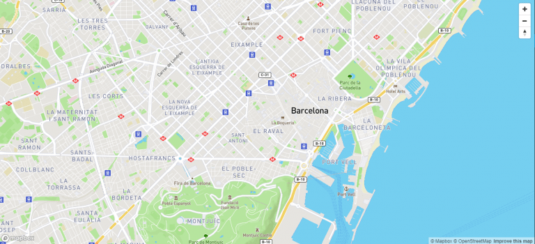

```
Programa de Ingeniería de Sistemas y Computación
Universidad del Quindío

Título: Mapas con Mapbox en Angular
Duración estimada: 120
Docentes: Carlos Andrés Florez
Guía: 18
```

# Mapas con Mapbox en Angular

## 🎯 Objetivo 

Implementar Mapbox en el proyecto final para aquellas páginas donde sea necesario mostrar reportes o crearlos por medio de mapas.

---

## Conceptos básicos

- **HTML**: Lenguaje de etiquetas de hipertexto usado para estructurar páginas web.
- **Framework CSS**: Conjunto de herramientas y convenciones predefinidas que facilitan el desarrollo de interfaces web estilizadas, por ejemplo: Bootstrap.
- **Lenguaje de programación TypeScript**: Superset de JavaScript que añade tipado estático y otras características.
- **Componentes en Angular**: Bloques reutilizables de código que encapsulan la lógica, la plantilla HTML y los estilos CSS para crear partes independientes de una aplicación web.
- **Servicios en Angular**: Clases que proporcionan funcionalidades compartidas y reutilizables, como la gestión de datos o la comunicación con APIs.
- **Inyección de dependencias en Angular**: Patrón de diseño que permite a los componentes y servicios recibir sus dependencias de manera automática, facilitando la modularidad.

---

## Contextualización Teórica

### ¿Qué es Mapbox?

[Mapbox](https://www.mapbox.com/) es un proveedor de mapas avanzado que ofrece una **API muy completa** para integrar funcionalidades de navegación en proyectos **web (JavaScript)** o **móviles (Kotlin, Swift)**.

Los datos de Mapbox provienen de diversas fuentes abiertas, entre ellas **OpenStreetMap** y la **NASA**, lo que garantiza información geográfica actualizada y de alta calidad.

Se puede consultar la documentación oficial en: [https://docs.mapbox.com/mapbox-gl-js/guides/](https://docs.mapbox.com/mapbox-gl-js/guides/)

### Propósito en el Proyecto

Mapbox se utilizará en nuestro proyecto con dos objetivos principales:

1. **Mostrar marcadores** en el mapa con los alojamientos existentes en la página de inicio.
2. **Seleccionar la ubicación** de un nuevo alojamiento en el formulario de creación, permitiendo obtener automáticamente su latitud y longitud.

### Marcadores (Markers)

Para ambos casos se emplearán [markers](https://docs.mapbox.com/help/getting-started/add-markers/), los cuales son iconos que pueden ubicarse en cualquier punto del mapa.
Estos marcadores son totalmente personalizables —pueden cambiar de color, tamaño, forma o incluso incluir contenido HTML o imágenes—, lo que permite representar visualmente distintos tipos de alojamientos o estados.

### Creación de un Mapa

Para usar Mapbox es necesario **generar un token de acceso**. Este se obtiene desde [https://account.mapbox.com/](https://account.mapbox.com/) (requiere crear una cuenta gratuita con el correo institucional).

Una vez se cuenta con el token, se puede crear un objeto de tipo `Map`, que requiere las siguientes propiedades principales:

* **container:** id del `div` que contendrá el mapa en el HTML.
* **style:** estilo visual del mapa (Mapbox ofrece una gran variedad de estilos prediseñados).
* **center:** coordenadas donde se centrará el mapa al cargar.
* **zoom:** nivel de acercamiento inicial.

Un mapa básico en Mapbox se vería de la siguiente forma:



### Funcionalidades Avanzadas

Además de los marcadores, Mapbox ofrece múltiples herramientas para enriquecer la experiencia de navegación, entre ellas:

* **Visualización 3D:** permite mostrar edificios y terrenos en tres dimensiones, generando una experiencia más inmersiva.
* **Rutas y navegación:** trazado de rutas entre puntos, cálculo de distancias y tiempos estimados de viaje.
* **Información en tiempo real:** estado del tráfico, condiciones del terreno y visualización dinámica de datos geoespaciales.

De hecho, empresas como **BMW**, **Strava**, **Snapchat** o **KFC** utilizan Mapbox para potenciar sus sistemas de navegación y análisis geográfico.

---

## Precauciones y Recomendaciones

Verifique que tiene instalado NodeJS en su última versión para poder compilar y ejecutar la aplicación de Angular. Tenga en cuenta que el proyecto del backend no es necesario para esta guía, por lo que no es necesario tenerlo corriendo.

---

## Evaluación o Resultado

Se espera que el estudiante logre comprender cómo implementar Mapbox en un proyecto web, como por ejemplo: poner marcadores, arrastrarlos en el mapa y programar diferentes eventos.

---

## Procedimiento

### 1. Instalación de dependencias de Mapbox

Para hacer uso de todas las funcionalidades explicadas anteriormente, es necesario agregar a nuestro proyecto de angular dos dependencias.

Escriba lo siguiente en el cmd de Windows o la terminal de GNU/Linux o Mac (se debe ejecutar en la carpeta raíz del proyecto de Angular).

```bash
pnpm install mapbox-gl
```

```bash
pnpm install @types/mapbox-gl
```

### 2. Configuración de estilos en angular.json

Luego, nos dirigimos al archivo `angular.json` y agregamos la ruta del archivo de estilos de mapbox necesario para su correcto funcionamiento.

En la lista `styles` (la misma que usamos para bootstrap) agregue: `"node_modules/mapbox-gl/dist/mapbox-gl.css"`

### 3. Creación del servicio de mapa

Centralizar las funcionalidades del mapa en un servicio es una buena práctica ya que es más fácil agregar, modificar o configurar aspectos relacionados a Mapbox. Si más adelante necesitamos funcionalidades adicionales se pueden agregar en dicho servicio.

Escriba lo siguiente en el cmd de Windows o en la terminal de GNU/Linux o Mac (recuerde ejecutar esto en la carpeta **services** del proyecto de Angular):

```bash
ng generate service map-service --skip-tests
```

### 4. Implementación del servicio de mapa

Modifique la clase `MapService` para que quede así:

```typescript
import { Injectable, OnDestroy } from '@angular/core';
import { Observable, Subject } from 'rxjs';
import mapboxgl, { LngLatLike, Map, Marker, MapMouseEvent } from 'mapbox-gl';
import { MarkerDTO } from '../models/marker-dto';

@Injectable({
  providedIn: 'root',
})
export class MapService implements OnDestroy {

  private map?: Map;
  private markers: Marker[] = [];
  private currentLocation: LngLatLike = [-75.6727, 4.53252];
  private readonly MAPBOX_TOKEN = 'COPIAR ACCESS TOKEN AQUÍ';
  private destroy$ = new Subject<void>();

  constructor() {
    mapboxgl.accessToken = this.MAPBOX_TOKEN;
  }

  /** Inicializa el mapa dentro del contenedor especificado */
  public create(containerId: string = 'map'): void {
    if (this.map) {
      this.map.remove(); // Evita fugas si se recrea el mapa
    }

    this.map = new mapboxgl.Map({
      container: containerId,
      style: 'mapbox://styles/mapbox/standard',
      center: this.currentLocation,
      zoom: 17,
      pitch: 45,
    });

    this.map.addControl(new mapboxgl.NavigationControl());
    this.map.addControl(
      new mapboxgl.GeolocateControl({
        positionOptions: { enableHighAccuracy: true },
        trackUserLocation: true,
      })
    );
  }

  /** Dibuja varios marcadores con popup */
  public drawMarkers(places: MarkerDTO[]): void {
    if (!this.map) return;

    places.forEach(({ id, title, photoUrl, location }) => {
      const popupHtml = `
        <strong>${title}</strong>
        <div>
          
        </div>
        <a href="/place/${id}">Ver más</a>
      `;

      new mapboxgl.Marker({ color: 'red' })
        .setLngLat([location.longitude, location.latitude])
        .setPopup(new mapboxgl.Popup().setHTML(popupHtml))
        .addTo(this.map!);
    });
  }

  /** Devuelve el mapa actual (si existe) */
  public get mapInstance(): Map | undefined {
    return this.map;
  }

  /** Limpieza al destruir el servicio */
  ngOnDestroy(): void {
    this.destroy$.next();
    this.destroy$.complete();

    if (this.map) {
      this.map.remove();
      this.map = undefined;
    }
  }
}
```

A continuación una explicación de cada función del servicio:

**`constructor`:**

- Se inicializa el token de acceso de Mapbox GL con una clave proporcionada por el usuario. Este token es necesario para acceder a los servicios de Mapbox. **Debe crear una cuenta en [https://account.mapbox.com/auth/signup](https://account.mapbox.com/auth/signup) para generar el Access Token. Asegúrese de que al momento de crear la cuenta use su correo electrónico institucional.**

**`create()`:**

- Esta función crea un mapa de Mapbox GL dentro de un contenedor HTML especificado por su id (por defecto es 'mapa').
- Si ya existe un mapa, se elimina para evitar fugas de memoria.
- Se configura el mapa con un estilo predeterminado, una ubicación central y un nivel de zoom inicial.
- Se agregan controles de navegación y geolocalización al mapa.

**`drawMarkers()`:**

- Esta función recibe una lista de objetos `MarkerDTO` que contienen información sobre la ubicación y detalles de cada marcador.
- Para cada marcador en la lista, se crea un marcador en el mapa con la posición correspondiente y se le asigna un cuadro emergente (popup) con información adicional, incluyendo una imagen y un enlace.
- Esta función es útil para mostrar múltiples marcadores en el mapa, como los alojamientos en la página de inicio.
- Se asegura de que el mapa esté inicializado antes de intentar agregar los marcadores.

**`mapInstance()`:**

- Esta es una propiedad de solo lectura que devuelve la instancia actual del mapa si está disponible. 
- Puede ser útil para acceder directamente al objeto del mapa para realizar operaciones adicionales.

**`ngOnDestroy()`:**

- Esta función se llama cuando el servicio es destruido.
- Se emite un evento para limpiar cualquier suscripción activa y se completa el sujeto `destroy$`.
- Si el mapa existe, se elimina y se establece en `undefined` para liberar recursos.

### 5. Creación del modelo `MarkerDTO`

Dado que la función `drawMarkers()` recibe una lista de `MarkerDTO`, es necesario crear este modelo. Cree el archivo `marker-dto.ts` en la carpeta **models** y agregue lo siguiente:

```typescript
import { LocationDTO } from "./place-dto";

export interface MarkerDTO {
    id: number,
    location: LocationDTO,
    title: string,
    photoUrl: string
}
```

Este DTO representa la información necesaria para mostrar un marcador en el mapa, incluyendo su ubicación, título e imagen. Se asume que `LocationDTO` ya está definido en `place-dto.ts`.

### 6. Personalización del popup del marcador

Ajuste el popup del marcador para que tenga un diseño más interesante, haga que se muestre la imagen destacada del alojamiento, su título, dirección y calificaciones promedio.

Para conocer más sobre Popups: [https://docs.mapbox.com/mapbox-gl-js/example/popup-on-click/](https://docs.mapbox.com/mapbox-gl-js/example/popup-on-click/)

### 7. Estructura HTML para el mapa en inicio

Modifique el componente `Home`, exactamente el archivo `home.html` para agregar el mapa, así:

```html
<div id="map"></div>
```

### 8. Estilos CSS para el mapa en inicio

Modifique el archivo `home.css` para agregar las dimensiones del mapa, así:

```css
#map {
    width: 100vw;
    height: 100vh;
}
```

Esto hará que el mapa ocupe toda la pantalla. Si desea que el mapa ocupe solo una parte de la pantalla, puede ajustar los valores de `width` y `height` según sus necesidades.

### 9. Configuración del componente de inicio

Modifique el componente `Home` para que quede así:

```typescript
import { Component, OnInit } from '@angular/core';
import { MapService } from '../../services/map-service';

@Component({
  selector: 'app-home',
  imports: [RouterModule],
  templateUrl: './home.html',
  styleUrl: './home.css'
})
export class Home implements OnInit {

  // Se inyecta el servicio de mapa en el constructor del componente
  constructor(private mapService: MapService) { }

  ngOnInit(): void {
    this.mapService.create();
  }
}
```

El componente `Home` utiliza el servicio `MapService` en su método `ngOnInit()` para inicializar el mapa cuando el componente se carga. `OnInit` es un ciclo de vida del componente que **se ejecuta después** de que Angular ha inicializado todas las propiedades vinculadas a datos del componente. 

Inicializar el mapa en `ngOnInit()` **asegura** que el mapa se configure correctamente una vez que el componente esté listo para interactuar con el DOM.

### 10. Verificación del mapa en inicio

Ejecute el proyecto y pruebe que el mapa sí se muestra en la página de inicio. Active la geolocalización para que el mapa se centre en su ubicación actual.

### 11. Mostrar alojamientos en el mapa de inicio

Haga que en el mapa de la página de inicio se muestren los alojamientos haciendo uso de marcadores. Para esto, por ahora podemos hacer uso del servicio `PlacesService` que tiene unos alojamientos de prueba. Modifique la función `ngOnInit()` del componente `Home` para que quede así:

```typescript
ngOnInit(): void {
  this.mapService.create();

  const places = this.placesService.getAll();
  this.mapService.drawMarkers(places); // Es necesario que haga un map de places a MarkerDTO
}
```

En este caso, `placesService.getAll()` devuelve una lista de alojamientos de prueba. Posteriormente, se llama a `mapService.drawMarkers(places)` para agregar los marcadores correspondientes en el mapa.

Para que esto funcione, debe inyectar `PlacesService` en el constructor del componente `Home`, así:

```typescript
constructor(private placesService: PlacesService) { }
```

Recuerde hacer el `import` correspondiente y no borre la inyección de `MapService` que se hizo anteriormente.

### 12. Verificación del mapa en inicio

Ejecute el proyecto y verifique que los alojamientos de prueba se muestran correctamente en el mapa de la página de inicio.

### 13. Integración del mapa en el formulario de crear alojamiento

Para crear un nuevo alojamiento es necesario conocer su latitud y longitud. Dado que obtener estos valores manualmente resulta poco práctico, utilizaremos un mapa interactivo que nos permitirá seleccionarlos de forma visual y precisa. 

Modifique el archivo `create-place.html` para agregar el mapa en el formulario, si previamente ya tiene un campo para la ubicación, puede eliminarlo. Agregue lo siguiente en el formulario:

```html
<div class="col-12">
  <label class="form-label">Ubicación: </label>
  <div id="map"></div>
</div>
```

Recuerde agregar las dimensiones del mapa en el archivo crear-reporte.component.css.

```css
#map {
    width: 100%;
    height: 300px;
}
```

### 14. Implementación de `ngOnInit` en `CreatePlace`

Haga que la clase `CreatePlace` implemente `OnInit` y en la función `ngOnInit()` agregue lo siguiente:

```typescript
ngOnInit(): void {
  // Inicializa el mapa con la configuración predeterminada
  this.mapService.create();

  // Se suscribe al evento de agregar marcador y actualiza el formulario
  this.mapService.addMarker().subscribe((marker) => {
    this.createPlaceForm.get('location')?.setValue({
      latitude: marker.lat,
      longitude: marker.lng,
    });
  });
}
```

La función `ngOnInit()` inicializa el mapa y agrega un marcador en respuesta a un clic. Posteriormente, actualiza las coordenadas de la ubicación del alojamiento en el formulario.

Para que esto funcione correctamente, debe inyectar `MapService` en el constructor de la clase, como se hizo en el componente `Home`.

### 15. Agregar la función `addMarker` en `MapService`

Agregue la siguiente función en la clase `MapService`:

```typescript
public addMarker(): Observable<mapboxgl.LngLat> {
  return new Observable((observer) => {
    if (!this.map) {
      observer.error('Mapa no inicializado');
      return;
    }

    // Limpia los marcadores existentes y agrega uno nuevo en la posición del click
    const onClick = (e: MapMouseEvent) => {
      this.clearMarkers();
      const marker = new mapboxgl.Marker({ color: 'red' })
        .setLngLat(e.lngLat)
        .addTo(this.map!);

      this.markers.push(marker);
      // Emite las coordenadas del marcador al observador
      observer.next(marker.getLngLat());
    };

    this.map.on('click', onClick);

    // Limpieza al desuscribirse
    return () => {
      this.map?.off('click', onClick);
    };
  });
}
```

Esta función crea un observable que emite las coordenadas del marcador cada vez que el usuario hace clic en el mapa. Si el mapa no está inicializado, se emite un error. Además, se asegura de limpiar los eventos al desuscribirse.

### 16. Verificación del mapa en el formulario

Ejecute el proyecto y pruebe que el mapa se muestra en el formulario. Haga click en el mapa y observe que el marcador se agrega y que las coordenadas son capturadas correctamente. 

Imprima los valores del formulario en la consola para verificar que las coordenadas se están asignando correctamente.

### 17. Control de versiones

Recuerde guardar todos los cambios en GIT y en GitHub.

---

## Para la próxima clase

- Investigue acerca de `HttpClient` de Angular.
- Investigue sobre Guards e Interceptors de Angular y para qué se usan.