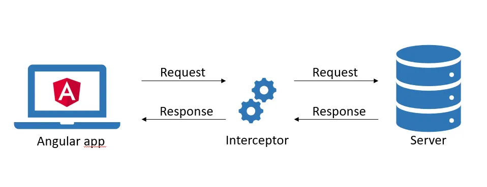

```
Programa de Ingeniería de Sistemas y Computación
Universidad del Quindío

Título: Guards e Interceptor en Angular
Duración estimada: 120
Docentes: Carlos Andrés Florez
Guía: 20
```

# Guards e Interceptor en Angular

## 🎯 Objetivo 

Implementar la protección de rutas en Angular mediante el uso de guards, y configurar un interceptor que se encargue de adjuntar el token de autenticación en cada solicitud HTTP realizada desde el frontend hacia el backend.

---

## Conceptos básicos

- **Lenguaje de programación TypeScript**: Superset de JavaScript que añade tipado estático y otras características.
- **Servicios en Angular**: Clases que proporcionan funcionalidades específicas y pueden ser compartidas entre diferentes componentes de una aplicación Angular. Se utilizan para manejar la lógica de negocio, interactuar con APIs, gestionar el estado de la aplicación, entre otros.
- **Componentes en Angular**: Bloques reutilizables de código que encapsulan la lógica, la plantilla HTML y los estilos CSS para crear partes independientes de una aplicación web.
- **API REST**: Conjunto de reglas y convenciones para construir y consumir servicios web que permiten la comunicación entre diferentes sistemas a través de HTTP.
- **JWT (JSON Web Token)**: Estándar abierto para la transmisión segura de información entre partes como un objeto JSON. Se utiliza comúnmente para la autenticación y autorización en aplicaciones web.
- **Spring Security**: Framework de seguridad para aplicaciones Java que proporciona autenticación, autorización y protección contra amenazas comunes.
  
---

## Contextualización Teórica

En esta guía se abordarán dos conceptos fundamentales en el desarrollo de aplicaciones web con Angular: los **Guards** y los **Interceptors**. Ambos son mecanismos que permiten gestionar la seguridad y el flujo de datos en una aplicación, pero operan en diferentes niveles y con propósitos distintos.

### Guards

Los **Guards** en Angular funcionan de manera similar a middlewares: se ejecutan antes de cargar una ruta y determinan si esta puede ser accedida o no. Una de sus principales ventajas es que, **al impedir la carga de rutas no autorizadas, se evita que los usuarios accedan a páginas para las cuales no tienen permisos**. Además, su uso permite una mejor organización del código, ya que la lógica relacionada con permisos y control de acceso se mantiene separada de la configuración de las rutas, lo que facilita el mantenimiento y la escalabilidad de la aplicación.

### Interceptors

Un **interceptor** se encarga de inspeccionar y/o modificar tanto las peticiones que se envían desde la aplicación de Angular al servidor como las respuestas que esta recibe. En otras palabras, actúa sobre el ciclo completo de solicitud y respuesta, permitiendo aplicar lógica personalizada en ambos sentidos de la comunicación.

Podemos representar el funcionamiento de un interceptor con la siguiente imagen:



#### Operaciones del interceptor HTTP

Generalmente, un interceptor puede realizar las siguientes operaciones:

- Modificar encabezados HTTP
- Modificar el cuerpo de la solicitud
- Establecer token de autenticación/autorización
- Modificar la respuesta HTTP
- Manejo de errores
- Registro y monitoreo de eventos

#### Uso del interceptor en nuestro proyecto

En nuestro contexto, el interceptor es una implementación de `HttpInterceptor` que utilizamos para **añadir automáticamente el token de autenticación a todas las peticiones HTTP** dirigidas al backend. Recordemos que la mayoría de los endpoints de nuestra API REST están protegidos mediante Spring Security, el cual deniega el acceso si no se proporciona un token válido generado por JWT (Bearer Token).

Además, el interceptor nos permite implementar la funcionalidad de *refresh token*, de modo que, cuando un token ha expirado, se pueda solicitar uno nuevo al servidor y así extender la sesión del usuario sin interrupciones constantes.

---

## Precauciones y Recomendaciones

Verifique que tiene instalado NodeJS en su última versión para poder compilar y ejecutar la aplicación de Angular. Tenga en cuenta que el proyecto de backend construído en IntelliJ IDEA debe estar en ejecución al momento de probar la API.

---

## Evaluación o Resultado

Se espera que el estudiante aprenda a configurar la protección de rutas correctamente según el estado de la sesión y del tipo de rol del usuario haciendo uso de guards, también se espera que el estudiante configure un interceptor para agregar en el encabezado de las peticiones HTTP el token de autenticación (si es que está disponible).

---

## Procedimiento

### 1. Creación del guard de login

Para proteger las rutas podemos usar guards. **Cree una nueva carpeta que se llame guards (dentro de la carpeta app)** y ubicados dentro de dicha carpeta escribimos lo siguiente en el cmd de windows o en la terminal de GNU/Linux o MacOS.

```bash
ng generate service login-service --skip-tests
```

### 2. Implementación del LoginGuard

Modifique el archivo `login-service.ts` (que creamos en el punto anterior) para que quede así:

```typescript
import { Injectable, inject } from '@angular/core';
import { ActivatedRouteSnapshot, CanActivateFn, Router, RouterStateSnapshot } from '@angular/router';
import { TokenService } from '../services/token-service';

@Injectable({
  providedIn: 'root'
})
export class LoginService {
  constructor(private tokenService: TokenService, private router: Router) { }

  canActivate(next: ActivatedRouteSnapshot, state: RouterStateSnapshot): boolean {
    if (this.tokenService.isLogged()) {
      this.router.navigate([""]);
      return false;
    }
    return true;
  }
}

export const LoginGuard: CanActivateFn = (next: ActivatedRouteSnapshot, state: RouterStateSnapshot): boolean => {
  return inject(LoginService).canActivate(next, state);
}
```

En este servicio se define la función `canActivate`, la cual verifica si el usuario ya ha iniciado sesión. En caso afirmativo, se realiza una redirección a la página de inicio. Esto es útil porque un usuario autenticado no debería poder acceder a las páginas de login o registro, ya que están destinadas únicamente a usuarios no autenticados. Finalmente, se crea una constante que permite ejecutar esta validación desde las rutas.

### 3. Configuración del LoginGuard en las rutas

Modifique el archivo `app.routes.ts` que está dentro de la carpeta `app` y añada lo siguiente en la lista `routes`:

```typescript
{ path: 'login', component: Login, canActivate: [LoginGuard] },
{ path: 'register', component: Register, canActivate: [LoginGuard] }
```

Como se explicó en el punto anterior la idea de usar `LoginGuard` es evitar que un usuario logueado pueda ver la página de login y de registro. 

Recuerde hacer el `import` de `LoginGuard` en `app.routes.ts` para que funcione correctamente.

### 4. Actualización del header según el estado de sesión

Dado que ya tenemos la implementación de sesión con el token del backend, podemos mejorar la página web haciendo algunos cambios como la de ocultar o mostrar menús (o secciones) en el header si la persona está logueada o no. Para esto, es necesario modificar el componente `Header`, en el archivo `header.ts` haga lo siguiente:

```typescript
import { Component, signal } from '@angular/core';
import { Router, RouterModule } from '@angular/router';
import { TokenService } from '../../services/token-service';

@Component({
  selector: 'app-header',
  imports: [RouterModule],
  templateUrl: './header.html',
  styleUrl: './header.css'
})
export class Header {
  protected readonly title = signal('BookingsUQ');
  isLogged = false;
  email: string = "";

  constructor(private tokenService: TokenService, private router: Router) {
    this.isLogged = this.tokenService.isLogged();
    if (this.isLogged) {
      this.email = this.tokenService.getEmail();
    }
  }

  public logout() {
    // Borrar token del sessionStorage
    this.tokenService.logout();
    // Redirigir al inicio y recargar la página
    this.router.navigate(['/']).then(() => window.location.reload());
  }
}
```

Se agregan dos atributos en el componente `Header`, uno para saber si el usuario está logueado (`isLogged`) y otro para guardar el `email` (si está logueado). Ambos valores se pueden obtener haciendo uso del servicio `TokenService`.

### 5. Función getEmail en TokenService

Si no la tiene, programe la función `getEmail()` en el archivo `token-service.ts` así:

```typescript
public getEmail(): string {
  const token = this.getToken();
  if (token) {
    const values = this.decodePayload(token);
    return values.email;
  }
  return "";
}
```

> ⚠️ **Nota:** Verifique si desde el backend se está enviado en los claims del JWT el valor email, si no es así, modifique el backend para que lo envíe. Si lo desea, puede enviar otro valor diferente como el nombre de usuario (username).

### 6. Modificación del HTML del header

Ahora modifique el archivo `header.html` en la sección del header donde está el botón de login y registro para que quede así:


```html
<div class="text-end">
  @if (!isLogged) {
    <button type="button" routerLink="/login" class="btn btn-outline-light me-2">Login</button>
    <button type="button" routerLink="/registro" class="btn btn-primary">Registro</button>
  }@else {
    <label class="me-3">Hola {{email}}</label>
    <button type="button" (click)="logout()" class="btn btn-outline-light">Logout</button>
  }
</div>
```


Básicamente, por medio del `@if` mostramos el botón de login y registro si el usuario no está logueado. De lo contrario (`@else`) se muestra el email del usuario y el botón de logout.

### 7. Prueba del header dinámico

Pruebe el funcionamiento de la página, inicie sesión y observe qué pasa. Luego cierre sesión y observe qué pasa.

### 8. Modificación del menú según el estado de sesión

Haga que se muestre un menú si el usuario no está logueado, y otro menú si está logueado. Esto por medio de `@if` y la variable `isLogged`. Esto es importante para mejorar la experiencia del usuario, ya que no tendría sentido mostrar opciones de menú que no puede usar.

Incluso, puede hacer que se muestren diferentes opciones de menú según el rol del usuario (si es afitrión o huésped). Recuerde que el rol lo puede obtener por medio de `TokenService` usando la función `getRole()` la cual captura el rol del usuario desde el token JWT.

### 9. Configuración de rutas con RoleGuard

Los guards nos permiten implementar comprobaciones más estrictas; por ejemplo, podemos restringir el acceso a una página para que solo sea accesible por un rol específico.

En el proyecto final, contamos con **funcionalidades exclusivas para anfitriones** y otras accesibles **únicamente para huéspedes autenticados**. Por ejemplo, los anfitriones (host) pueden ver sus alojamientos creados, crear nuevos, editarlos, entre otras, mientras que solo los huéspedes (guest) pueden crear una reserva, calificar, ver sus reservas, entre otras acciones. Por lo tanto, **es necesario validar** ciertas rutas mediante guards para asegurar el acceso adecuado.

En la lista routes del archivo `app.routes.ts` añadiremos lo siguiente (**no borre lo que tiene solo adicione las nuevas propiedades**):

```typescript
{ path: 'create-place', component: CreatePlace, canActivate: [RoleGuard], data: { expectedRole: ["ROLE_HOST"] } },
{ path: 'edit-place/:id', component: CreatePlace, canActivate: [RoleGuard], data: { expectedRole: ["ROLE_HOST"] } },
{ path: "my-places", component: MyPlaces, canActivate: [RoleGuard], data: { expectedRole: ["ROLE_HOST"] } },
```

Es importante mencionar que en la lista de `expectedRole` debemos escribir el nombre del rol tal como lo retorna el backend (esto se hace en el backend cuando crea el token JWT). En nuestro caso, el backend retorna el token con el rol `ROLE_HOST` o `ROLE_GUEST`, y así se debe escribir para que se haga la comprobación adecuadamente. **En el código anterior solo se muestran algunas rutas a manera de ejemplo, usted debe configurar las que falten.**

### 10. Creación del RoleGuard

Creamos una nueva guard de la siguiente manera (recuerde ejecutarlo en la carpeta **guards** del proyecto):

```bash
ng generate service role-service --skip-tests
```

### 11. Implementación del RoleGuard

Modificamos el archivo `role-service.ts` (creado en el punto anterior) para que quede así:

```typescript
import { inject, Injectable } from '@angular/core';
import { TokenService } from '../services/token-service';
import { ActivatedRouteSnapshot, CanActivateFn, Router, RouterStateSnapshot } from '@angular/router';

@Injectable({
  providedIn: 'root'
})
export class RoleService {

  constructor(private tokenService: TokenService, private router: Router) { }

  canActivate(next: ActivatedRouteSnapshot, state: RouterStateSnapshot): boolean {

    const expectedRole: string[] = next.data["expectedRole"];
    const realRole = this.tokenService.getRole();

    if (!this.tokenService.isLogged() || !expectedRole.includes(realRole)) {
      this.router.navigate([""]);
      return false;
    }

    return true;
  }

}

export const RoleGuard: CanActivateFn = (next: ActivatedRouteSnapshot, state: RouterStateSnapshot): boolean => {
  return inject(RoleService).canActivate(next, state);
}
```

Si no la tiene, programe la función `getRole()` en el archivo `token-service.ts`, puede basarse en la función `getEmail()` explicada anteriormente.

### 12. Validación del RoleGuard

**Valide que todo está funcionando correctamente.** Intente acceder a los componentes de mis alojamientos, crear uno nuevo. Luego inicie sesión e intente de nuevo acceder a dichas páginas. Solo nos debe permitir acceder a dichas páginas si estamos logueados y si tenemos el rol adecuado.

### 13. Aplicación del guard a todas las rutas

Agregue `canActivate` y el `expectedRole` a todas las rutas de la aplicación frontend que lo requieran, así como lo hicimos con los componentes explicados anteriormente.

### 14. Creación del interceptor

Finalmente para hacer que, una vez el usuario haya iniciado sesión, se envíe el token en cada petición al backend es necesario crear un interceptor. **Para esto, debe crear una nueva carpeta que se llame interceptor (dentro de la carpeta app)** y ubicados dentro de dicha carpeta escribimos lo siguiente en el cmd de windows o en la terminal de Linux o MacOS.

```bash
ng generate interceptor token --skip-tests
```

### 15. Implementación del interceptor

Modificamos el archivo `token-interceptor.ts` (creado en el punto anterior) para que quede así:

```typescript
import { inject } from '@angular/core';
import { HttpInterceptorFn } from '@angular/common/http';
import { TokenService } from '../servicios/token.service';

export const tokenInterceptor: HttpInterceptorFn = (req, next) => {
  const tokenService = inject(TokenService);

  if (!tokenService.isLogged()) {
    return next(req);
  }

  const token = tokenService.getToken();
  const authReq = req.clone({
    setHeaders: {
      Authorization: `Bearer ${token}`
    }
  });

  return next(authReq);
};
```

El interceptor actúa como un intermediario (*middleware*) entre las peticiones del frontend y las respuestas del backend. Para implementarlo, se debe crear una función `HttpInterceptorFn`. En ella, se valida si el usuario está autenticado; si es así, se agrega al encabezado HTTP el token de autenticación (Bearer Token), el cual se obtiene a través del `TokenService`.

### 16. Configuración del interceptor en app.config

Modifique el archivo `app.config.ts` para que entre en operación el interceptor creado en el punto anterior.

```typescript
import { ApplicationConfig, provideBrowserGlobalErrorListeners, provideZoneChangeDetection } from '@angular/core';
import { provideRouter } from '@angular/router';
import { provideHttpClient, withInterceptors } from '@angular/common/http';

import { routes } from './app.routes';
import { tokenInterceptor } from './interceptor/token-interceptor';

export const appConfig: ApplicationConfig = {
  providers: [
    provideBrowserGlobalErrorListeners(),
    provideHttpClient(withInterceptors([tokenInterceptor])),
    provideZoneChangeDetection({ eventCoalescing: true }),
    provideRouter(routes)
  ]
};
```

Se ha modificado la configuración del cliente HTTP para que utilice el interceptor `tokenInterceptor` en todas las peticiones que se realicen.

### 17. Prueba del interceptor

**Pruebe que todo funcione correctamente.** Haga pruebas con diferentes tipos de usuarios, con las rutas y verifique que todo esté bien configurado.

> ⚠️ **Importante:** Si comentó las validaciones del método `securityFilterChain()` de la clase `SecurityConfig` del backend (como se indicó en la guía anterior), quite dichos comentarios y deje la clase tal como la tenía antes para que las rutas estén protegidas.

### 18. Implementación de refresh token (opcional)

Si al enviar la petición el backend nos retorna un error con el mensaje de que el token ya caducó, se recomienda crear una función `refresh()` para solicitarle al backend que construya un nuevo token y nos lo envíe, al recibirlo de vuelta lo actualizamos en el `sessionStorage` del frontend y se procede con la solicitud nuevamente.

Para esto, debe crear un nuevo endpoint de tipo `POST`: `@PostMapping("/refresh")` en `AuthController` que permita actualizar el token vencido.

### 19. Función refresh en el frontend (opcional)

Cree la función `refresh()` en el servicio `TokenService` del frontend para que quede así para que solicite un nuevo token al backend. **Investigue cómo se puede modificar el interceptor para que cuando el backend nos retorna un error 401 se invoque la función `refresh()`, se actualice el token y envíe de nuevo la petición al backend con el nuevo token.**

### 20. Control de versiones

Recuerde guardar todos los cambios en Git y en GitHub.

---

## Para la próxima clase

- Lea e investigue sobre el despliegue de nuestros proyectos (backend y frontend) en la nube por medio de alguna herramienta gratuita. Por ejemplo: [https://railway.app/](https://railway.app/), [https://fly.io/](https://fly.io/), [https://firebase.google.com/](https://firebase.google.com/), [https://render.com/](https://render.com/), [https://vercel.com/](https://vercel.com/), y otros.