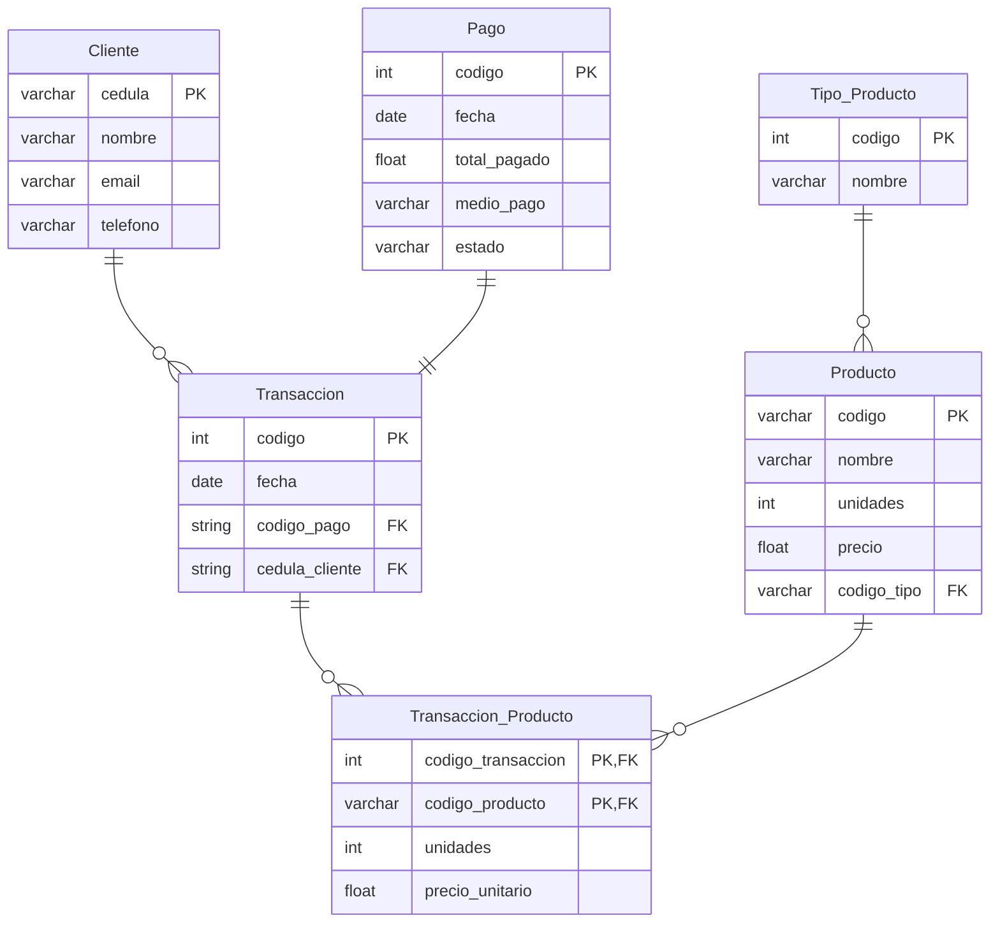

```
Programa de Ingeniería de Sistemas y Computación
Universidad del Quindío

Título: Sentencias básicas en SQL
Duración estimada: 120
Docentes: Carlos Andrés Florez, Christian Andrés Candela
Guía: 07
```

# Sentencias básicas en SQL

### 🎯 Objetivo
Conocer los conceptos básicos del lenguaje SQL, esencial en las bases de datos relacionales.

---

### Conceptos Básicos
MariaDB, línea de comandos.

---

## Contextualización Teórica

Una **base de datos** es un conjunto de datos estructurados que se almacenan y gestionan de manera eficiente. Hay dos tipos principales de bases de datos: las bases de datos relacionales y las bases de datos no relacionales. En este documento nos enfocaremos en las **bases de datos relacionales**, que utilizan tablas para representar los datos y sus relaciones.

**SQL** (Structured Query Language) es un lenguaje diseñado para administrar y recuperar información de sistemas de gestión de bases de datos relacionales, como por ejemplo MariaDB o MySQL.

Las bases de datos relacionales se organizan en dos marcadas secciones: el **esquema** y **los datos** (o instancias). El esquema es la definición de la estructura de la base de datos y principalmente almacena los siguientes datos:

- El nombre de cada tabla.
- Las columnas de cada tabla (cada columna tiene un nombre, un tipo de dato y puede tener restricciones).
- La relación de cada columna con otras tablas.

Existen dos subconjuntos de sentencias SQL, uno para la definición del esquema de la base de datos que se llama **DDL** y otro para la manipulación de los datos (o instancias) que se llama **DML**.

### Lenguaje de definición de datos (DDL)
Es un conjunto de instrucciones para trabajar con el esquema. Principalmente:
- `CREATE <algo>`
- `ALTER <algo> <cómo>`
- `DROP <algo>`

### Lenguaje de manipulación de datos (DML)
Es un conjunto de instrucciones para trabajar con los datos. Principalmente:
- `SELECT <campos> FROM <tabla> WHERE <condiciones>`
- `INSERT INTO <tabla> (<campo1>, ...) VALUES (<valor1>,...)`
- `UPDATE <tabla> SET <campo> = <valor> WHERE <condición>`
- `DELETE FROM <tabla> WHERE <condición>`

---

## Procedimiento

Una tienda requiere un sistema de información que le permita gestionar la información de sus productos, clientes y transacciones:
- De cada producto se debe almacenar su código, nombre, precio, unidades y tipo
- De cada transacción se debe registrar su código, el cliente que realiza la compra, el (o los) productos que compra, fecha de compra y pago
- Del pago se debe registrar su fecha, total pagado, estado del pago y método de pago
- Por último, del cliente se requiere su cédula, nombre, email y teléfono

### 1. Diseñar el diagrama entidad relación

Modelar todos los datos del problema.



### 2. Crear la base de datos

Ingresar al monitor de base de datos, crear la base de datos `tienda` y acceder a ella:

```bash
$ mariadb -u root -p
```
Al ingresar la contraseña, debe aparecer el prompt de MariaDB, y debe ejecutar los siguientes comandos:

```sql
create database tienda;
use tienda;
```

### 3. Crear tabla cliente

Se recomienda crear primero las tablas que no dependen de otra tabla. Cada tabla debe tener una llave primaria (**Primary key**) que identifica cada registro como único dentro de la tabla:

```sql
create table cliente(
    cedula varchar(10) not null,
    nombre varchar(200) not null,
    email varchar(100) not null unique,
    telefono varchar(12),
    primary key (cedula)
);
```
Para mostrar la estructura de la tabla, se puede usar:

```sql
describe cliente;
```

### 4. Crear tabla tipo_producto

La llave primaria será un campo autoincrementable de tipo `int`:

```sql
create table tipo_producto(
    codigo int not null auto_increment,
    nombre varchar(200) not null,
    primary key (codigo)
);
```

### 5. Crear tabla producto
Esta tabla depende de `tipo_producto` mediante una llave foránea (**Foreign Key**). La llave foránea identifica una columna en una tabla hija que se refiere a una columna en otra tabla:

```sql
create table producto(
    codigo varchar(10) not null,
    nombre varchar(200) not null,
    precio float not null,
    unidades int not null,
    tipo int not null,
    primary key (codigo),
    foreign key (tipo) references tipo_producto (codigo)
);
```

>**⚠️ IMPORTANTE:** Las llaves foráneas deben ser del mismo tipo de dato y misma longitud que la llave primaria que referencian.

### 6. Crear tabla pago
Necesaria para la tabla transacción:

```sql
create table pago(
    codigo int not null auto_increment,
    fecha date not null,
    total_pago float not null,
    estado varchar(10) not null,
    metodo_pago varchar(50) not null,
    primary key (codigo)
);
```

>**⚠️ Nota**: Esta tabla se puede normalizar creando tablas separadas para estado y método de pago.

### 7. Crear tabla transaccion
Depende de las tablas `cliente` y `pago` mediante llaves foráneas:

```sql
create table transaccion(
    codigo int not null auto_increment,
    fecha date not null,
    cedula_cliente varchar(10) not null,
    codigo_pago int not null,
    primary key (codigo),
    foreign key (cedula_cliente) references cliente (cedula),
    foreign key (codigo_pago) references pago (codigo)
);
```

### 8. Crear tabla transaccion_producto
Soluciona la relación muchos a muchos entre transacción y producto. La llave primaria está compuesta por las llaves primarias de las tablas involucradas:

```sql
create table transaccion_producto(
    codigo_transaccion int not null,
    codigo_producto varchar(10) not null,
    unidades int not null,
    precio_unitario float not null,
    primary key (codigo_transaccion, codigo_producto),
    foreign key (codigo_transaccion) references transaccion (codigo),
    foreign key (codigo_producto) references producto (codigo)
);
```

### 9. Comandos adicionales
Una vez definida la estructura, se pueden usar:
- `DROP` para borrar tablas
- `ALTER` para modificarlas

### 10. Insertar clientes de prueba
Para ingresar registros se usa `INSERT INTO`:

```sql
insert into cliente values ("123", "Pepito", "pepe@mail.com", "7827827");
insert into cliente(cedula, nombre, email) values ("124", "Juanita", "juana@mail.com");
insert into cliente values ("125", "Pablo", "pablo@mail.com", "7901234");
```

### 11. Consultar registros
La sentencia `SELECT` permite obtener registros:

```sql
select * from cliente;
```

### 12. Actualizar y eliminar registros
Ejemplo para actualizar el teléfono de un cliente:

```sql
update cliente set telefono = "7500000" where cedula = "124";
select * from cliente; 
```

Ejemplo para eliminar un cliente:

```sql
delete from cliente where cedula = "125";
select * from cliente;
```

### 13. Insertar tipos de productos
Solo se define el nombre, el código es autoincrementable:

```sql
insert into tipo_producto(nombre) values ("Tecnología");
insert into tipo_producto(nombre) values ("Electrodoméstico");
insert into tipo_producto(nombre) values ("Deporte");
```
Para consultar los tipos de productos:
```sql
select * from tipo_producto;
```

### 14. Insertar productos
Deben existir tipos de productos previamente registrados:

```sql
insert into producto values ("a12", "Teclado gamer", 300000, 2, 1);
insert into producto values ("b43", "Nintendo Switch OLED", 1500000, 1, 1);
insert into producto values ("h62", "Tenis Adidas", 450000, 10, 3);
```

### 15. Insertar registros relacionados
Ejemplo completo de inserción con llaves foráneas:

```sql
insert into pago(fecha, total_pago, estado, metodo_pago) values ("2023/08/15", 300000, "APROBADA", "PSE");
insert into transaccion(fecha, cedula_cliente, codigo_pago) values ("2023/08/15", "123", 1);
insert into transaccion_producto values (1, "a12", 1, 300000);
```

### 16. Usar JOIN para relacionar tablas
La instrucción `JOIN` permite mezclar tablas para completar información:

```sql
-- JOIN básico (mezcla todos los registros)
select * from cliente join transaccion;

-- JOIN con restricción usando ON
select * from cliente c join transaccion t on c.cedula = t.cedula_cliente;

-- JOIN seleccionando campos específicos
select c.cedula, c.nombre, t.codigo, t.fecha from cliente c join transaccion t on c.cedula = t.cedula_cliente;
```

### 17. Herramientas con GUI para bases de datos
Existen diversas herramientas con interfaz gráfica que facilitan la gestión de bases de datos, tales como:

- **MySQL Workbench**: Permite diseñar, modelar y gestionar bases de datos MySQL.
- **Outerbase**: Herramienta de administración para bases de datos de diferentes motores.
- **HeidiSQL**: Ligera y fácil de usar, ideal para gestionar bases de datos MySQL y MariaDB.

Si lo desea, puede explorar estas herramientas para facilitar su trabajo con bases de datos. Se recomienda **Outerbase** por su simplicidad y versatilidad.

---

## Tarea

1. Añada una llave foránea en la tabla cliente para que quede guardado en qué ciudad vive.

2. Añada un campo en la tabla producto para que tenga una descripción. Este campo debe ser de tipo `TEXT` (no `VARCHAR`) ya que la descripción puede ser tan extensa como el usuario decida.

3. Diseñe un diagrama entidad-relación para este ejercicio: Una biblioteca requiere un sistema de información que le permita gestionar la información de sus libros y préstamos:
   - De cada libro se debe almacenar la información de su autor (o autores), isbn, nombre, género, año, unidades
   - De cada préstamo se debe registrar el código, la persona que pide el préstamo, el (o los) libros que presta, fecha del préstamo, fecha de devolución
   - De la persona se requiere la cédula, nombre, email y teléfono
   - Del autor su nombre y nacionalidad